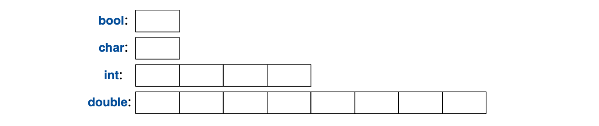

<a class="en-page-number" id="1"></a>

<div class="chapter-number"><p class="chapter-number">{{ page.ch }}</p></div>

# 基础知识 {#the-basics}

> 我们要做的第一件事儿，
>
> 就是把律师统统杀光。
>
> —— <span title="外语教学与研究出版社 2015年10月 出版的《亨利六世 中：英汉对照》 由 覃学岚 译。 —— 译者注">《亨利六世》（中）</span>[^1]

## 1.1 导言 {#1.1}

本章将简略地给出 C++ 的文法，C++ 的内存模型和计算模型，以及将代码组织成程序的基本机制。
这部分语言特性所支持的编程风格常见于 C，也被称为*过程式编程（procedural programming）*。

<a class="en-page-number" id="2"></a>

## 1.2 程序 {#1.2}

C++ 是种编译型语言。要运行一个程序，其源文本需要通过编译器处理，
生成一些目标文件，而后由链接器组合出一个可执行文件。
一个典型的 C++ 程序生成自多个源代码文件（通常简称为*源文件(source files)*）。


可执行文件针对特定的 硬件/操作系统 组合创建，不可移植，比方说，
不能从 Mac系统 拿到 Windows系统 上运行。
当我们说到 C++ 程序的可移植性时，一般是在说源代码的可移植性；
就是说，这份源码可以在多个系统上被编译并运行。

ISO C++ 标准定义了两类东西：

- 语言核心特性(core language features)，诸如内置的类型（例如 `char` 和 `int`）
    以及循环（例如 `for`-语句 和 `while`-语句）
- 标准库组件(standard-library components)，诸如容器（例如 `vector` 和 `map`）
    以及 I/O 操作（例如 `<<` 和 `getline()`）

标准库组件完全是普通的 C++ 代码，由具体的 C++ 实现提供。
换句话说， C++ 标准库可以并确实是用 C++ 自身(包括少量的机器语言代码，
用于线程上下文切换等功能)实现的。
这意味着，对多数需求严苛的系统编程而言，C++ 具有足够的表达能力和效率。

C++ 是静态类型语言。
就是说，任何一个东西（例如对象、值、名称和表达式）被用到的时候，
其类型都必须是编译器已知的。对象的类型确定了可施加操作的集合。

### 1.2.1 Hello, World! {#1.2.1}

最小的 C++ 程序是

```cpp
int main(){}    // 最小的 C++ 程序
```

此处定义了一个名为`main`的函数，它不接受参数，也不执行任何操作。

花括号`{}`，在 C++ 中表示结组。在此处，它标示了函数体的起止点。双斜杠，`//`，
发起一个注释并延续至行尾。注释是供人阅读的，编译器忽略所有注释。

任何一个 C++ 程序必须有且只有一个名为`main()`的全局函数。整个程序由该函数开始执行。
如果`main()`返回了任何`int`整数值，该值被返回给“系统”。
如果没有返回值，系统会接收到一个值，表示执行成功。
`main()`返回的非零值表示出错。并非所有操作系统和执行环境都利用这个返回值。
基于 Linux/Unix 的环境用它，而基于 Windows 的环境几乎不用。

<a class="en-page-number" id="3"></a>

一个典型的程序会有些输出，以下程序写出 `Hello, World!`：

```cpp
#include <iostream>

int main()
{
    std::cout << "Hello, World!\n";
}
```

`#include <iostream>`这行告诉编译器，在`iostream`中查找标准输入输出流相关的声明，
并*包含（include）*进来。如果缺失这些声明，以下表达式

```cpp
std::cout << "Hello, World!\n"
```

就无效了。操作符`<<`(“输向”)将其第二个参数写入第一个。
在本例中，字符串文本(string literal)`"Hello, World!\n"`被写入到标准输出流`std::cout`上。
字符串文本是由双引号包围的一连串字符。在字符串文本中，反斜杠`\`后跟一字符共同表示一个“特殊字符”。
在这里，`\n`是换行符，所以写出的字符是`Hello, World!`紧跟一个换行。

`std::`指出名称`cout`需要在标准库（standard-library）命名空间（§3.4）中查找。
我在谈论标准功能的时候通常略掉`std::`；§3.4 里展示了一个方法，在使命名空间中的名称可见时，无需显式提引。

一般来说，所有的可执行代码都会被置于函数中，再由`main()`函数直接或者间接地调用，例如：

```cpp
#include <iostream>         // 包含（“引入”）I/O 流程序库的声明

using namespace std;        // 让std里的名称无需使用 std:: 就可见 (§3.4)

double square(double x)     // 计算一个双精度浮点数的平方
{
    return x*x;
}

void print_square(double x)
{
    cout << "the square of " << x << " is " << square(x) << "\n";
}

int main()
{
    print_square(1.234);    // 打印：the square of 1.234 is 1.52276
}
```

“返回类型”为`void`时，表示该函数不会返回任何值。

<a class="en-page-number" id="4"></a>

## 1.3 函数 {#1.3}

在 C++ 程序里，完成某个事项的主要方式是调用函数去执行。定义函数就是指定某个操作怎样被执行。
除非事先声明过，否则函数无法被调用。

函数声明给出了该函数的名称、返回值类型（如果有的话），以及调用时必须提供的参数之数量和类型。例如：

```cpp
Elem* next_elem();      // 不接受参数；返回指向 Elem 的指针（一个 Elem*）
void exit(int);         // int 参数；无返回值
double sqrt(double);    // double 参数；返回一个 double
```

在函数声明中，返回值出现在名称前面，参数类型被括在小括号里，跟在名称后面。

参数传递的语法跟初始化（§3.6.1）的语法一致。就是说，会检查参数类型，
在必要的时候会对参数进行隐式类型转换（§1.4）。例如：

```cpp
double s2 = sqrt(2);        // 以 double 类型参数 double{2} 调用 sqrt()
double s3 = sqrt("three");  // 错误：sqrt() 要求参数类型为 double
```

编译期类型检查和类型转换的价值不容小觑。

函数声明中可以包含函数名。这对程序的读者有益，但除非该声明同时也是函数定义，
编译器将忽略这些参数名。例如：

```cpp
double sqrt(double d); // 返回 d 的平方根
double square(double); // 返回参数的平方
```

函数的类型由返回值类型和参数类型序列构成。例如：

```cpp
double get(const vector<double>& vec, int index); // 类型： double(const vector<double>&,int)
```

函数可以作为类（§2.3, §4.2.1）的成员。对于*成员函数（member function）*来说，
类名也是该函数类型的组成部分。例如：

```cpp
char& String::operator[](int index); // 类型： char& String::(int)
```

我们希望代码易于理解，因为这是可维护性的前提。
而可读性的前提是，将运算任务拆分成有意义的小块（体现为函数和类），并为其命名。
这些函数为运算提供词汇表，犹如类型（内置类型和用户定义类型）为数据提供基本的词汇表。
C++ 标准算法（例如 `find`, `sort` 和 `iota`）开了个好头。
然后，我们可以编排函数，将通用或专用的作业表示成更大型的运算任务。

代码中的报错数跟代码的数量和复杂度有关。这两个因素都可以通过更多、更简短的函数来解决。
使用函数完成一项特定任务，总是能救我们于水火，不必在其它代码中敲入一段特定的代码；
创建函数会强制我们为一项任务命名并单独创建文档。

如果两个函数以同样的名称定义，但使用不同的参数类型，编译器将选用最匹配的函数调用。例如：

<a class="en-page-number" id="5"></a>

```cpp
void print(int);    // 接收一个整型参数
void print(double); // 接收一个浮点型参数
void print(string); // 接收一个 string 参数

void user()
{
    print(42);          // 调用 print(int)
    print(9.65);        // 调用 print(double)
    print("Barcelona"); // 调用 print(string)
}
```

如果有两个备选参数可以调用，但都不优于另一个，该调用将被认为具有二义性，编译器将报错。例如：

```cpp
void print(int,double);
void print(double,int);

void user2()
{
    print(0,0); // 错误：二义性
}
```

多个同名函数的定义被称为*函数重载（function overloading）*，是泛型编程(§7.2)的基础之一。
当函数被重载，所有同名函数应被赋予相同的语义。`print()`函数就是这样的案例；
每个`print()`函数都打印其参数。

## 1.4 类型，变量和算术运算 {#1.4}

所有的名称及表达式都具有类型，用以规定可执行的运算。例如，声明

```cpp
int inch;
```

指出， `inch` 的类型是 `int`；也就是说，`inch` 是个整数型变量。

*声明（declaration）* 是把一个东西引入程序的语句。它规定了这个东西的类型：

- *类型（type）* 规定了一组可能的值和一组运算（针对对象）
- *对象（object）* 是若干内存，其中承载某种类型的值
- *值（value）* 是一些二进制位，其含义由某个类型规定
- *变量（variable）* 是一个具名对象

C++ 提供了一小组基本类型，既然我并非组织学家，也就不把它们逐一列出了。
想要完整列表，可借助参考资料，例如网络上的 [Stroustrup,2013] 或者 [Cppreference]。
举几个例子：

<a class="en-page-number" id="6"></a>

```cpp
bool        // 布尔类型，可能的值是 true 和 false
char        // 字符，例如：'a'、'z' 和 '9'
int         // 整数，例如：-273、42、和 1066
double      // 双精度浮点数，例如：-273.15、3.14 和 6.626e-34
unsigned    // 非负整数，例如：0、1、和 999 (用于逻辑位运算)
```

每个基本类型都直接对应于硬件结构，其容量是固定的，该容量决定了其中存储的值的取值范围。



`char`类型变量的容量由机器决定，可容纳一个字符（一般来说是个8比特位的字节），
其余类型的容量都是`char`的整数倍。类型的容量是实现定义的（就是说，在不同的机器上可以不一样），
可使用`sizeof`运算符获取；例如：`sizeof(char)` 等于 `1`，`sizeof(int)` 则通常是`4`。

数字可以是浮点数或者整数。

- 浮点数通过小数点标记（比如：`3.14`）或者使用科学计数法（比如：`3e-2`）。
- 整数文本默认是十进制（比如：`42`是四十二）。前缀`0b`表示二进制（基数是2）整数文本。
    前缀`0x`表示十六进制（基数是16）整数文本（比如：`0xBAD1234`）。
    前缀`0`表示八进制（基数是8）整数文本（比如：`0334`）。

要提高长文本的可读性，我们可以使用单引号（'）作为数字分隔符。
例如：π 大概是 `3.14159'26535'89793'23846'26433'83279'50288`，
如果用十六进制是`0x3.243F'6A88'85A3'08D3`。

### 1.4.1 算术运算 {#1.4.1}

算术运算符对于基本类型来说，可以进行合理的组合：

```cpp
x+y     // 加法（plus）
+x      // 一元加（unary plus）
x−y     // 减法（minus）
−x      // 一元减（unary minus）
x*y     // 乘法（multiply）
x/y     // 除法（divide）
x%y     // 对整数取余(取模)（remainder(modulus)）
```

比较运算符也是这样：

<a class="en-page-number" id="7"></a>

```cpp
x==y    // 相等（equal）
x!=y    // 不等（not equal）
x<y     // 小于（less than）
x>y     // 大于（greater than）
x<=y    // 小于等于（less than or equal）
x>=y    // 大于等于（greater than or equal）
```

除此之外，还提供了逻辑运算符：

```cpp
x&y     // 按位与（bitwise and）
x|y     // 按位或（bitwise or）
xˆy     // 按位异或（bitwise exclusive or）
~x      // 取补（bitwise complement）
x&&y    // 逻辑与（logical and）
x||y    // 逻辑或（logical or）
!x      // 逻辑非(否定)（logical not(negation)）
```

按位的逻辑运算，其结果的类型与操作数一致，值是每个对应的位都参与运算的结果。
逻辑运算符`&&` 和 `||` 仅仅依据操作数的值返回 `true` 或 `false`。

在赋值和算术运算中，C++ 会为操作数在基本类型之间，执行任何有意义的转换，以便它们可以任意混合：

```cpp
void some_function()    // 函数不返回任何值
{
    double d = 2.2;     // 初始化浮点数
    int i = 7;          // 初始化整数
    d = d+i;            // 把和赋值给d
    i = d*i;            // 把积赋值给i；注意：double类型的 d*i 被截断为一个 int
}
```

表达式里用到的转换被称为*常规算术转换（the usual arithmetic conversions）*，
旨在确保表达式运算按照操作数中最高的精度执行。
比如说，`double` 和 `int` 的加法运算，以双精度浮点数算术执行。

请留意，`=` 是 赋值运算符，而 `==` 是比较相等与否。

除了传统的算术和逻辑运算符，C++ 还提供了专门的运算符用于修改变量：

```cpp
x+=y    // x = x+y
++x     // 自增： x = x+1
x−=y    // x = x-y
−−x     // 自减： x = x-1
x*=y    // 倍增 x = x*y
x/=y    // 倍缩 x = x/y
x%=y    // x = x%y
```

这些运算符简洁、便捷，并且应用频繁。

表达式的估值顺序是从左至右，除了赋值，它是从右到左。很不幸，函数参数的估值顺序是未指定。

<a class="en-page-number" id="8"></a>

### 1.4.2 初始化 {#1.4.2}

在某个对象被使用之前，必须给定一个值。C++ 为初始化提供了多种方法，
比如上面用到的 `=`，还有一种通用形式，基于花括号内被隔开的初值列表：

```cpp
double d1 = 2.3;                // d1 初始化为 2.3
double d2 {2.3};                // d2 初始化为 2.3
double d3 = {2.3};              // d3 初始化为 2.3 （使用 { ... } 时，此处的 = 可有可无）
complex<double> z = 1;          // 一个复数，使用双精度浮点数作为标量
complex<double> z2 {d1,d2};
complex<double> z3 = {d1,d2};   // （使用 { ... } 时，此处的 = 可有可无）

vector<int> v {1,2,3,4,5,6};    // 一个承载 int 的 vector
```

`=` 是传统形式，可追溯至C语言，但如果你拿不准，请使用 `{}`-列表 这种通用形式。
最起码，在涉及信息损失的类型转换时，它能拉你一把。

```cpp
int i1 = 7.8; // i1 的值将是 7 （惊不惊喜，意不意外？）
int i2 {7.8}; // 错误：浮点数向整数转换
```

很不幸，*缩窄转换（narrowing conversion）* 这种有损信息的形式，比方说`double`到`int`
以及`int`到`char`，在使用`=`（而非`{}`）的时候，会合法并悄无声息地进行。
这种由隐式缩窄转换导致的问题，是对C语言向后兼容(§16.3)的代价。

常量(§1.6)不允许置为未初始化状态，变量也只该在极罕见的情况下不初始化。在准备好合适的值以前，别引入这个名称。
对于用户定义的类型（比如`string`、`vector`、`Matrix`、`Motor_controller`以及`Orc_warrior`）
可将其定义为隐式初始化(§4.2.1)。

定义变量时，如果可以初始值中推导出类型，就无需明确指定：

```cpp
auto b = true;      // bool类型
auto ch = 'x';      // char类型
auto i = 123;       // int类型
auto d = 1.2;       // double类型
auto z = sqrt(y);   // 无论sqrt(y)返回什么类型，z都被指定为该类型
auto bb {true};     // bb是bool类型
```

在`auto`的情况下，我们往往用`=`，因为不涉及类型转化的隐患，如果你更青睐`{}`初始化，但用无妨。

无特定原因去指明类型时，就可以用`auto`，“特定原因”包括：

- 当该定义位于较大的作用域中时，希望其类型对阅读源码读的人一目了然。
- 希望明确规定变量的取值范围或精度（比方说，想用`double`，而非`float`）。

运用`auto`，可以避免冗余，也不用敲很长的类型名。在泛型编程中这尤为重要，这种情况下，
对象的确切类型难于知晓，而且类型名可能还特别长(§12.2)。

<a class="en-page-number" id="9"></a>

## 1.5 作用域和生命期 {#1.5}

声明会把其名称引入到某个作用域：

- *局部作用域（local scope）*：声明在函数(§1.3)或lambda表达式(§6.3.2)内部的名称，
    被称为*局部名称（local name）*。它的作用域从声明的位置，延续到其声明所驻的代码块末尾。
    *代码块（block）*由一对`{}`界定。函数参数的名称也被视为局部名称。
- *类作用域（class scope）*：定义在类(§2.2、§2.3、第4章)中，且在任何函数(§1.3)、
    lambda表达式(§6.3.2)和`enum类`(§2.5)之外的名称，
    被称为*成员名称（member name）*——也叫*类成员名称（class member name）*。
    其作用域从容纳它的类声明的左花括号`{`开始，到这个类声明的末尾。
- *命名空间作用域（namespace scope）*：如果名称被定义在一个命名空间（namespace）(§3.4)里，
    且在任何函数(§1.3)、lambda表达式(§6.3.2)、类(§2.2、§2.3、第4章)、
    和`enum类`(§2.5)之外，就称之为*命名空间成员名称（namespace member name）*。
    其作用域从声明所在位置开始，直至命名空间结尾。

未定义于任何其它结构内的名称，被称作*全局名称（global name）*，
位于*全局命名空间（global namespace）*中。

此外，某些对象可以不具名，例如临时变量，以及通过`new`创建的对象。例如：

```cpp
vector<int> vec;    // vec是全局的（一个承载整数的全局 vector）

struct Record {
    string name;    // name 是Record的成员（string类型成员）
    // ...
};

void fct(int arg)   // fct是全局的（全局函数）
                    // arg是局部的（一个整数参数）
{
    string motto {"Who dares wins"};    // motto 是局部的
    auto p = new Record{"Hume"};        // p指向一个不具名Record（通过 new 创建）
    // ...
}
```

对象在使用前必须先被构造（初始化），并将在其作用域末尾被销毁。
对于命名空间中的对象，其销毁的时间点位于程序的终止。
对成员来说，其销毁的时间点，由持有它的对象的销毁时间点确定。
经由`new`创建的对象，将“存活”至`delete`(§4.2.2)销毁它为止。

## 1.6 常量 {#1.6}

关于不可变更，C++有两种概念：

- `const`：相当于“我保证不会修改这个值”。
    它主要用于指定接口，对于通过指针以及引用传入函数的数据，无需担心其被修改。
    编译器为`const`作出的“保证”担保。一个`const`的值可在运行期间得出。

<a class="en-page-number" id="10"></a>

- `constexpr`：相当于“将在编译期估值”。
    它主要用于常量，用以明确指出，该数据的栖身之所，将出于性能考量而被置于只读内存
    （在这里被损坏的几率极低）里。一个`constexpr`的值必须由编译器得出。

例如：

```cpp
constexpr int dmv = 17;             // dmv是个具名常量
int var = 17;                       // var不是常量
const double sqv = sqrt(var);       // sqv是个具名常量，很可能要在运行时得出

double sum(const vector<double>&);  // sum不会修改其参数(§1.7)

vector<double> v {1.2, 3.4, 4.5};   // v不是一个常量
const double s1 = sum(v);           // OK：sum(v)将在运行期估值
constexpr double s2 = sum(v);       // 报错：sum(v)不是常量表达式
```

如果函数要用在*常量表达式（constant expression）*中，就是说，
在一个由编译器估值的表达式里，则必须用`constexpr`定义。例如：

```cpp
constexpr double square(double x) { return x*x; }

constexpr double max1 = 1.4*square(17);     // OK 1.4*square(17) 是常量表达式
constexpr double max2 = 1.4*square(var);    // 报错：var不是常量表达式
const double max3 = 1.4*square(var);        // OK，可在运行时估值
```

`constexpr`函数可采用非常量的参数，但此时其结果就不再是常量表达式。
对于`constexpr`函数，在无需常量表达式的语境里，就可以用非常量表达式参数调用它。
如此一来，就不必把本质上相同的函数定义两遍：一遍用于常量表达式，另一遍用于变量。

要成为`constexpr`，函数必须极其简单，且不能有副作用，且只能以传入的数据作为参数。
尤其是，它不能修改非局部变量，但里面可以有循环，以及它自己的局部变量。例如：

```cpp
constexpr double nth(double x, int n)   // 假定 n>=0
{
    double res = 1;
    int i = 0;
    while (i<n) {   // while-循环：在条件为真时执行(§1.7.1)
        res*=x;
        ++i;
    }
    return res;
}
```

在某些场合下，语言规则强制要求使用常量表达式（比如：数组界限(§1.7)、case标签(§1.8)、
模板的值参数(§6.2)，以及用`constexpr`定义的常量）。其它情况下，编译期估值着眼于性能。
抛开性能问题不谈，不变性（状态不可变更的对象）是一个重要的设计考量。

<a class="en-page-number" id="11"></a>

## 1.7 指针、数组及引用 {#1.7}

最基本的数据集合，是一串连续分配的，相同类型元素的序列，被称为*数组（array）*。
它基本脱胎于硬件。`char`类型元素的数组可以这样定义：

```cpp
char v[6];  // 6个字符的数组
```

与之类似，指针的定义是这样：

```cpp
char* p;    // 指向字符的指针
```

在声明里，`[]`意指“什么什么的数组”，而`*`意指“指向什么什么东西”。
所有数组都以`0`作为下界，所以`v`有六个元素，从`v[0]`到`v[5]`。
数组容量必须是常量表达式(§1.6)。指针变量可持有相应类型对象的地址：

```cpp
char* p = &v[3];    // p指向v的第四个元素
char x = *p;        // *p是p的目标对象
```

在表达式里，一元前置运算符`*`意指“什么什么的内容”，而一元前置运算符`&`意指“什么什么的地址”。
我们可以把前面初始化定义的结果图示如下：


思考一下，从一个数组里复制十个元素到另一个：

```cpp
void copy_fct()
{
    int v1[10] = {0,1,2,3,4,5,6,7,8,9};
    int v2[10];                 // 将成为v1的副本

    for (auto i=0; i!=10; ++i)  // 复制所有元素
        v2[i]=v1[i];
    // ...
}
```

`for`-语句可读作“把`i`置零；在`i`不等于`10`的时候，复制第`i`个元素并把`i`增1。”
用于整数或浮点数变量时，自增运算符`++`仅做加`1`处理。
C++还提供一个简化的 `for`-语句，名为 区间-`for`-语句，用于以最简单的方式遍历序列：

<a class="en-page-number" id="12"></a>

```cpp
void print()
{
    int v[] = {0,1,2,3,4,5,6,7,8,9};

    for (auto x : v)        // 针对v中的每个x
        cout << x << '\n';

    for (auto x : {10,21,32,43,54,65})
        cout << x << '\n';
    // ...
}
```

第一个 区间-`for`-语句 可读作“对于`v`的每个元素，从头至尾，复制进`x`并打印它。”
请留意，以列表初始化数组的时候，无需为它指定界限。区间-`for`-语句 可用于任何的元素序列(§12.1)。

若不想把`v`中的值复制到变量`x`，而仅让`x`引用到一个元素，可一这么写：

```cpp
void increment()
{
    int v[] = {0,1,2,3,4,5,6,7,8,9};

    for (auto& x : v)   // 为v里的每个x加1
        ++x;
    // ...
}
```

在声明中，一元前置运算符`&`意指“引用到什么什么”。
引用和指针类似，只是在访问引用指向的值时，无需前缀`*`。
此外，在初始化之后，引用无法再指向另一个对象。

在定义函数参数时，引用特别有用。例如：

```cpp
void sort(vector<double>& v);   // 把v排序（v是个承载double的vector）
```

通过引用，我们确保了在调用`sort(my_vec)`的时候，不会复制`my_vec`，
并且被排序的确实是`my_vec`，而非其副本。

想要不修改参数，同时还避免复制的开销，可以用`const`引用(§1.6)。例如：

```cpp
double sum(const vector<double>&)
```

接收`const`引用参数的函数非常普遍。

在用于声明的时候，运算符（例如`&`、`*`及`[]`）被称为*声明运算符（declarator operator）*：

```cpp
T a[n]  // T[n]: 具有n个T的数组
T* p    // T*: p是指向T的指针
T& r    // T&: r是指向T的引用
T f(A)  // T(A): f是个函数，接收一个A类型的参数，返回T类型的结果
```

<a class="en-page-number" id="13"></a>

### 1.7.1 空指针 {#1.7.1}

我们尽量确保指针总是指向一个对象，以便对其解引用时合法。
当没有对象可指，或我们想表达“有效对象不存在”（比如：列表的终结）的概念时，
就为指针赋予值`nullptr`（空指针）。仅有一个`nullptr`，供所有指针类型共享：

```cpp
double* pd = nullptr;
Link<Record>* lst = nullptr;    // 指向承载Record的Link
int x = nullptr;                // 报错：nullptr是指针而非整数
```

时时检查指针参数，以确保其有所指，小心驶得万年船：

```cpp
int count_x(const char* p, char x)
    // 统计p[]中出现x的次数
    // 假定p指向 以零结尾 的字符数组（或者没有指向）
{
    if (p==nullptr)
        return 0;
    int count = 0;
    for (; *p!=0; ++p)
        if (*p==x)
            ++count;
    return count;
}
```

请留意，可以用`++`递增指针，使其指向数组的下一个元素；
以及，在用不到的时候，`for`-语句的初始化部分可以留空。

在`count_x()`的定义里，假定了这个`char*`是一个 *C-风格 字符串（C-style string）*，
就是说，该指针指向一个以零结尾的`char`数组。
字符串文本中的字符是不可变的，为了能处理`count_x("Hello!")`，
我给`count_x()`声明了`const char*`参数。

在老式代码里，通常用`0`或`NULL`，而非`nullptr`。
但是，采用`nullptr`，可以消除整数（比如`0`或`NULL`）和指针（比如`nullptr`）之间的混乱。

在`count_x()`的例子中，`for`语句的初始化部分没用，就可以用更简单的`while`-语句替代：

```cpp
int count_x(const char∗ p, char x)
    // 统计p[]中出现x的次数
    // 假定p指向 以零结尾 的字符数组（或者没有指向）
{
    if (p==nullptr)
        return 0;
    int count = 0;
    while (∗p) {
        if (∗p==x)
            ++count;
        ++p;
    }
    return count;
}
```

<a class="en-page-number" id="14"></a>

`while`-语句会一直执行到其条件变成`false`为止。

对数值的判定（比如`count_x()`里的`while(*p)`），等同于将其与`0`比较（也就是`while(*p!=0)`）。
对指针指的判定（比如`if(p)`），等同于将其与`nullptr`比较（也就是`if(p!=nullptr)`）。

不存在“空引用”。引用必须指向有效的对象（并且编译器的实现假定是这样）。
有些隐晦的小聪明可以绕过这些规则；别那么干。

## 1.8 判定 {#1.8}

C++有一套常规语句，用来表达选择与循环，诸如`if`-语句、`switch`-语句、`while`-语句、`for`-语句。
举个例子，这有一个很简单的函数，它向用户提问，并返回一个布尔值表示拥护的回复：

```cpp
bool accept()
{
    cout << "Do you want to proceed (y or n)?\n";   // 输出问题
    char answer = 0;                                // 初始化一个值，无需显示
    cin >> answer;                                  // 读取回应
    if (answer == 'y')
        return true;
    return false;
}
```

同输出运算符`<<`（“输至”）配对，运算符`>>`（“取自”）用于输入；`cin`是标准输入流（第10章）。
`>>`右操作数的类型决定输入的有效性，该右操作数也是输入操作的收货方。
待输出字符串末尾的字符`\n`表示另起一行(§1.2.1)。

请留意，`answer`定义在被需要的地方（而非那以前）。声明可以出现在任何可放置语句之处。

此例可以改良，接收一个`n`（代表“no”）作为回应：

```cpp
bool accept2()
{
    cout << "Do you want to proceed (y or n)?\n";   // 输出问题
    char answer = 0;                                // 初始化一个值，无需显示
    cin >> answer;                                  // 读取回应

    switch (answer) {
    case 'y':
        return true;
    case 'n':
        return false;
    default:
        cout << "I'll take that for a no.\n";
        return false;
    }
}
```

<a class="en-page-number" id="15"></a>

`switch`-语句把一个值与一组常量进行比较。这些常量被称为`case`-标签，必须互不相同，
如果该值不匹配任何一个常量，就执行`default`。
如果值不匹配任何`case`-标签，且没有`default`，就什么都不做。

如果一个函数里有`switch`-语句，在从该函数返回的时候，可以不退出`case`。
通常，我们会继续执行`switch`-语句后续的内容。这可以通过`break`语句实现。
举个例子，这是个电子游戏的命令解析器，略原始，还有点小聪明：

```cpp
void action()
{
    while (true) {
        cout << "enter action:\n";  // 询问动作
        string act;
        cin >> act;                 // 把字符串读入一个string
        Point delta {0,0};          // Point里存有一个{x,y}对

        for (char ch : act) {
            switch (ch) {
            case 'u':   // 上（up）
            case 'n':   // 北（north）
                ++delta.y;
                break;
            case 'r':   // 右（right）
            case 'e':   // 东（east）
                ++delta.x;
                break;
            // ... more actions ...
            default:
                cout << "I freeze!\n";
            }
            move(current+delta∗scale);
            update_display();
        }
    }
}
```

与`for`-语句(§1.7)类似，`if`-语句接收一个值并对它判定。例如：

```cpp
void do_something(vector<int>& v)
{
    if (auto n = v.size(); n!=0) {
        // ... 如果 n!=0 就走到这 ...
    }
    // ...
}
```

此处的整数`n`仅被定义为`if`-语句内使用，以`v.size()`初始化，并立即由分号后的条件`n!=0`进行判定。
声明在条件中的名称，其作用域同时囊括了`if`-语句的两个分支。

<a class="en-page-number" id="16"></a>

与`for`-语句都情况相同，把名称声明在`if`-语句的条件中，目的是限制变量的作用域以提升可读性，并减少错误发生。

最常见的情况是针对`0`（或`nullptr`）判定变量。这种情况下，无需明确提及判定条件。例如：

```cpp

void do_something(vector<int>& v)
{
    if (auto n = v.size()) {
        // ... 如果 n!=0 就走到这 ...
    }
    // ...
}
```

请尽可能采用这种简洁的形式。

## 1.9 映射至硬件 {#1.9}

C++ 提供了到硬件的直接映射。当你使用基础运算，其操作由硬件执行，通常是单个的机器运算。
例如把两个`int`相加，`x+y`执行一条整数加法的机器指令。

C++编译器实现把机器的内存视为一连串的存储位置，可向其中放置（带类型的）对象，并可用指针对其寻址：


指针在内存里体现为机器地址，所以图中`p`的数值会是`3`。
如果这看着像数组(§1.7)，那是因为数组在C++中，基本就是对“内存中一连串对象”的抽象。

这种基本语言构件向硬件的映射，对底层性能至关重要，数十年来，C和C++就是闻名于斯。
C和C++的基本机器模型基于计算机硬件，而非某种数学概念。

### 1.9.1 赋值 {#1.9.1}

内置类型的赋值，就是简单的机器复制操作。例如：

```cpp
int x = 2;
int y = 3;
x = y; // x 变成 3
// 注意： x==y
```

这很明显。可以图示如下：

<a class="en-page-number" id="17"></a>


注意，两个对象是独立的。可以修改`y`的值却不牵连`x`。比如`x=99`并不会修改`y`的值。
这一点对所有类型都成立，不仅仅是`int`，这与Java、C#以及其它语言不同，但和C语言一样。

如果想让不同的对象引用向相同（共享）的值，必须明确指出。可以用指针：

```cpp
int x = 2;
int y = 3;
int∗ p = &x;
int∗ q = &y;    // 现在 p!=q 且 *p!=*q
p = q;          // p 成了 &y； 现在 p==q，因此（很明显）*p == *q
```

可图示如下：


以`88`和`92`作为`int`的地址，是随便选的。再者，可见 赋值目标 获得了 赋值源 的值，
结果是两个独立的对象（此处都是指针），具有相同的值。
就是说`p=q`导致`p==q`。执行`p=q`后，两个指针都指向`y`。

引用和指针都 引用向/指向 对象，而且在内存里都表现为机器地址。
但是在语言规则里，二者的使用形式不同。
向一个引用赋值，不会改变它引用了什么，而是会赋值给它引用的对象：

```cpp
int x = 2;
int y = 3;
int& r = x;     // r 引用向 x
int& r2 = y;    // 现在r2引用向 y
r = r2;         // 经由r2读取,通过r写入：x变成3
```

可图示如下：


要访问指针所指的值，需要借助`*`；但访问 引用所指的值 却是自动（隐式）的。

对于所有内置类型，以及设计良好——提供了`=`（赋值）和`==`（相等判定）——的用户定义类型（第2章），
执行过`x=y`后，都会得到`x==y`。

<a class="en-page-number" id="18"></a>

### 1.9.2 初始化 {#1.9.2}

初始化和赋值不一样。一般来说，对于合法的赋值操作，被赋值对象必须有值。
另一边，初始化的任务 是让一块未初始化过的内存成为一个有效的对象。
对绝大多数类型，针对 未初始化变量 的读取和写入都是未定义的（undefined）。
对于内置类型，这在引用身上尤其明显：

```cpp
int x = 7;
int& r {x}; // 把r绑定到x上（r引用向x）
r = 7;      // 不论r引用向什么，给它赋值
int& r2;    // 报错：未初始化引用
r2 = 99;    // 不论r2引用向什么，给它赋值
```

很幸运，不能存在未初始化的引用；如果能，那么`r2=99`就会把`99`赋值给某个不确定的内存位置；
其结果会导致故障或者崩溃。

`=`可用于初始化引用，但千万别被它搞糊涂了。例如：

```cpp
int& r = x; // 把r绑定到x上（r引用向x）
```

这依然是初始化，并把r绑定到x上，而不涉及任何的值复制。

初始化和赋值的区别，对很多用户定义的类型——比如`string`和`vector`——而言同样极度重要，
在这些类型中，被赋值的对象拥有一份资源，该资源最终将被释放(§5.3)。

参数传递和返回值返回的基本语义是初始化(§3.6)。比方说，这就是传引用的实现方式。

## 1.10 忠告 {#1.10}

此处的忠告是 C++ Core Guidelines [Stroustrup,2015] 的子集。以类似 [CG: ES.23]
的形式引用向核心指南，其意思是 Expressions and Statement 章节的 第23条规则。
通常，核心指南提供更深入的理论和用例。

- [1] 别慌！船到桥头自然直；§1.1; [CG: In.0]。
- [2] 不要专门或单独使用内置特性。恰恰相反，基本（内置）特性，最好间接通过程序库使用，
    比方说 ISO C++ 标准库（第8-15章）；[CG: P.10]。
- [3] 想写出好程序，不必对C++掌握到巨细靡遗。
- [4] 把力气用在编程技术上，而非语言特性。
- [5] 有关语言定义相关问题的最终解释，请参考 ISO C++ 标准；§16.1.3; [CG: P.2]。
- [6] 把有用的操作“打包”成函数，还要取个好名字；§1.3; [CG: F.1]。
- [7] 函数应当仅具有单一的逻辑功能；§1.3; [CG: F.2]。
- [8] 保持函数简短；§1.3; [CG: F.3]。
- [9] 当函数针对不同类型执行同样概念的操作时，采用重载；§1.3。
- [10] 当函数可能在编译期估值时，用`constexpr`声明它；§1.6; [CG: F.4]。

<a class="en-page-number" id="19"></a>

- [11] 去理解基本语义向硬件的映射；§1.4, §1.7, §1.9, §2.3, §4.2.2, §4.4。
- [12] 用数字分隔符为大文本值提高可读性；§1.4; [CG: NL.11]
- [13] 别用复杂表达式；[CG: ES.40]
- [14] 别用导致范围缩小的类型转换；§1.4.2; [CG: ES.46]
- [15] 最小化变量的作用域；§1.5
- [16] 别用“魔数”；使用符号常量；§1.6; [CG: ES.45]。
- [17] 尽量用不可变更的数据；§1.6; [CG: P.10]。
- [18] 每个声明里有（且仅有）一个名称；[CG: ES.10]
- [19] 保持常见和局部名称简短，让不常见和非局部名称长一些；[CG: ES.7]。
- [20] 别用形似的名称；[CG: ES.8]。
- [21] 别用全大写（`ALL_CAPS`）名称；[CG: ES.9]。
- [22] 在提及类型的声明里，尽量用`{}`-初始化 语法；§1.4; [CG: ES.23]。
- [23] 使用`auto`以避免重复输入类型名；§1.4.2; [CG: ES.11]。
- [24] 尽量别弄出来未初始化的变量；§1.4; [CG: ES.20]。
- [25] 尽量缩小作用域；§1.5; [CG: ES.5]。
- [26] 如果在`if`-语句的条件中定义变量，尽量采用针对`0`的隐式判定；§1.8。
- [27] 仅在涉及位操作时，使用`unsigned`；§1.4; [CG: ES.101] [CG: ES.106]。
- [28] 确保对指针的使用简单且直白；§1.7; [CG: ES.42]。
- [29] 用`nullptr`，而非`0`或`NULL`；§1.7; [CG: ES.47]。
- [30] 在有值去初始化它之前，别声明变量；§1.7, §1.8; [CG: ES.21]。
- [31] 别给直观的代码写注释； [CG: NL.1]。
- [32] 用注释阐释意图；[CG: NL.2]。
- [33] 保持缩进风格一致；[CG: NL.4]。

[^1]: 出自 外语教学与研究出版社 2015年10月 出版的《亨利六世 中：英汉对照》 由 覃学岚 译。 —— 译者注

---
