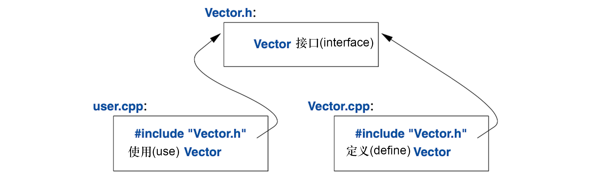

<a class="en-page-number" id="29"></a>

<div class="chapter-number"><p class="chapter-number">{{ page.ch }}</p></div>

# 模块化 {#modularity}

> 我打断你的时候不许打断我。
>
> —— 温斯顿·丘吉尔

## 3.1 导言 {#introduction}

一个C++程序由许多独立开发的部分组成，比如函数（§1.2.1）、用户定义类型（第2章）、类的层级（§4.5）及模板（第6章）。管理这些的关键，在于为它们之间的交互作出清晰的定义。第一步也是最为重要的一步，是区分接口和实现。中语言层级，C++用声明表示接口，*声明（declaration）*把操控函数或类所需的项目一一列举。例如：

```cpp
double sqrt(double);    // 平方根函数接收double参数，返回double值

class Vector {
public:
    Vector(int s);
    double& operator[](int i);
    int size();
```

<a class="en-page-number" id="30"></a>

```cpp
private:
    double∗ elem;   // elem指向一个数组，该数组承载sz个double
    int sz;
};
```

此处要点是函数体，即函数*定义（definition）*位于“别处”。在本例中，可能会有需求让`Vector`的概况也位于“别处”，但我们得到后面（抽象类型；§4.3）处理这个问题。`sqrt()`的定义可能是这样：

```cpp
double sqrt(double d)   // sqrt()的定义
{
    // ... 数学课本里的算法 ...
}
```

对于`Vector`，我们需要给其三个成员函数都提供定义：

```cpp
Vector::Vector(int s)               // 构造函数的定义
    :elem{new double[s]}, sz{s}     // 初始化成员变量
{
}

double& Vector::operator[](int i)   // 取下标运算符的定义
{
    return elem[i];
}

int Vector::size()                  // size()的定义
{
    return sz;
}
```

必须为`Vector`的函数提供定义，`sqrt()`就不必，因为它隶属于标准库。不过二者并无本质差别：程序库仅仅是“我们刚好用到的某些别的代码”，这些代码的跟我们编写的那些，遵守相同的规则。

任何实体都可以具有多个声明，但只允许有一个定义。

## 3.2 独立编译 {#separate-compilation}

C++支持分离编译，这种情况下，对于用到的类型和函数，仅有其声明对用户是可见的。这些类型和函数的定义位于其它的源文件中，且会被独立编译。运用独立编译，可以把程序分离成一系列半独立的代码片段。通过这种分离操作，可以缩短编译时间，对于逻辑上独立的部件，予以强行分割（从而减少犯错）。库通常就是一组独立编译的代码片段（比如函数）。

一般来说，对于定义模块接口的声明部分，可以置于一个文件中，并通过文件名表明用途，例如：

<a class="en-page-number" id="31"></a>

```cpp
// Vector.h:

class Vector {
public:
    Vector(int s);
    double& operator[](int i);
    int size();
private:
    double∗ elem;   // elem指向一个数组，该数组承载sz个double
    int sz;
};
```

该声明会被置于名为`Vector.h`的文件中，然后，用户*包含（include）*这个*头文件（header file）*，以访问该接口。例如：

```cpp
// user.cpp:

#include "Vector.h" // 获取Vector的接口
#include <cmath>    // 获取标准库中的数学函数，其中包括sqrt()

double sqrt_sum(Vector& v)
{
    double sum = 0;
    for (int i=0; i!=v.size(); ++i)
        sum+=std::sqrt(v[i]);       // 平方根的和
    return sum;
}
```

为了对编译器确保一致性，为`Vector`提供实现的`.cpp`文件同样会包含提供接口的`.h`文件：

```cpp
// Vector.cpp:

#include "Vector.h"     // 获取Vector的接口

Vector::Vector(int s)
    :elem{new double[s]}, sz{s} // 初始化成员变量
{
}

double& Vector::operator[](int i)
{
    return elem[i];
}

int Vector::size()
{
    return sz;
}
```

`user.cpp`和`Vector.cpp`的代码共享`Vector.h`内的`Vector`接口信息，

<a class="en-page-number" id="32"></a>

但除此之外它们是独立的，并可以独立编译。该程序的个部分可图示如下：



严格来说，独立编译并不是语言本身的问题，而是有关最大限度利用特定语言实现优势的问题。无论如何，这在实践中意义重大。优秀的程序组织方法是：把程序当作一组模块，明确定义其依赖关系，利用语言特性逻辑化地表达这种模块化，然后利用文件把模块化以实体形式暴露出来，以实现高效的编译。

可独自（包含`#include`进来的`.h`文件）被编译的`.cpp`文件，叫做*编译单元（translation unit）*。程序由数以千计的编译单元组成。

## 3.3 模块（C++20） {#module}

使用`#include`把程序组织成多个部件的方法，很古老、易出错且成本高昂。如果在101个编译单元中用到`#include header.h`，`header.h`中的文本将被编译器处理101次。如果在`header2.h`之前用了`#include header1.h`，那么`header1.h`中的声明和宏可能会影响`header2.h`里代码的意义。很明显，这不太理想，实际上自该机制在1972年被引入C语言以来，对推高成本和bug量，它就一直负有不可推卸的责任。

对于在C++中表示实体模块，终于初见曙光了。这个语言特性叫`nodule`，尚未进入 ISO C++，但已经是一个 ISO技术细则（Technical Specification）[ModulesTS]，<span title="在本书翻译的时候，也就是2022年初，`module`已经被纳入 ISO C++，并定义在“INTERNATIONAL STANDARD ISO/IEC 14882:2020”（该标准文件的第6版，出版于2020年12月）的第10章。">并将成为C++20的一部分</span>[^1]。因为在编译器实现中已经提供了该功能，所以，尽管其细节可能还要变动，而且可能要等好几年才能广泛用于生产环境，我依然要在这里推荐使用它。使用`#include`的老代码，将会“存活”相当长的时间，因为要修改它，代价高昂且及其耗时。

使用`module`组织§3.2中`Vector`和`sqrt_sum()`的示例，方法如下：

```cpp
// 文件 Vector.cpp:

module;     // 此编译单元将定义一个模块

// ... 此处为 Vector 的实现所需的内容 ...
```

<a class="en-page-number" id="33"></a>

```cpp
export module Vector;   // 定义名为"Vector"的模块

export class Vector {
public:
    Vector(int s);
    double& operator[](int i);
    int size();
private:
    double∗ elem;       // elem指向一个数组，该数组承载sz个double
    int sz;
};

Vector::Vector(int s)
    :elem{new double[s]}, sz{s}     // 初始化成员变量
{
}

double& Vector::operator[](int i)
{
    return elem[i];
}

int Vector::size()
{
    return sz;
}

export int size(const Vector& v) { return v.size(); }
```

以上代码定义了名为`Vector`的`module`，它导出了类`Vector`及其所有的成员函数，和非成员函数 `size()`。

使用该`module`的方法是：在需要的地方`import`它。例如：

```cpp
// 文件 user.cpp:

import Vector;      // 获取Vector的接口
#include <cmath>    // 获取标准库中的数学函数，其中包括sqrt()

double sqrt_sum(Vector& v) 
{
    double sum = 0;
    for (int i=0; i!=v.size(); ++i)
        sum+=std::sqrt(v[i]);       // 平方根的和
    return sum;
}
```

我本来也可以`import`标准库中的数学函数，但我用了老式的`#include`，就是为了表明新老方式可以混用。这样的混用，对于把老代码逐步从`#include`迁移到`import`至关重要。

<a class="en-page-number" id="34"></a>

头文件和模块方式的区别不仅仅在语法层面：

- 模块仅编译一次（而非在每个用到的编译单元都处理）
- 两个模块的`import`顺序可任意颠倒，而不会影响其意义
- 如果把什么东西导入到一个模块，该模块的用户无法悄无声息地访问到你导入的东西，以至于引起麻烦：`import`不会跨模块传导。

模块在可维护性及编译性能方面的影响，会非常显著。

## 3.4 命名空间 {#namespace}

除了函数(§1.3)、类(§2.3)以及枚举(§2.5)，C++还提供名为*命名空间（namespace）*的机制，以表达某些声明捆绑在一起，因此这些名称不会跟其它名称发生冲突。比如说，我想弄个复数类型(§4.2.1, §14.4)：

```cpp
namespace My_code {
    class complex {
        // ...
    };

    complex sqrt(complex);
    // ...

    int main(); 
}

int My_code::main()
{
    complex z {1,2};
    auto z2 = sqrt(z);
    std::cout << '{' << z2.real() << ',' << z2.imag() << "}\n"; 
    // ...
}

int main()
{
    return My_code::main();
}
```

把我的代码放到命名空间`My_code`里后，确保了我定义的名称没有跟标准库命名空间`std`(§3.4)中的名称产生冲突。这种谨慎就很明智了，因为标准库确实提供了`complex`的运算(§4.2.1, §14.4)。

想要在另一个命名空间中访问，最简单的方式就是：使用命名空间名进行限定（比如`std::cout`和`My_code::main`），“真正的`main`”定义在全局命名空间里，也就是并非位于某个命名空间、类或者函数的局部。

反复用命名空间名限定名称，很单调且容易分神，可以用`using`-声明把名称引入某个域：

<a class="en-page-number" id="35"></a>

```cpp
void my_code(vector<int>& x, vector<int>& y) 
{
    using std::swap;    // 使用标准库中的 swap
    // ...
    swap(x,y);          // std::swap()
    other::swap(x,y);   // 别的 swap()
    // ...
}
```

`using`-声明 使命名空间中的一个名称可用，其效果就像该名称在`using`-声明所处的作用域中声明一样。在`using std::swap`语句之后，就好像`swap`被声明在`my_code()`中一模一样。

要访问标准库命名空间中的所有名称，可以用这个`using`-指令：

```cpp
using namespace std;
```

在`using`-指令所处的作用域内，指令提及的命名空间内的所有名称，都能以非限定方式访问。因此在针对`std`的`using`-指令后，我们可以直接用`cout`代替`std::cout`。使用`using`-指令后，我们无法再对该命名空间内的名称进行精细挑选，因此要慎用功能，通常适用于程序中广泛使用的库（比如`std`）,或者在转化某个未使用`namespace`程序的过渡期。

命名空间主要用于组织较大的程序组件，比如程序库。在使用独立开发的部分组成程序时，它能简化该过程。

## 3.5 错误处理 {#error-handling}

错误处理是个即庞大又复杂的主题，其关注点和覆盖面远超语言特性本身，涉及到编程技术与工具。好在C++的某些特性能帮一把。主要帮手就是类型系统。相对于用费劲巴力的方法直接构建程序——也就是使用内置类型（比如`char`、`int`及`double`）和语句（比如`if`、`while`及`for`），我们构建适合该程序的类型（比如`string`、`map`及`regex`）和算法（比如`sort()`、`find_if()`及`draw_all()`）。这些高层设施简化了编码过程，避免大量错误（比如，你不太可能在对话框上执行树遍历），还有助于编译器查错。C++的主体致力于设计并实现出优雅且高效的抽象（比如，用户定义类型和作用于其上的算法）。此种抽象的一个结果便是，在程序运行时，故障的检测点和处理点相互分离。当程序增大，尤其是库被广泛应用，错误处理的标准化就愈加重要了。在程序开发的早期就规划错误处理规划的策略，是个好主意。

### 3.5.1 异常 {#exception}

回到`Vector`的例子。对于§2.3中的vector，越界访问（out-of-range）其元素的时候，*应当*做些什么呢？

- 在此情形下，`Vector`的作者不会知道用户的意图（一般来说，`Vector`的作者甚至对这个vector所在的程序都一无所知。）
- `Vector`的用户无法始终去检测这个问题（如果有办法，那这种越界访问压根儿就不该发生）

假设我们想从越界访问的错误中恢复运行，解决方案是：实现`Vector`的人检测越界访问的企图，并将其告知用户。用户采取适宜的措施。例如：`Vector::operator[]()`能检测越界访问的企图，并抛出一个`out_of_range`异常：

```cpp
double& Vector::operator[](int i)
{
    if (i<0 || size()<=i)
        throw out_of_range{"Vector::operator[]"};
    return elem[i];
}
```

这个`throw`把控制转给一个处理`out_of_range`异常的代码，该代码位于某个函数，而该函数直接或间接的调用`Vector::operator[]`。要做到这一点，编译器实现就得*展开（unwind）*函数调用堆栈，以便回退到调用者的上下文。就是说，异常处理机制将退出作用域及函数，以便回退到有意处理该类异常的调用者，必要时沿途调用析构函数(§4.2.2)。例如：

```cpp
void f(Vector& v)
{
    // ...
    try {   // 此处的异常将被下面定义的代码处理
        v[v.size()] = 7;        // 试图访问v到末尾之后
    }
    catch (out_of_range& err) { // 糟了：out_of_range错误
        // ... 处理越界错误 ...
        cerr << err.what() << '\n';
    }
    // ...
}
```

我们把需要异常处理的代码放到`try`-代码块里。给`v[v.size()]`赋值的企图不会得逞。因此，会进入`catch`-子句，里面包含处理`out_of_range`异常的代码。`out_of_range`异常定义在标准库中（`<stdexcept>`里），且已用于标准库里某些读写容器的函数中。

我通过引用捕捉此异常以避免复制它，并使用`what()`函数打印错误信息，该信息是在`throw`-位置塞进异常里的。

使用异常处理机制，可以让错误处理更简洁、更系统化，也更具可读性。要确保这些，就不要滥用`try`-语句。让错误处理实现简洁和系统化的主要技术（被称为*资源请求即初始化（Resource Acquisition Is Initialization; RAII）*）将在 §4.2.2 中细聊。RAII的大体思路是允许构造函数获取全部所需资源，以便该类能够运作，并切让析构函数释放所有资源，这样就可以让资源的释放有保障且低调进行。

<a class="en-page-number" id="37"></a>

如果一个函数绝不该抛出异常，可以用`noexcept`声明它。例如：

```cpp
void user(int sz) noexcept
{
    Vector v(sz);
    iota(&v[0],&v[sz],1); // 用1,2,3,4...填充v（详见§14.3）
    // ...
}
```

万一`user()`还是抛出了异常，`std::terminate()`将立即被调用以终止程序。

### 3.5.2 不变式 {#invariant}

用异常标示越界访问，是这样一个示例：函数对参数进行检验，并在不满足基本假设——*前置条件（precondition）*——时拒绝运行。如果我们想郑重其事声明`Vector`的下标运算符，就应该有些诸如此类的表达：“索引必须位于区间\[`0`:`size()`)内”，而实际上，我们在`operator[]()`里正是这样检查的。[`a`:`b`)这个标记定义了一个半开区间，就是说，`a`在这个区间里，而`b`不在。在定义函数的时候，应当考虑一下：前置条件是什么；是否要检测它(§3.5.3)。对绝大多数程序来说，应该对简单的不变式进行测试，请参阅 §3.5.4。

既然`operator[]()`运算符作用于`Vector`类型的对象，那么如果`Vector`的成员不具备“合理的”值，这个运算就毫无意义。确切的说，我们指出了“`elem`指向承载`sz`个元素的数组”，但那仅仅在注释里。这种语句为类指明某个假设为真，被称为*类的不变式（class invariant）*，简称*不变式（invariant）*。为类制定不变式（以确保成员函数有的放矢）的职责归构造函数，而成员函数运行完之后，要确保不变式依然成立。不巧的是，我们`Vector`的构造函数有点虎头蛇尾了。它出色地为`Vector`的成员变量完成了初始化，却没留意传入的参数是否合理。考虑考虑这个：

```cpp
Vector v(−27);
```

基本是这就要出事了。

更靠谱的定义是这样的：

```cpp
Vector::Vector(int s)
{
    if (s<0)
        throw length_error{"Vector constructor: negative size"};
    elem = new double[s];
    sz = s;
}
```

我用了标准库里的`length_error`异常，来报告元素数量不是正整数的问题，因为标准库也用这个异常报告这类问题。如果`new`运算符没找到可分配的内存，将抛出`std::bad_alloc`。可以这么写：

<a class="en-page-number" id="38"></a>

```cpp
void test()
{
    try {
        Vector v(−27);
    }
    catch (std::length_error& err) {
        // 处理大小为负数的情况
    }
    catch (std::bad_alloc& err) {
        // 处理内存不足的问题
    }
}
```

你可以定义自己的类当作异常使用，可以在检测到异常的地方塞入任意信息，这些信息会被带到异常被处理的地方(§3.5.1)。

一般来说，函数在捕获异常之后就已经没法搞定待处理的任务了。然后，异常“处理”就是低限度的局部资源清理，然后重新抛出该异常。例如：

```cpp
void test()
{
    try {
        Vector v(−27);
    }
    catch (std::length_error&) {    // 处理一下，重新抛出
        cerr << "test failed: length error\n";
        throw;                      // 重新抛出
    }
    catch (std::bad_alloc&) {       // *（一个词被屏蔽）！这个程序没法处理内存耗尽的问题
        std::terminate();           // 终止程序
    }
}
```

罕有设计良好的`try`-代码块。系统化地使用 RAII 技术(§4.2.2, §5.3)，以避免滥用`try`-代码块。

不变式的概念对于类的设计很重要，对于函数的设计，前置条件有类似的作用。不变式

- 帮助我们理解：我们到底想要什么
- 使我们关注细节；在促使代码准确无误方面，这些细节让我们更有胜算（在调试和测试之后）。

不变式的概念是C++资源管理的基础，经由构造函数（第4章）和析构函数起作用(§4.2.2, §13.2)。

### 3.5.3 错误处理的替代方案 {#error-handling-alternative}

对于所有现实世界的软件而言，错误处理都是个主要的问题，所以自然而然地存在多种多样的方案。如果一个错误被侦测到，且无法在函数内进行处理，该函数就必须想办法与调用者就这个问题进行沟通。对此，C++最常规的机制是抛出异常。

<a class="en-page-number" id="39"></a>

对于某些语言来说，异常机制的设计，仅仅是提供返回值的替代方案。C++不在其中：异常机制的设计意图是，为未能完成的任务报告故障。异常机制与构造函数及析构函数结合起来，为错误处理和资源管理(§4.2.2, §5.3)提供具有一致性的框架。编译器专门为值返回做过优化，与把同样的值通过异常返回相比，代价小之又小。

抛出一个异常，不仅仅是为当前无法处理的错误报告出错这么简单。函数对于未能完成的被指派的任务，可以这样说明：

- 抛出一个异常
- 用特定返回值表示故障
- （借由某个函数，比如`terminate()`、`exit()`或`abort()`）终止程序

返回某个错误标记值（“错误码（error code）”）的情形有：

- 该故障常见且可预期。例如：某个打开文件的请求失败是很常见的（可能是该文件不存在，或者由于权限不够）
- 调用层级非常少，有理由认为调用者能处理该故障。

抛出异常的情形有：

- 该错误极其罕见，以至于程序员特别容易忽视对它的检查。比如，你上次检查`pringf()`的返回值是什么时候？
- 直接调用者也无法处理该错误。相反，该错误必须层层回退到最终的调用者。比如，对于一个应用程序的内存分配失败和网络丢失问题，想让每个函数都妥善处理根本不可行。
- 某个应用程序的底层模块里新增的错误类型，而高层模块根本没写过处理它的代码。例如，某个本是单线程的应用程序改成了多线程，或者从本地资源变成了远程访问的网上资源。
- 错误码根本没有有效的途径返回。例如：构造函数根本就没有可供“调用者”检查的返回值。特别是，在构造多个局部变量时，或者是在构造复杂对象的局部时，基于错误码的资源清理会变得相当复杂。
- 值返回的方式会被搞得很复杂或者代价高昂，比如要同时返回一个值和一个错误标识（比如`pair`; §13.4.3），或者可能导致启用传出参数、非局部错误标识符，或者什么其它弯弯绕儿。
- 错误必须沿整个调用路径传达到“最终调用者”。反复检查错误码就很烦冗、代价高且易出错。
- 该错误的修复方案取决于多个函数调用的结果，导致某个局部状态的维护，得在多个调用和复杂的控制流程里进行。
- 出错的函数是个回调函数（作为函数的参数），以至于调用者甚至无法知晓调用了什么函数。
- 某个错误，要求执行某些“撤回操作”。

终止程序的情形有：

- 某种无法修复的错误。例如：对于许多——但并非所有——系统，不存在合理的手段解决内存耗尽问题。
- 所在系统检测到显著错误时，错误处理机制依赖于重启线程、进程或者机器本身。

<a class="en-page-number" id="40"></a>

要确保能终止程序，一个方法是为函数添加`noexcept`，以便来自该程序实现里中任何地方的`throw`都能触发`terminate()`。注意，某些应用程序不接收无条件终止，因此必须采取替代方案。

很遗憾，以上这些情形并非泾渭分明、易于实施。跟程序的体量和复杂度都有关系。有时在程序的演化过程里，取舍会发生变化。这有赖于经验。如果拿不准，尽量用异常，因为在体量变化时，它表现良好，不必借助外部工具进行检查，以要求有错误都得到处理。

别笃信所有的错误码或所有异常都不可取；它们都有明确的用途。另外，也别笃信关于异常处理缓慢的谣言；相较于复杂或罕见的错误情形，以及反复检查错误码，一般来说它快多了。

借助异常进行错误处理，要想简洁高效，RAII(§4.2.2, §5.3)至关重要。充斥着`try`块的乱七八糟代码，往往是错误处理策略中最糟糕的情形，这种情形是面向错误码的。

### 3.5.4 契约（contract） {#contract}

针对不变式、前置条件等的可选运行时测试，目前尚无通用和标准的书写方式。有个契约机制被提交到了C++20[Garcia,2016] [Garcia,2018]。它旨在帮助依赖测试确保程序完善的用户，这些程序进行大规模的运行时检查，而后部署的代码仅具备极少的检查。在那些依赖于系统化大规模检查的组织中，这种方法广泛用于高性能应用程序。

目前，只能依赖权宜之计，例如：用命令行的宏控制运行时检查：

```cpp
double& Vector::operator[](int i)
{
    if (RANGE_CHECK && (i<0 || size()<=i))
        throw out_of_range{"Vector::operator[]"};
    return elem[i];
}
```

标准库提供了调试用的宏`assert()`，以确保某个条件在运行时成立。例如：

```cpp
void f(const char∗ p)
{
    assert(p!=nullptr); // p绝不能是nullptr
    // ...
}
```

如果这个`assert()`条件在“调试模式”不成立，程序将终止。如果不在调试模式，`assert()`就不做检查。这个方法忒糙还不灵活，不过也经常能凑合用。

### 3.5.5 静态断言 {#static-assertion}

异常为运行时报错。如果错误能在编译时发现则甚好。对于绝大多数类型系统、给用户定义类型指定接口的语言特性而言，这就是意义所在。最起码，能够对编译期可知的大多数属性进行检查，对于不满足需求的情况，以编译器出错信息报出。例如：

<a class="en-page-number" id="41"></a>

```cpp
static_assert(4<=sizeof(int), "integers are too small");    // 检查整数容量
```

在不满足`4<=sizeof(int)`时，这段代码输出`integers are too small`；也就是，在系统上的`int`不足4个字节时。这种表达预期的语句被称为*断言（assertion）*。

`static_assert`机制可用于任意情形——只要可以用常量表达(§1.6)式写出。例如：

```cpp
constexpr double C = 299792.458;                    // km/s

void f(double speed)
{
    constexpr double local_max = 160.0/(60∗60);         // 160 km/h == 160.0/(60*60) km/s

    static_assert(speed<C,"can't go that fast");        // 错误：speed必须是常量
    static_assert(local_max<C,"can't go that fast");    // OK

    // ...
}
```

在`A`不为`true`时，`static_assert(A,S)`把`S`作为编译器错误输出。如果不想输出特定信息就把`S`留空，编译器会采用默认信息：

```cpp
static_assert(4<=sizeof(int));    // 采用默认信息
```

默认信息的内容通常是`static_assert`所在的源码位置，外加一个表示断言的字母。

`static_assert`最重要的用途，在泛型编程(§7.2, §13.9)中，当对用作参数的类型有特定要求时。

## 3.6 函数参数和返回值 {#function-arguments-and-return-values}

把信息从程序的一个位置向另一个位置传递，最主要且推荐的方法是通过函数调用。执行功能所需的信息以参数传入参数，生成的结果以返回值形式传出。例如：

```cpp
int sum(const vector<int>& v)
{
    int s = 0;
    for (const int i : v)
        s += i;
    return s;
}

vector fib = {1,2,3,5,8,13,21};

int x = sum(fib);       // x变成53
```

<a class="en-page-number" id="42"></a>

在函数间传递信息还有其它途径，比如全局变量(§1.5)、指针和引用参数(§3.6.1)以及类对象（第4章）中的共享状态。全局变量极不推荐，它是恶名昭彰的出错根源；状态应该仅在特定函数中共享，这些函数实现出设计良好的抽象（也就是：累的成员函数§2.3）。

既然函数信息的传入和传出如此重要，就不难想见它们有多种方式。主要涉及：

- 该对象是被复制还是被共享？
- 如果该对象被共享，是否可变？
- 如果对象转移了，是否要留下一个“空对象”(§5.2.2)？

参数传递和返回值传出的默认行为都是“复制”(§1.9)，某些复制可以隐式优化为转移。

在`sum()`例子中，作为结果的`int`是以复制方式传出`sum()`的，但对于可能容量巨大的`vector`，复制进入`sum()`将会低效且毫无意义，所以参数以引用方式传入（用`&`标示;§1.7）。

`sum()`无需修改其参数，这种不可变更性通过将`vector`声明为`const`(§1.6)来标示，因此，`vector`是通过`const`引用传递的。

### 3.6.1 参数传递 {#argument-passing}

先研究怎么把值弄进函数里。默认情况下是复制（“传值（pass-by-value）”），如果想引用向调用者环境里的对象，可以通过引用（“传引用（pass-by-reference）”）。例如：

```cpp
void test(vector<int> v, vector<int>& rv) // v是传值；rv是传引用
{
    v[1] = 99;      // 修改v（局部变量）
    rv[2] = 66;     // 修改rv引用向的内容
}

int main()
{
    vector fib = {1,2,3,5,8,13,21};
    test(fib,fib);
    cout << fib[1] << ' ' << fib[2] << '\n';    // 输出2 66
}
```

关心性能的时候，通常对小型的值传值而较大的值传引用。此处的“小”意味着“复制的成本低廉东西”。具体来说，“小”的含义因机器架构而异，但是“不超过两或三个指针容量”是个广为称赞的指标。

如果出于性能原因选择传引用，但无需修改参数，可以像`sum()`例中那样，传`const`(常)引用。截至目前，这是尚佳代码里的常情：它快且不易错。

函数参数缺省值也是常见现象；就是说，一个偏好值或者最常用的值。可以通过*缺省函数参数（default function argument）*进行指定，例如：

<a class="en-page-number" id="43"></a>

```cpp
void print(int value, int base =10);    // 以“base”为基数输出value

print(x,16);    // 十六进制
print(x,60);    // 六十进制（苏美尔人）
print(x);       // 使用缺省值：十进制
``

这是对重载的简化写法：

```cpp
void print(int value, int base);    // 以“base”为基数输出value

void print(int value)               // 以10为基数输出value
{
    print(value,10);
}
```

### 3.6.2 值返回 {#value-return}

完成计算之后，需要把结果弄出函数并返回调用者。同上，值返回也默认是复制，并且这对于较小的对象很完美。只有在投递给调用者的东西不属于函数的局部作用域时，才通过“传引用”返回。例如：

```cpp
class Vector {
public:
    // ...
    double& operator[](int i) { return elem[i]; }   // 返回对第i个元素的引用
private:
    double∗ elem;       // elem指向一个数组，该数组承载sz个double
    // ...
};
```

`Vector`的第`i`个元素独立存在于取下标运算符，因此可以返回对它的引用。

另一方面，在函数返回后局部变量就消失了，所以不能返回指向它的指针或引用：

```cpp
int& bad()
{
    int x;
    // ...
    return x;   // 糟糕：返回了指向局部变量x的引用
}
```

幸而，所有主流C++编译器都能捕获`bad()`里这个明显的错误。

返回引用或者较“小”类型的值很高效，但是要把大量信息传出函数该怎么办呢？考虑一下这个例子：

<a class="en-page-number" id="44"></a>

```cpp
Matrix operator+(const Matrix& x, const Matrix& y)
{
    Matrix res;
    // ... 对所有 res[i,j], res[i,j] = x[i,j]+y[i,j] ...
    return res;
}

Matrix m1, m2;
// ...
Matrix m3 = m1+m2;  // 没有复制
```

即便对时下的硬件而言，复制一个`Matrix`的代价可能都*非常（very）*大且高昂。因此我们不进行复制，而是为`Matrix`定义一个转移构造函数（move constructor）(§5.2.2)，从而以低廉的代价把`Matrix`从`operator+()`传出。此处*不*需要这样手动参与内存管理：

```cpp
Matrix∗ add(const Matrix& x, const Matrix& y)   // 复杂且易错的20世纪风格
{
    Matrix∗ p = new Matrix;
    // ... 对所有的 *p[i,j], *p[i,j] = x[i,j]+y[i,j] ...
    return p;
}

Matrix m1, m2;
// ...
Matrix∗ m3 = add(m1,m2);    // 仅复制一个指针
// ...
delete m3;                  // 这个操作太容易忘记
```

很遗憾，通过指针返回大型对象，在老式代码里很常见，而且是个难以捕获错误的主要根源。别写这样的代码。注意，`operator+()`跟`add()`同样高效，但是定义简单、易于使用还不易出错。

如果函数搞不定手上的活儿，它可以抛出异常(§3.5.1)。这可以保持代码干净，避免因充斥着针对“罕见问题”测试的错误码而搞得一团糟。

函数的返回类型可以从返回值本身推断出来。例如：

```cpp
auto mul(int i, double d) { return i∗d; } // 此处的“auto”意思是“推断返回类型”
```

这很方便，尤其对于泛型函数（函数模板（function template）; §6.3.1）以及lambda表达式(§6.3.3)来说，但是请谨慎采用，因为推导出来的类型会让接口不稳定：对函数（或lambda表达式）内容的修改，会改变返回类型。

### 3.6.3 结构化绑定 {#structured-binding}

函数只能返回单独的一个值，但这个值可以是包含多个成员的类对象。这让我们能够高效地返回多个值。例如：

```cpp
struct Entry {
    string name;
    int value;
};
```

<a class="en-page-number" id="45"></a>

```cpp
Entry read_entry(istream& is)   // 很菜的读取函数（更好的版本参看 §10.5）
{
    string s;
    int i;
    is >> s >> i;
    return {s,i};
}

auto e = read_entry(cin);

cout << "{ " << e.name << " , " << e.value << " }\n";
```

此处的`{s,i}`被用于构建`Entry`类型的返回值。与之类似，可以把`Entry`的成员“拆包”到本地变量里：

```cpp
auto [n,v] = read_entry(is);
cout << "{ " << n << " , " << v << " }\n";
```

`auto [n,v]`这句声明了两个局部变量`n`和`v`，它们的类型从`read_entry()`的返回类型推导出来。这个给类对象成员命名的机制叫*结构化绑定（structured binding）*。

考虑以下示例：

```cpp
map<string,int> m;
// ... 填充 m ...
for (const auto [key,value] : m)
    cout << "{" << key "," << value << "}\n";
```

按惯例，可以用`const`和`&`限定`auto`，例如：

```cpp
void incr(map<string,int>& m) // increment the value of each element of m 
{
    for (auto& [key,value] : m)
        ++value;
}
```

在结构化绑定用于不包含私有数据的类时，绑定方式显而易见：为绑定定义的名称数量，必须与类中的非静态数据数量相同，绑定中的名称按次序对应成员变量。与显式使用复合对象相比，此类代码的质量并无差异；使用结构化绑定的主旨在于恰如其分地表达意图。

通过成员函数的访问操作类对象同样可行。例如：

```cpp
complex<double> z = {1,2};
auto [re,im] = z+2;         // re=3; im=2
```

`conplex`有两个数据成员，但其接口包含两个访问函数，它们是`real()`和`imag()`。把一个`complex<double>`映射到两个局部变量，比如`re`和`im`，是可行且高效的，但此种技巧不在此书的关注范畴。

<a class="en-page-number" id="46"></a>

## 3.7 忠告 {#advice}

- [1] 注意区分声明（用做接口）和定义（用走实现）; §3.1。
- [2] 使用头文件代表接口，以强调逻辑结构; §3.2; [CG: SF.3]。
- [3] 在实现函数的源文件内，`#include`其头文件; §3.2; [CG: SF.5]。
- [4] 不要在头文件里定义非内联函数; §3.2; [CG: SF.2]。
- [5] （在支持`module`的地方）以`module`替代头文件; §3.3。
- [6] 使用命名空间表达逻辑结构; §3.4; [CG: SF.20]。
- [7] 为代码迁移、基本类库（比如`std`），或在局部作用域内使用`using`-指令; §3.4; [CG: SF.6] [CG: SF.7]。
- [8] 别把`using`-指令放在头文件里; §3.4; [CG: SF.7]。
- [9] 在没办法搞定要处理的任务时抛出异常; §3.5; [CG: E.2]。
- [10] 异常仅做错误处理用途; §3.5.3; [CG: E.3]。
- [11] 在直接调用者该处理某个错误的时候，采用错误码; §3.5.3。
- [12] 在错误将要穿过大量函数调用层级的时候，抛出异常; §3.5.3。
- [13] 拿不定该用异常还是错误码的时候，用异常; §3.5.3。
- [14] 在设计早期就确定错误处理的策略; §3.5; [CG: E.12]。
- [15] 使用能反应设计意图的用户定义类型作为异常（而非内置类型）; §3.5.1。
- [16] 不要在每个函数中都捕捉所有异常; §3.5; [CG: E.7]。
- [17] 用 RAII 代替`try`-代码块; §3.5.1, §3.5.2; [CG: E.6]。
- [18] 如果函数不该抛出异常，用`noexcept`声明它; §3.5; [CG: E.12]。
- [19] 让构造函数建立不变式，若其无法做到则抛出异常; §3.5.2; [CG: E.5]。
- [20] 围绕不变式设计错误处理策略§3.5.2; [CG: E.4]。
- [21] 能在编译期检查的就在编译期检查; §3.5.5 [CG: P.4] [CG: P.5]。
- [22] “小”值传值，“大”值传引用; §3.6.1; [CG: F.16]。
- [23] 尽可能用常（`const`）引用而非普通引用; §3.6.1; [CG: F.17]。
- [24] 使用函数返回值进行返回（而非传出参数）; §3.6.2; [CG: F.20] [CG: F.21]。
- [25] 别滥用返回类型推断; §3.6.2。
- [26] 别滥用结构化绑定；使用具名返回类型可令文档更明确; §3.6.3。

[^1] 在本书翻译的时候，也就是2022年初，`module`已经被纳入 ISO C++，并定义在“INTERNATIONAL STANDARD ISO/IEC 14882:2020”（该标准文件的第6版，出版于2020年12月）的第10章。
