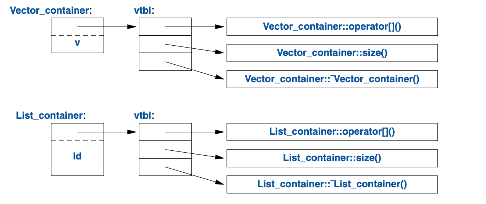

<a class="en-page-number" id="47"></a>

<div class="chapter-number"><p class="chapter-number">{{ page.ch }}</p></div>

# 类

> 那些类型并不“抽象”，
>
> 它们跟`int`和`float`一样真实。
>
> —— 道格·麦克罗伊

## 4.1 导言 {#introduction}

本章及后续三章在避免牵涉过多细节的情况下，说明C++对抽象和资源管理的支持：

- 本章简略地介绍定义及使用新类型（用户定义类型）的方式。
    具体而言，介绍了*实体类（concrete class）*、*抽象类（abstract class）*和
    *类层次（class hierarchy）*用到的基本属性、实现技术及语言构造。
- 第5章介绍C++已经给定意义的操作，比如构造函数、析构函数和赋值。
    勾勒出一个规则——把它们综合运用于对象声明期的控制中的规则，
    以实现简洁、高效且完善的资源管理。
- 第6章介绍模板，一种利用（其它）类型和算法把类型和算法参数化的机制。
    作用于用户定义类型和内置类型的运算以函数表示，有时会泛化为
    *模板函数（template function）*及*函数对象（function object）*。
- 第7章是泛型编程底层的概念、技术及语言特性的概览。着重于*概念（concept）*的定义和使用，
    从而精确地给出模板的接口并指导设计。
    *可变参数模板（variadic template）*的问世是为了阐释最通用同时也最灵活的接口。

<a class="en-page-number" id="48"></a>

这语言构造被用于支持大名鼎鼎的*面向对象编程（object-oriented programming）*和
*泛型编程（generic programming）*。随后的第8-15章给出标准库的示例及应用。

C++的主要语言构造是*类（class）*。类是用户定义类型，在程序代码中代表某个概念。
每当程序的设计中出现一个概念、构想或实体等，我们就试图用一个类去代表它，
使其现身于代码，而不仅仅存在于脑子、设计文档或注释里。借助一套精选的类构建程序，
远比直接用内置类型来得容易理解和稳妥。尤其是，库通常以类呈现。

除类基本类型、运算符和语句之外的所有语言构造，从本质上讲，都是用来辅助定义更好且更好用的类。
“更好”的意思是更准确、更易于维护、更高效、更优雅、更顺手、更具可读性、更符合直觉。
多数编程技术有赖于特定种类的类的设计和实现。程序员的意愿和品味是天差地别。
因此对类的支援近乎广阔无边。此处仅介绍对三种重要的类的支援：

- 实体类(§4.2)
- 抽象类(§4.3)
- 类层次中的类(§4.2)

浩如烟海有用的类可被归为其中一种。还有更多的类是它们的轻微变种或者用它们组合出来的。

## 4.2 实体类型 {#concrete-type}

*实体类（concrete class）*的基本意图是，其表现“恰如内置类型”。
例如：复数类和无限精度的整数类都非常类似于内置的`int`，当然，它们各自特色的语意和运算除外。
与之类似，`vector`和`string`都类似于内置的数组，但却青出于蓝(§9.2, §10.3, §11.2)。

实体类型在定义方面的特征是：它的<span title="请原谅我硬搞出来一个词，因为它在本章出现了太多次。其实按我的理解，更合理的说法是“用到的所有数据”，本质上是在说“数据”，可是仅译成“数据”容易跟“data”混淆；而“representation”在这是名词“表示”的意思，说成“用到的所有数据的表示”又太拗口。如果改成“数据表示”，容易被误会成主谓短语，用在句子的语境中，容易引起误解；改成“表示数据”又容易被误会成动宾短语，引发类似的误解。所以我把“表示”改成了“表征”，这样无论理解成“名词+名词”还是“形容词+名词”的偏正短语，意思都是“什么什么样的数据”，同时还能跟单纯的“数据（data）”区分开来。">表征数据（representation）</span>[^1]位于定义之中。
在大量重要的案例中，比如`vector`，其表征数据是一个或多个指针——指向存储在别处的数据，
但其表征数据却呈现在实体类的每个对象之中。这让实现在运行时间和存储空间方面都效率上佳。
具体来说，它允许我们：

- 把实体类型的对象放在栈上、静态分配的内存里，以及其它对象中(§1.5)；
- 直接使用该对象（而非经由指针或引用）；
- 立即且完整地初始化对象（比如利用构造函数; §2.3），以及
- 复制或转移对象(§5.2)。

表征数据可以私有（像`Vector`的情形; §2.3）且仅允许通过成员函数访问，
但它的存在是毫无疑问的。因此，一旦表征数据有任何实质性的变动，
用户就必须重新编译。这是让实体类型跟内置类型行为一致的必要代价。

<a class="en-page-number" id="49"></a>

对于不常更改的类型，以及局部变量给出了迫切需要的明确性和高效性的情形，
这可取甚至备受青睐。为增强灵活性，实体类型可以把其表征数据的绝大部分放在
自由存储区（动态内存，堆）里，并借由位于类对象内的部分进行存取。`vector`和`string`
就是这样实现的；可视作具有精雕细琢接口的资源操控器（resource handle）。

### 4.2.1 算术类型 {#an-arithmetic-type}

“经典的用户定义算术类型”是`complex`：

```cpp
class complex {
    double re, im;      // 表征数据：两个double
public:
    complex(double r, double i) :re{r}, im{i} {}    // 用两个标量构造complex
    complex(double r) :re{r}, im{0} {}              // 用一个标量构造complex
    complex() :re{0}, im{0} {}                      // complex的默认值：{0,0}

    double real() const { return re; }
    void real(double d) { re=d; }
    double imag() const { return im; }
    void imag(double d) { im=d; }

    complex& operator+=(complex z)
    {
        re+=z.re;       // 加至re和im
        im+=z.im;
        return *this;   // 返回结果
    }

    complex& operator-=(complex z)
    {
        re-=z.re;
        im-=z.im;
        return *this;
    }

    complex& operator*=(complex);   // 定义在类外某处
    complex& operator/=(complex);   // 定义在类外某处
};
```

这是个略微简化版本的标准库`complex`(§14.4)。类定义本身仅包含特定运算
——那些需要访问表征数据的。表征数据直白且常规。由于实用性原因，
它必须兼容 Fortran 60年前定义的版本，所以需要一套常规运算。
除逻辑方面的要求之外，`complex`还必须高效，否则没什么用。
这意味着简单的运算必须内联。就是说简单运算（比如构造函数、`+=`和`imag()`）的实现，
在机器语言里不能有函数调用。在类里定义的函数，默认就是内联的。
也可以显式要求内联——在函数声明前使用关键字`inline`。

<a class="en-page-number" id="50"></a>

具备工业强度的`complex`（比如标准库里那个）在是否内联方面的权衡很谨慎。

可以无参数调用的构造函数叫*默认构造函数（default constructor）*。
所以`complex()`就是`complex`的默认构造函数。定义了默认构造函数的类型，
就消除了未初始化变量的隐患。

返回实部和虚部的函数用了说明符`const`，意思是通过某个对象调用时，
此函数不会修改该对象。`const`成员函数既可以通过`const`对象也可以通过非`const`对象调用，
但是非`const`成员函数只能通过非`const`对象调用。例如：

```cpp
complex z = {1,0};
const complex cz {1,3};
z = cz;                 // OK：赋值给非const变量
cz = z;                 // 错误：complex::operator=()是个非const成员函数
double x = z.real();    // OK: complex::real() 是个const成员函数
```

很多有用的运算无需直接访问`complex`的表征数据，因此可以与类定义分开：

```cpp
complex operator+(complex a, complex b) { return a+=b; }
complex operator-(complex a, complex b) { return a-=b; }
complex operator-(complex a) { return {-a.real(), -a.imag()}; } // 一元负号
complex operator*(complex a, complex b) { return a*=b; }
complex operator/(complex a, complex b) { return a/=b; }
```

本例中，因为参数传值，所以修改参数不会影响调用者的副本，还可以把修改的结果作为返回值。

`==`和`!=`就很直白了：

```cpp
bool operator==(complex a, complex b)   // 相等
{
    return a.real()==b.real() && a.imag()==b.imag();
}
bool operator!=(complex a, complex b)   // 不等
{
    return !(a==b);
}
complex sqrt(complex);      // 定义在别处
// ...
```

`complex`类可以这样用：

```cpp
void f(complex z)
{
    complex a {2.3};    // 以 2.3 构造 {2.3,0.0}
    complex b {1/a};
    complex c {a+z*complex{1,2.3}};
```

<a class="en-page-number" id="51"></a>

```cpp
    // ...
    if (c != b)
        c = −(b/a)+2*b;
}
```

编译器会把涉及`complex`数值的运算符转换成相应的函数调用。
例如：`c!=b`对应`operator!=(c,b)`，`1/a`对应`operator/(complex{1},a)`。

用户定义的运算符（“重载运算符（overloaded operator）”）应该谨慎且按常规使用。
其语法由语言确定，所以你不能定义出一元的`/`。另外，无法修改内置类型运算符的含义，
所以你不能把`int`的`+`重定义成减法。

### 4.2.2 容器 {#container}

*容器（container）*是承载元素集合的对象。我们把`Vector`称为容器，
因为`Vector`类型的对象是容器。如 §2.3 所定义，`Vector`作为`double`的容器不无道理：
它易于理解，建立了有用的不变式(§3.5.2)，对存取操作提供了区间有效性检查，
提供了`size()`以便在其元素上循环。但是它有个致命的缺陷：它用`new`分配元素，
却从未进行释放。这可糟糕了，因为尽管C++为垃圾回收定义了接口(§5.3)，
却不能保证该接口生效——在将未使用的内存用于新对象方面。某些场景无法使用垃圾回收器，
更常见的情形是，出于逻辑和性能原因，你倾向于对销毁行为做更精细的控制。
我们需要一个机制来确保由构造函数分配的内存得以释放；这个机制是*析构函数（destructor）*：

```cpp
class Vector {
public:
    Vector(int s) :elem{new double[s]}, sz{s}   // 构造函数：申请资源
    {
        for (int i=0; i!=s; ++i)    // 初始化元素
            elem[i]=0;
    }

    ~Vector() { delete[] elem; }    // 析构函数：释放资源

    double& operator[](int i);
    int size() const;
private:
    double* elem;   // elem指向一个数组，该数组承载sz个double
    int sz;
};
```

析构函数的名称是取补运算符`~`后跟类名；它跟构造函数互补。
`Vector`的构造函数用`new`运算符在自由存储区（也叫堆（heap）
或动态存储区（dynamic store））里分配了一些内存。
析构函数使用`delete[]`运算符释放那块内存。
普通`delete`删除单个对象，`delete[]`删除数组。

这些都以不干涉`Vector`用户为前提。用户仅仅创建并使用`Vector`，就像对内置类型一样。例如：

<a class="en-page-number" id="52"></a>

```cpp
void fct(int n)
{
    Vector v(n);
    // ... 使用 v ...
    {
        Vector v2(2*n);
        // ... 使用 v 和 v2 ...
    } // v2 在此被销毁
    // ... 使用 v ..
} // v 在此被销毁
```

像`int`和`char`等内置类型一样，`Vector`遵循命名、作用域、内存分配、生命期等的规则(§1.5)。
此处的`Vector`版本为简化而略掉了错误处理；参见 §3.5。

构造函数/析构函数 这对组合是很多优雅技术的根基。
确切的说，它是C++大多数资源管理技术(§5.3, §13.2)的根基。考虑如下的`Vector`图示：


构造函数分配这些元素并适当初始化`Vector`的成员变量们。析构函数释放这些元素。
这个*数据操控器模型（handle-to-data model）*特别常见，
用于在对象生命期内管理可变容量的数据。这个构造函数申请资源、析构函数释放资源
的技术叫做*资源请求即初始化（Resource Acquisition Is Initialization）*
或者RAII，为我们消灭“裸的`new`操作”，就是说，避免在常规代码中进行内存分配，
将其隐匿于抽象良好的实现中。与之类似，“裸的`delete`操作”也要避免。
避免裸`new`和裸`delete`，能大大降低代码的出错率，也更容易确保不会资源泄漏(§13.2)。

### 4.2.3 初始化容器 {#initializing-container}

容器的作用是承载元素，因此很明显需要便利的方法把元素放入容器。
可以用合适的元素数量创建`Vector`，然后给这些元素赋值，但一般来说，其它方法更优雅。
此处介绍两种受到青睐的风格：

- *初始化列表构造函数（initializer-list constructor）*： 用一个元素列表进行初始化。
- `push_back()`：在序列的末尾（在后方（back））添加一个新元素。

它们可以这样声明：

```cpp
class Vector {
public:
    Vector(std::initializer_list<double>);  // 用一个double列表初始化
    // ...
    void push_back(double);                 // 在末尾新增元素，把容量加一
    // ...
};
```

<a class="en-page-number" id="53"></a>

在输入任意数量元素的时候，`push_back()`很有用，例如：

```cpp
Vector read(istream& is)
{
    Vector v;
    for (double d; is>>d; )     // read floating-point values into d
        v.push_back(d);         // add d to v return v;
}
```

循环的终止条件是文件终止或格式错误。在终止之前，每个读入的数字都被添加到`Vector`，
因此在函数结束的时候，`v`的容量是读入的元素数量。
我用了`for`循环，而非按惯例的`while`循环，目的是把`d`的作用域限制在循环内。
可以为`Vector`定义一个转移构造函数，以便在`read()`返回大量数据时的运行成本低廉，
§5.2.2 阐释此内容：

```cpp
Vector v = read(cin);   // 此处未对Vector的元素进行复制
```

`std::vector`提供的`push_back()`即其它修改`vector`容量的高效方式，详见§11.2。

用于定义初始化列表构造函数的`std::initializer_list`是个标准库中的类型，为编译器熟知：
当我们用`{}`列表，诸如`{1,2,3,4}`的时候，编译器会为程序创建一个`initializer_list`对象。
因此可以这样写：

```cpp
Vector v1 = {1,2,3,4,5};            // v1有5个元素
Vector v2 = {1.23, 3.45, 6.7, 8};   // v2有4个元素
```

`Vector`的初始化列表构造函数可能长这样：

```cpp
Vector::Vector(std::initializer_list<double> lst)   // 用列表初始化
    :elem{new double[lst.size()]}, sz{static_cast<int>(lst.size())}
{
    copy(lst.begin(),lst.end(),elem);               // 从lst复制到elem(§12.6)
}
```

很遗憾，标准库为容量和下标选择了`unsigned`整数，所以我得用丑陋的`static_cast`
把初始化列表的容量显式转换成`int`。
这个选择简直迂腐，因为手写列表的元素数量基本不会超出有符号整数的上限
（16位整数是32,767，32位整数是2,147,483,647）。
但是类型系统没有常识。它仅仅知道变量可能的值范围，而非实际的值，所以即便实际上没违反规则，
它依然要牢骚不断。这种警告偶尔能帮程序员避免糟糕的失误。

`static_cast`不对它转换的值进行检查；它信任程序员能运用得当。
可它也总有走眼的时候，所以如果吃不准，检查一下值。
显式类型转换（通常也叫*强制类型转换（cast）*，以提醒你，它也会帮倒忙）应该尽可能不用。
尽量仅在系统底层使用不带检查的类型转换。它们极易出错。

还有两种类型转换分别是：`reinterpret_cast`，它简单地把对象当作一连串字节对待；
`const_cast`用于“转掉`const`限制”。
对类型系统的审慎运用和设计良好的库，有助于在高层的软件中消除不带检查的类型转换。

<a class="en-page-number" id="54"></a>

## 4.3 抽象类型 {#abstract-type}

`complex`和`Vector`这些被称为实体类型，因为其表征数据是其定义的一部分。
因此，它们像内置类型。相反，*抽象类型（abstract type）*是把用户和实现细节隔绝开的类型。
为此，要把接口和表征数据解耦开来，并不能再拥有纯局部变量。
既然不知道抽象类的表征数据的任何信息（甚至其容量），
就只能把它的对象分配在自由存储区(§4.2.2)，并通过引用或指针访问它们(§1.7, §13.2.1)。

首先，我们定义`Container`类的接口，我们将把它设计成`Vector`的更抽象版本：

```cpp
class Container {
public:
    virtual double& operator[](int) = 0;    // 纯虚函数
    virtual int size() const = 0;           // const 成员函数 (§4.2.1)
    virtual ~Container() {}                 // 析构函数 (§4.2.2)
};
```

该类是一个用于描述后续容器的纯接口。
`virtual`这个词的意思是“后续可能在从此类派生的类中被重新定义”。
用`virtual`声明的函数自然而然的被称为*虚函数（virtual function）*。
从`Container`派生的类为`Container`接口提供实现。
古怪的`=0`语法意思是，该函数是*纯虚的*；就是说，某些继承自`Container`的类*必须*定义该函数。
因此，根本无法定义出一个仅仅是`Container`类型的对象。例如：

```cpp
Container c;                                // 报错：抽象类没有自己的对象
Container* p = new Vector_container(10);    // OK：Container作为接口使用
```

`Container`只能用做作接口，服务于那些为其`operator[]()`和`size()`函数提供实现的类。
带有虚函数的类被称为*抽象类（abstract class）*。

`Container`可以这样用：

```cpp
void use(Container& c)
{
    const int sz = c.size();

    for (int i=0; i!=sz; ++i)
        cout << c[i] << '\n';
}
```

请注意`use()`在使用`Container`接口时对其实现细节一无所知。它用到`size()`和`[ ]`，
却不知道为它们提供实现的是什么类型。
如果一个类为诸多其它类定义接口，通常被称为*多态类型（polymorphic type）*。

如抽象类常见的那样，`Container`也没有构造函数。毕竟它不需要初始化数据。
另一方面，`Container`实实在在有一个析构函数，并且还是`virtual`的，
以便继承自`Container`的类去实现它。
对于抽象类这也是常见的，因为它们往往通过引用或指针进行操作，
而借由`Container`指针销毁其对象的人，根本不清楚其实现用到了哪些资源。

<a class="en-page-number" id="55"></a>

抽象类`Container`仅仅定义接口，没有实现。想让它发挥作用，
就的弄一个容器去实现其接口规定的那些函数。为此，可以使用一个实体类`Vector`:

```cpp
class Vector_container : public Container { // Vector_container 实现了 Container
public:
    Vector_container(int s) : v(s) { }      // s个元素的Vector
    ~Vector_container() {}

    double& operator[](int i) override { return v[i]; }
    int size() const override { return v.size(); }
private:
    Vector v;
};
```

`:public`可以读作“派生自”或者“是……的子类型”。我们说`Vetor_container`*派生（derived）*
自`Container`，并且`Container`是`Vetor_container`的*基类（base）*。
还有术语把`Vetor_container`和`Container`分别称为*子类（subclass）*和*亲类（superclass）*。
我们说派生类继承了其基类的成员，所以这种基类和派生类的关系通常被称为*继承（inheritance）*。

我们这里的`operator[]()`和`size()`*覆盖（override）*了基类`Container`中对应的成员。
我明确使用`override`表达了这个意向。这里的`override`可以省略，但是明确使用它，
可以让编译器查错，比如函数名拼写错误，或者`virtual`函数和被其覆盖的函数之间的细微类型差异等等。
明确使用`override`，在较大的类体系中格外有用，否则就难以搞清楚覆盖关系。

这里的析构函数（`~Vector_container()`）覆盖了基类的析构函数（`~Container()`）。
请注意，其成员的析构函数（`~Vector`）被该类的析构函数（`~Vector_container()`）隐式调用了。

对于`use(Container&)`这类函数，可以使用`Container`而无视其实现细节，
其它函数要负责创建它操作的具体对象。例如：

```cpp
void g()
{
    Vector_container vc(10); // 十个元素的Vector
    // ... 填充 vc ...
    use(vc);
}
```

由于`use()`只了解`Container`接口而非`Vector_container`，
它就可以对`Container`的其它实现同样有效。例如：

```cpp
class List_container : public Container { // List_container implements Container
public:
    List_container() { }    // empty List
    List_container(initializer_list<double> il) : ld{il} { }
    ~List_container() {}
```

<a class="en-page-number" id="56"></a>

```cpp
    double& operator[](int i) override;
    int size() const override { return ld.size(); }
private:
    std::list<double> ld;   // double类型的（标准库）列表 (§11.3)
};

double& List_container::operator[](int i)
{
    for (auto& x : ld) {
        if (i==0)
            return x;
        −−i;
    }
    throw out_of_range{"List container"};
}
```

此处的表征数据是标准库的`list<double>`。一般来说，我不会给使用`list`的容器实现取下标操作，
因为`list`取下标操作的性能比`vector`差得一塌糊涂。但我在这里想展示的是一个略偏激的实现。

某函数可以创建一个`List_container`，然后让`use()`去使用它：

```cpp
void h()
{
    List_container lc = { 1, 2, 3, 4, 5, 6, 7, 8, 9 };
    use(lc);
}
```

这里的重点是，`use(Container&)`不知道其参数是`Vector_container`、`List_container`，
还是什么其他容器类型；它也不需要知道。
它可以使用任何种类的`Container`。它仅知晓`Container`定义的接口。
因此，就算是`List_container`的实现发生改变，甚至是使用一个全新的派生自`Container`的类，
`use(Container&)`也不需要重新编译。

这种灵活性的反面是：必须通过指针或引用去操作对象(§5.2, §13.2.1)。

## 4.4 虚函数 {#virtual-function}

复习一下`Container`的用法：

```cpp
void use(Container& c)
{
    const int sz = c.size();

    for (int i=0; i!=sz; ++i)
        cout << c[i] << '\n';
}
```

`use()`中的`c[i]`调用是怎么解析到对应的`operator[]()`呢？
当`h()`调用`use()`，`List_container`的`operator[]()`必须被调用。
`g()`调用`use()`，`Vector_container`的`operator[]()`必须被调用。

<a class="en-page-number" id="57"></a>

想要实现这种解析，`Container`对象必须包含某种信息，以便能够在运行时找到正确的函数供调用。
常见的编译器实现技术是，编译器把虚函数的名称转换成一个索引，对应进一个函数指针表格中。
这个表格通常被称为*虚函数表（virtual function table）*，或者简称`vtbl`。
每个带有虚函数的类都有自己的`vtbl`以确认其虚函数。这可以图示如下：



`vtbl`中的函数能够让对象被正确地使用，即便调用者对该对象的容量及其数据布局全都一无所知。
调用者的实现仅需要知道`Container`中指向`vtbl`指针的位置，以及每个用到的虚函数的索引。
虚函数调用机制几乎能做到与“常规函数调用”机制同样高效（性能差别不到25%）。
其空间消耗是每个带有虚函数的类的对象一个指针，再加上每个类一个`vtbl`。

## 4.5 类层次 {#class-hierarchy}

`Container`是个很简要的类层次示例。*类层次（class hierarchy）*是一组类，
通过派生（比如 `: public`）创建，按棱形格次序排列。类层次用来表示具有层次关系的概念。
比如“消防车是一种卡车，卡车是一种车”，以及“笑脸图是一种圆圈，圆圈是一种图形”。
巨大的，具有成百上千个类，还即深又宽的类体系也属平常。
作为一个部分真实的经典案例，考虑一下屏幕上的形状：


箭头代表继承关系。例如：`Circle`类派生自`Shape`类。

<a class="en-page-number" id="58"></a>

习惯上，类层次把最基础的类作为根，自上而下向派生（定义更晚）类生长。
为了用代码表示这个简单的图示，就必须先声明一个类，以定义所有类型的通用属性：

```cpp
class Shape {
public:
    virtual Point center() const =0;    // 纯虚函数
    virtual void move(Point to) =0;

    virtual void draw() const = 0;      // 在“画布”上绘制
    virtual void rotate(int angle) = 0;

    virtual ～Shape() {}                // 析构函数
    // ...
};
```

自然而然的，该接口是个抽象类：就所关注的表征数据，对于各种`Shape`而言，
（除指向`vtbl`位置的指针之外）*毫无（nothing）*共同之处。
根据这个定义，可以写一个通用的函数，用来操纵一个vector，其元素是指向图形的指针：

```cpp
void rotate_all(vector<Shape*>& v, int angle)   // 把v的元素旋转给定角度
{
    for (auto p : v)
        p−>rotate(angle);
}
```

要定义特定的图形，必须指明它是个`Shape`，定义它特有的属性（包括其虚函数）：

```cpp
class Circle : public Shape {
public:
    Circle(Point p, int rad);       // 构造函数

    Point center() const override
    {
        return x;
    }
    void move(Point to) override
    {
        x = to;
    }

    void draw() const override;
    void rotate(int) override {}    // 优美且简洁的算法
private:
    Point x;    // 圆心
    int r;      // 半径
};
```

截至目前，`Shape`和`Circle`的例子于`Container`相比，还没有什么亮点，请接着往下看：

<a class="en-page-number" id="59"></a>

```cpp
class Smiley : public Circle {  // 用圆圈作为笑脸的基类
    public:
    Smiley(Point p, int rad) : Circle{p,rad}, mouth{nullptr} { }
    ~Smiley() {
        delete mouth;
        for (auto p : eyes)
            delete p;
    }

    void move(Point to) override;
    void draw() const override;
    void rotate(int) override;

    void add_eye(Shape* s)
    {
        eyes.push_back(s);
    }
    void set_mouth(Shape* s);
    virtual void wink(int i);   // 让第i只眼做“飞眼”
    // ...
private:
    vector<Shape*> eyes;        // 一般是两只眼睛
    Shape* mouth;
};
```

`vector`的成员函数`push_bach()`把参数复制进`vector`（这里是`eyes`），
成为末尾的元素，且把该 vector 的容量增一。

现在，可以调用`Smiley`的基类及其成员变量的那些`draw()`函数来定义`Smiley::draw()`了：

```cpp
void Smiley::draw() const
{
    Circle::draw();
    for (auto p : eyes)
        p−>draw();
    mouth−>draw();
}
```

请注意，`Smiley`把它的眼睛保存在一个标准库的`vector`里，并在析构函数中把它们销毁。
`Shape`的析构函数是`virtual`的，而`Smiley`又覆盖了它。
虚析构函数对于抽象类来说是必须的，因为对派生类的对象操控，通常是借由其抽象基类提供的接口进行的。
确切的说，它可能是通过其基类的指针被销毁的。然后，虚函数调用机制确保适当的那个析构函数被调用。
该析构函数则会隐式调用其基类的虚构函数，以及它成员变量的析构函数。

<a class="en-page-number" id="60"></a>

在这个简化过的例子中，把眼睛和嘴巴准确放置到代表脸的圆圈中，是程序员的的任务。

在一派生方式定义一个新类时，我们可以添加新的 成员变量 或/和 运算。这带来了极佳的灵活性，
同时又是词不达意和不良设计的温床。

### 4.5.1 层次的益处 {#benefits-from-hierarchies}

类的层次结构有两个益处：

- *接口继承（interface inheritance）*：派生类对象可用于任何基类对象胜任的位置。
    就是说，基类充当了派生类的接口。`Container`和`Shape`这两个类就是例子。这种类通常是抽象类。

- *实现继承（implementation inheritance）*：基类的函数和数据直接就是派生类实现的一部分。
    `Smiley`对`Circle`的构造函数、`Circle::draw()`的调用就是这方面的例子。
    这种基类通常具有成员变量和构造函数。

实体类——尤其是带有少量表征数据那些——跟内置类型非常类似：通常作为局部变量定义，通过名称进行访问，
把它们复制来复制去的，凡此种种。位于类层次结构中那些就不一样了：
通常用`new`把它们分配在自由存储区中，借由指针或引用访问它们。
举个例子，有这么个函数，它从输入流读取数据，用于描述图形，然后构造对应的`Shape`对象：

```cpp
enum class Kind { circle, triangle, smiley };

Shape* read_shape(istream& is)  // 从输入流is读取图形描述
{
    // ... 从 is 读取图形概要信息，找到其类型（Kind） k ...

    switch (k) {
    case Kind::circle:
        // 把圆圈的数据 {Point,int} 读取到p和r
        return new Circle{p,r};
    case Kind::triangle:
        // 把三角形的数据 {Point,Point,Point} 读取到p1、p2、和p3
        return new Triangle{p1,p2,p3};
    case Kind::smiley:
        // 把笑脸的数据 {Point,int,Shape,Shape,Shape} 读取到p、r、e1、e2、和m
        Smiley* ps = new Smiley{p,r};
        ps−>add_eye(e1);
        ps−>add_eye(e2);
        ps−>set_mouth(m);
        return ps;
    }
}
```

某个程序可以这样使用此图形读取器：

<a class="en-page-number" id="61"></a>

```cpp
void user()
{
    std::vector<Shape*> v;
    while (cin)
        v.push_back(read_shape(cin));
    draw_all(v);        // 为每个元素调用 draw()
    rotate_all(v,45);   // 为每个元素调用 rotate(45)
    for (auto p : v)    // 别忘了销毁元素（指向的对象）
        delete p;
}
```

显而易见，该例被简化过了——尤其是错误处理相关的内容——但它清晰地表明了，`user()`函数对其
所操纵图形的类型一无所知。`user()`的代码仅需要编译一次，在程序加入新的`Shape`之后继续使用。
请留意，没有任何图形的指针流向了`user()`之外，因此`user()`就要负责回收它们。
这通过运算符`delete`完成，且严重依赖于`Shape`的虚析构函数。因为该虚构函数是虚的，
`delete`调用的是距基类最远的派生类里的那个。
这至关重要，因为可能获取了各式各样有待释放的资源（比如<span title="一般翻译为“文件句柄”，我很讨厌“句柄”这词，它让我在初学Windows编程时困惑了很久，我在实践了一段时间之后，慢慢理解到，这个英文 “handle” 是很直白的，意思就是“把手”，我觉得翻译成“把手”要比“句柄”好得多。&#10;参阅了[为什么handle会被翻译成句柄？ - 薛非的回答 - 知乎](https://www.zhihu.com/question/22950899/answer/25197413)后，我决定改一个基本能望文生义的两字词汇去替代“句柄”，“handle” 本义的“柄”作为名词词尾保留，同时不使用常见单词，因为会导致“难以作为关键词搜索”的问题。首字存在多个备选：&#10;&#10;“操”，取自“操作”一词，感觉最适宜，但因为有人把“操”污名化出“肏”的意义，为免给用户带来“解释吧，没必要；不解释吧，又让文盲耻笑”的困境，不得不忍痛放弃了；&#10;“持”，初望难免有“静止不动”的意味（例如“僵持”），不合适；&#10;“握”，太直白，容易跟常规词汇冲突。&#10;&#10;最后考虑了“执柄”，“执”乍看就是拿着，后续可以动也可以不动，有成词但不常见，故选它，希望初次接触这个概念的人不至于太过困惑。">文件执柄</span>[^2]、锁及输出流）。
在本例中，`Smiley`要删除其`eyes`和`mouth`的对象。删完这些之后，它又去调用`Circle`的析构函数。
对象的构建通过构造函数“自下而上”（从基类开始），而销毁通过虚构函数“从顶到底”（从派生类开始）。

### 4.5.2 层次辨向 {#hierarchy-navigation}

`read_shape()`函数返回`Shape*`，以便我们对所有`Shape`一视同仁。
但是，如果我们想调用某个派生类特有的函数，比方说`Smiley`里的`wink()`，该怎么办呢？
我们可以用`dynamic_cast`运算符问这个问题“这个`Shape`对象是`Smiley`类型的吗？”：

```cpp
Shape* ps {read_shape(cin)};

if (Smiley* p = dynamic_cast<Smiley*>(ps)) {    // ... ps指向一个 Smiley 吗？ ...
    // ... 是 Smiley；用它
}
else {
    // ... 不是 Smiley，其它处理 ...
}
```

在运行时，如果`dynamic_cast`的参数（此处是`ps`）指向的对象不是期望的类型（此处是`Smiley`）
或其派生类，`dynamic_cast`就返回`nullptr`。

当一个指向非期望派生类对象的指针作为参数可接受时，我们把`dynamic_cast`用于指针类型。
然后测试结果是否为`nullptr`。该测试通常放置于条件表达式的初始化参数位置，很便捷。

如果非期望类型不可接受，我们就直接把`dynamic_cast`用于引用类型。
如果该对象不是期望的类型，`dynamic_cast`抛出一个`bad_cast`异常：

```cpp
Shape* ps {read_shape(cin)};
Smiley& r {dynamic_cast<Smiley&>(*ps)}; // 某处可以捕捉到 std::bad_cast
```

有节制地使用`dynamic_cast`可以让代码整洁。

<a class="en-page-number" id="62"></a>

如果能避免用到类型信息，就可以写出简洁且高效的代码，但丢掉的类信息系偶尔必须被找回来。
这种情况的发生，通常是我们把对象传给了一个系统，该系统通过某个特定基类的接口接收这个对象。
当这个系统后续把这个对象传回来时，我们可能要找回原始类型。类似于`dynamic_cast`的
运算被称为“是……类别”或者“是……实例”运算。

### 4.5.3 避免资源泄漏 {#avoiding-resource-leaks}

有阅历的程序员可能注意到了我有三个纰漏：

- `Smiley`的实现可能在`delete`指向`mouth`的指针时出错
- `read_shape()`的用户可能忘记`delete`返回的指针
- `Shape`指针容器的所有者可能忘记`delete`它们指向的对象

从这个意义上讲，指向自由存储区中对象的指针是危险的：
“直白老旧的指针（plain old pointer）”不该用于表示所有权。例如：

```cpp
void user(int x)
{
    Shape∗ p = new Circle{Point{0,0},10};
    // ...
    if (x<0) throw Bad_x{}; // 资源泄漏潜在危险
    if (x==0) return;       // 资源泄漏潜在危险
    // ...
    delete p;
}
```

除非`x`为正，否则就会资源泄漏。把`new`的结果赋值给“裸指针”就是自找麻烦。

这类问题有一个简单的解决方案，在需要释放操作时，使用标准库的`unique_prt`(§13.2.1) 而非“裸指针”：

```cpp
class Smiley : public Circle {
    // ...
private:
    vector<unique_ptr<Shape>> eyes; // 一般是两只眼睛
    unique_ptr<Shape> mouth;
};
```

这是一个关于简洁、通用、高效的资源管理(§5.3)技术的示例。

这个修改有个良性的副作用：我们不需要再为`Smiley`定义析构函数了。
编译器会隐式生成一个，以便将`vector`中的`unique_ptr`(§5.3)销毁。
使用`unique_ptr`的代码跟用裸指针的通用高效。

重新审视`read_shape()`的使用：

```cpp
unique_ptr<Shape> read_shape(istream& is) // 从输入流is读取图形描述
{
    // ... 从 is 读取图形概要信息，找到其类型（Kind） k ...
```

<a class="en-page-number" id="63"></a>

```cpp

    switch (k) {
    case Kind::circle:
        // 把圆圈的数据 {Point,int} 读取到p和r
        return unique_ptr<Shape>{new Circle{p,r}};
    // ...
}

void user()
{
    vector<unique_ptr<Shape>> v;
    while (cin)
        v.push_back(read_shape(cin));
    draw_all(v);        // 为每个元素调用 draw()
    rotate_all(v,45);   // 为每个元素调用 rotate(45)
} // 所有 Shape 都隐式销毁了
```

现在每个对象都被一个`unique_ptr`持有，在它被不再被需要，
也就是`unique_ptr`离开作用域的时候，就会销毁其持有的对象。

要让`unique_ptr`版本的`user()`正常运作，就需要能够接受`vector<unique_ptr<Shape>>`
版本的的`draw_all()`和`rotate_all()`。
写很多这种`_all()`函数很烦冗，所以 §6.3.2 会介绍一个替代方案。

## 4.6 忠告 {#advice}

- [1] 用代码直接表达意图；§4.1; [CG: P.1]。
- [2] 实体类型是最简单的类。情况许可的时候，优先用实体类，
    而非更复杂的类或者普通的数据结构体§4.2; [CG: C.10]。
- [3] 用实体类去表示简单的概念；§4.2。
- [4] 在对性能要求严苛的组件上，优先用实体类，而别选择类层次；§4.2。
- [5] 定义构造函数去处理对象的初始化；§4.2.1, §5.1.1; [CG: C.40] [CG: C.41]。
- [6] 只在需要直接访问类的表征数据的时候，才把一个函数定义为成员函数；§4.2.1; [CG: C.4]。
- [7] 自定义运算符的主要用途应该是模拟传统运算；§4.2.1; [CG: C.160]。
- [8] 为对称运算符使用非成员函数；§4.2.1; [CG: C.161]。
- [9] 不修改对象状态的成员函数，定义为`const`；§4.2.1。
- [10] 如果构造函数申请了资源，这个类就需要虚构函数去释放这个资源；§4.2.2; [CG: C.20]。
- [11] 避免使用“裸的”`new`和`delete`操作；§4.2.2; [CG: R.11]。
- [12] 利用资源操控器和 RAII 去管理资源；§4.2.2; [CG: R.1]。
- [13] 如果类是容器，请给它定义一个初始化列表构造函数；§4.2.3; [CG: C.103]。
- [14] 需要接口和实现完全分离的时候，用抽象类作为接口；§4.3; [CG: C.122]。
- [15] 通过指针和引用访问多态对象；§4.3。
- [16] 抽象类通常不需要构造函数；§4.3; [CG: C.126]。
- [17] 对具有与生俱来层次结构的概念，使用类层次结构表示它们；§4.5。

<a class="en-page-number" id="64"></a>

- [18] 带有虚函数的类，应该定义虚析构函数；§4.5; [CG: C.127]。
- [19] 在较大的类层次中，显式用`override`进行覆盖；§4.5.1; [CG: C.128]。
- [20] 设计类层次的时候，要分清实现继承和接口继承；§4.5.1; [CG: C.129]。
- [21] 在不可避免要在类层次中进行辨别的时候，使用`dynamic_cast`；§4.5.2;[CG:C.146]。
- [22] 当“转换目标不属于所需的类”需要报错时，就把`dynamic_cast`用于引用类型；
    §4.5.2; [CG: C.147]。
- [23] 如果“转换目标不属于所需的类”可接受，就把`dynamic_cast`用于指针类型；
    §4.5.2; [CG: C.148]。
- [24] 对于通过`new`创建的对象，用`unique_prt`和`shared_prt`避免忘记`delete`；
    §4.5.3; [CG: C.149]。

[^1] 请原谅我硬搞出来一个词，因为它在本章出现了太多次。其实按我的理解，更合理的说法是
“用到的所有数据”，本质上是在说“数据”，可是仅译成“数据”容易跟“data”混淆；
而“representation”在这是名词“表示”的意思，说成“用到的所有数据的表示”又太拗口。
如果改成“数据表示”，容易被误会成**主谓短语**，用在句子的语境中，容易引起误解；
改成“表示数据”又容易被误会成**动宾短语**，引发类似的误解。所以我把“表示”改成了“表征”，
这样无论理解成“名词+名词”还是“形容词+名词”的**偏正短语**，意思都是“什么什么样的数据”，
同时还能跟单纯的“数据（data）”区分开来。—— 译者注

[^2] 一般翻译为“文件句柄”，我很讨厌“句柄”这词，它让我在初Windows编程时困惑了很久，
我在实践了一段时间之后，慢慢理解到，这个英文**handle**是很直白的，意思就是“把手”，
我觉得翻译成“把手”要比“句柄”好得多。
参阅了[[为什么handle会被翻译成句柄？ - 薛非的回答 - 知乎]](https://www.zhihu.com/question/22950899/answer/25197413)后，
我决定改一个基本能望文生义的两字词汇去替代“句柄”，**handle**本义的“柄”作为名词词尾保留，
同时不使用常见单词，因为会导致“难以作为关键词搜索”的问题。首字存在多个备选：

- “操”，取自“操作”一词，感觉最适宜，但因为有人把“操”污名化出“肏”的意义，
    为免给用户带来“解释吧，没必要；不解释吧，又让文盲耻笑”的困境，不得不忍痛放弃了；
- “持”，初望难免有“静止不动”的意味（例如“僵持”），不合适；
- “握”，太直白，容易跟常规词汇冲突；

最后考虑了“执柄”，“执”乍看就是拿着，后续可以动也可以不动，有成词但不常见，故选它，
希望初次接触这个概念的人不至于太过困惑。—— 译者注
