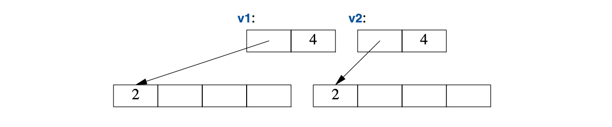

<a class="en-page-number" id="65"></a>

<div class="chapter-number"><p class="chapter-number">{{ page.ch }}</p></div>

# 基本操作

> 如果有人说
>
> “我想要一种编程语言，
>
> 不论什么功能，只要许个愿就行”，
>
> 给他个棒棒糖吧。
>
> <span title="出自文章《Epigrams on Programming》：https://en.wikipedia.org/wiki/Epigrams_on_Programming">—— Alan Perlis</span>[^1]

## 5.1 导言 {#introduction}

有些操作，比如初始化、赋值、拷贝和移动，从语言规则所做假设的角度，属于基础操作。
而其它一些，比如`==`和`<<`，其意义约定俗成，不遵从这种约定，麻烦就大了。

### 5.1.1 基本操作 {#essential-operations}

在众多设计中，对象的构建至关重要。
其用法的多样性体现在语言特性在初始化操作所支持的广度和灵活性上。

类型的构造函数、析构函数以及拷贝、转移这些操作，逻辑关系盘根错节。
定义它们的时候一定要彼此配合，否则就会有逻辑或者性能上的问题。

<a class="en-page-number" id="66"></a>

如果一个类`X`有析构函数，且其作用非同小可，比如自由存储区资源回收或者释放锁，
那这个类很可能就需要整一个全活了：

```cpp
class X {
public:
    X(Sometype)             // “常规构造函数”：创建对象
    X();                    // 缺省构造函数
    X(const X&)             // 拷贝构造函数
    X(X&&);                 // 移动构造函数
    X& operator=(const X&); // 拷贝赋值：清理目标对象并拷贝
    X& operator=(X&&);      // 移动赋值：清理目标对象并移动
    ～X();                  // 析构函数：清理资源
    // ...
};
```

对象的拷贝和移动有五种情形：

- 赋值给另一个对象
- 为一个对象提供初值
- 作为函数参数
- 作为函数的返回值
- 作为一个异常

赋值操作采用拷贝或者移动运算符。原则上，其它情形均使用拷贝或者构造函数。
不过，拷贝或移动构造函数的调用通常会被优化掉，方法是把初始值直接在该对象上进行构造。例如：

```cpp
X make(Sometype);
X x = make(value);
```

此处，编译器通常把`make()`返回的`X`在`x`上构造；从而消除（“省略”）掉一次拷贝。

除了初始化具名对象和分配在自由存储区上的对象之外，构造函数也被用于临时对象的构造，
以及显式类型转换的实现。

除了“常规构造函数”，以下这些成员函数也会在按需被编译器生成。
如果想显式生成默认实现展示，可以这样：

```cpp
class Y {
public:
    Y(Sometype);
    Y(const Y&) = default;  // 我确定想要默认的拷贝构造函数
    Y(Y&&) = default;       // 以及默认的移动构造函数
    // ...
};
```

如果你显式生成了一部分默认实现，那其它的缺省定义就不会再生成了。

如果某个类具有指针成员变量，那么显式定义拷贝和移动操作通常是比较明智的。
原因是指针可能指向某个资源，需要类去`delete`，这种情况下，默认将成员逐个复制的操作会导致错误。
又或者，这个指针指向的资源，要求类绝对*不能*`delete`。
无论属于哪种情况，代码的读者都需要弄清楚。相关例子，请参阅 §5.2.1。

<a class="en-page-number" id="67"></a>

一个值得力荐的规则（有时候也叫*零规则（the rule of zero）*）是，要么定义全部基础操作，
要么全不定义（全用默认实现）。例如：

```cpp
struct Z {
    Vector v;
    string s;
};

Z z1;       // 默认初始化 z1.v 和 z1.s
Z z2 = z1;  // 默认拷贝 z1.v 和 z1.s
```

本例中，在有需求的情况下，编译器会合成逐成员操作的默认构造函数、拷贝、移动和析构函数，
且语意全都正确。

与`=default`相对，`=delete`用于表示拒绝生成某个操作。
类层次中的基类是个经典的例子，这种情况下，我们要禁止将成员逐个复制的操作。例如：

```cpp
class Shape {
public:
    Shape(const Shape&) =delete;            // 没有拷贝操作
    Shape& operator=(const Shape&) =delete;
    // ...
};

void copy(Shape& s1, const Shape& s2)
{
    s1 = s2;    // 报错：Shape的拷贝操作已移除
}
```

`=delete`会导致被`delete`函数的应用触发编译器报错；
`=delete`可用于屏蔽任何函数，不仅仅是基本成员函数。

### 5.1.2 类型转换 {#conversions}

仅接受单个参数的构造函数定义了源自参数类型的转换。
例如，`complex`(§4.2.1)有个源自`double`的构造函数：

```cpp
complex z1 = 3.14;  // z1 成为 {3.14,0.0}
complex z2 = z1*2;  // z2 成为 z1*{2.0,0} == {6.28,0.0}
```

有时这种隐式转换很适宜，但不总是。例如，`Vector`(§4.2.2)有一个源自`int`的构造函数：

```cpp
Vector v1 = 7; // OK：v1有7个元素
```

这通常都不适宜，标准库的`vector`就禁止`int`到`vector`的“类型转换”。

避免这一问题的途径是仅允许显式“类型转换”；就是说这样定义构造函数：

<a class="en-page-number" id="68"></a>

```cpp
class Vector {
public:
    explicit Vector(int s); // 不会隐式从 int 转换到 Vector
    // ... 
;
```

效果是这样的：

```cpp
Vector v1(7);   // OK： v1 有 7 个元素
Vector v2 = 7;  // 报错：不能从int隐式转换到Vector
```

涉及类型转换到时候，更多的类型与`Vector`相似，而非`complex`，
因此，应该把`explicit`用于单参数的构造函数，除非有理由不用。

### 5.1.3 成员变量初始值 {#member-initializers}

当某个类定义了数据成员，我们应该为其提供默认初始值，这被称为*成员变量默认初始值*。
考虑一下`complex`(§4.2.1)的这个新版本：

```cpp
class complex {
    double re = 0;
    double im = 0;  // 表征数据：两个默认值为 0.0 的 double
public:
    complex(double r, double i) :re{r}, im{i} {}  // 用两个标量构造complex：{r,i}
    complex(double r) :re{r} {}                   // 用一个标量构造complex：{r,0}
    complex() {}                                  // 默认的complex：{0,0}
    // ...
}
```

只要构造函数未给定一个值，就会应用默认值。
这可以简化编码，并有助于避免粗心大意导致的成员变量未初始化。

## 5.2 拷贝和移动 {#copy-and-move}

默认情况下，对象可以被复制。无论对用户定义类型还是内置类型，这都成立。
默认的复制是逐成员的：复制每个成员变量。例如使用 §4.2.1 的`complex`：

```cpp

void test(complex z1) 
{
    complexz2{z1};  // 拷贝初始化 
    complex z3;
    z3 = z2;        // 拷贝赋值
    // ...
}
```

现在`z1`、`z2`和`z3`的值相同，因为不论赋值还是初始化函数，都把两个成员变量全复制了。

当我们设计类时，必须要始终考虑是否以及如何复制一个对象。
对于简单的实体类型，逐成员复制通常是正确的语意。

<a class="en-page-number" id="69"></a>

但是对于某些精细的实体类型，比如`Vector`，逐成员复制并非正确语意，对于抽象类型则几乎从来不是。

### 5.2.1 容器复制 {#copying-containers}

当某个类时个*资源执柄（resource handle）*——就是说，当该类负责通过指针访问某个对象——
默认的逐成员复制通常是个灾难。逐成员复制会违反资源执柄的不变式(§3.5.2)。
例如，默认复制会导致`Vector`的一个副本指向与原件相同的元素：

```cpp
void bad_copy(Vector v1)
{
    Vector v2 = v1; // 把v1的表征数据复制到v2
    v1[0] = 2;      // v2[0] 现在也是2！
    v2[1] = 3;      // v1[1] 现在也是3！
}
```

假设`v1`有四个元素，结果可以图示如下：


万幸的是，`Vector`具有析构函数的事实强烈暗示了，默认（逐成员）的复制语意不对，
而编译器起码应该对本例给出警告。我们需要定义一个更优的复制语意。

某个类对象的复制由两个成员函数定义：*拷贝构造函数（copy constructor）*和*拷贝赋值函数（copy assignment）*：

```cpp
class Vector {
private:
    double* elem;   // elem指向一个数组，该数组承载sz个double
    int sz;
public:
    Vector(int s);                          // 构造函数：建立不变式，申请资源
    ~Vector() { delete[] elem; }            // 析构函数：释放资源

    Vector(const Vector& a);                // 拷贝构造
    Vector& operator=(const Vector& a);     // 拷贝赋值

    double& operator[](int i);
    const double& operator[](int i) const;

    int size() const;
};
```

一个合格的`Vector`拷贝构造函数的定义，要按元素数量所需分配存储空间，然后把元素复制到里面，
以便在复制后，每个`Vector`都有它自己的元素副本：

<a class="en-page-number" id="70"></a>

```cpp
Vector::Vector(const Vector& a) // 拷贝构造函数
    :elem{new double[a.sz]},    // 为元素分配存储空间
    sz{a.sz}
{
    for (int i=0; i!=sz; ++i)   // 复制元素
        elem[i] = a.elem[i];
}
```

现在，`v2=v1`示例的结果可以这样表示：



在成员函数里，名称`this`是预定义的，它指向调用该成员函数的那个对象。

### 5.2.2 容器转移 {#moving-containers}

可以通过定义拷贝构造函数和拷贝赋值函数来控制复制，但对于庞大的容器复制的代价高昂。
在传递一个对象给函数时，可以利用引用避免复制的代价，但却不能返回一个指向局部对象的引用作为结果
（在调用者查看的时候，局部变量就已经被销毁了），考虑这个：

```cpp
Vector operator+(const Vector& a, const Vector& b)
{
    if (a.size()!=b.size())
        throw Vector_size_mismatch{};

    Vector res(a.size());
```

<a class="en-page-number" id="71"></a>

```cpp
    for (int i=0; i!=a.size(); ++i)
        res[i]=a[i]+b[i];
    return res;
}
```

从`+`返回一个值，涉及到复制局部变量`res`出去，并且放置于某个调用者可以访问的位置。
该`+`操作可以这么用：

```cpp
void f(const Vector& x, const Vector& y, const Vector& z)
{
    Vector r;
    // ...
    r = x+y+z;
    // ...
}
```

这起码要复制`Vector`两次（在每次调用`+`时候）。如果某个`Vector`很大，
比方说有 10,000 个 double，可就太丢人了。最丢人的是`operator+()`里的`res`复制后再没用过。
我们不是真想复制；仅想把结果从函数里弄出来：想要*转移（move）*一个`Vector`，而非*复制(copy)*它。
万幸的是，我们可以表明这个意图：

```cpp
class Vector {
    // ...

    Vector(const Vector& a);            // 拷贝构造函数
    Vector& operator=(const Vector& a); // 拷贝赋值函数

    Vector(Vector&& a);                 // 移动构造函数
    Vector& operator=(Vector&& a);      // 移动赋值函数
};
```

根据这个定义，编译器在把返回值传出函数时，将使用*移动构造函数（move constructor）*执行。
这意味着，`r=x+y+z`将不涉及`Vector`的复制。取而代之的是，`Vector`仅被移动了。

与之相似，`Vector`移动构造函数的定义也是小菜一碟：

```cpp
Vector::Vector(Vector&& a)
    :elem{a.elem},      // 从a“拿来元素”
    sz{a.sz}
{
    a.elem = nullptr;   // a现在没有元素了
    a.sz = 0;
}
```

`&&`的意思是“右值引用（rvalue reference）”，是个可以绑定到右值的引用。
“右值（rvalue）”这词故意跟“左值（lvalue）”相对，“左值”大体上是“可以出现在赋值左侧的东西”。
因此右值——大概其——是不能对其赋值的东西，比如函数调用返回的某个整数。
这样，右值引用就是一个*没有其他人（nobody else）*能为其赋值的东西，所以可以安全地“偷取”其值。
`operator+()`中的局部变量`res`就是一个例子。

<a class="en-page-number" id="72"></a>

移动构造函数*不*接受`const`参数：毕竟，它本该从其参数中把值移除。
*移动赋值函数（move assignment）*的定义相似。

每当右值引用作为初值，或作为赋值右侧的值，就应用移动操作。

移动操作之后，“移自”对象所处的状态应允许析构函数执行。
一般来说，也允许向一个“移自”对象赋值。标准库算法（第12章）假定如此。我们的`Vector`也是这样。

程序员知道某个值再也不会用到了，但编译器不见得这么聪明，程序员可以指明：

```cpp
Vector f()
{
    Vector x(1000);
    Vector y(2000);
    Vector z(3000);
    z = x;              // 执行复制（x可能在f()后续被用到）
    y = std::move(x);   // 执行转移（转移复制函数）
    // ... 最好别在这用x了 ...
    return z;           // 执行转移
}
```

标准库函数`move()`并不真移动什么。而是返回其（我们想移动的）参数的引用——*右值引用*；
实际上进行了类型转换(§4.2.3)。

在`return`执行之前，情况是：


当我们从`f()`返回后，`z`就在其元素被`return`移出`f()`后而销毁了。
不过`y`的析构函数则将`delete[]`其元素。

编译器（由C++标准规定）对消除大多数跟初始化相关的复制操作负有义务，
因此转移构造函数的调用并不想你想的那样频繁。
这种*拷贝消除（copy elision）*甚至消除了转移操作中极微小的性能损失。
另一方面，隐式消除赋值操作中的复制和转移操作，几乎是不可能的，因此，转移赋值对性能影响巨大。

## 5.3 资源管理 {#resource-management}

定义构造函数、拷贝操作、转移操作和析构函数后，
程序员能完全控制所持资源（比如容器的元素）的生命期。
此外，转移构造函数可以将对象从一个作用域移到另一个，轻而易举且代价低廉。
这样，对于无法或者不该通过复制方式取出作用域的对象，就能轻易低廉地转移出来。

<a class="en-page-number" id="73"></a>

考量标准库的`thread`，它相当于一个并发行为(§15.2)，和承载上百万个`double`的`Vector`。
前者无法复制，后者不该复制。

```cpp
std::vector<thread> my_threads;

Vector init(int n)
{
    thread t {heartbeat};               // 并发运行心跳（在别的线程里）
    my_threads.push_back(std::move(t)); // 把 t 转移到 my_threads(§13.2.2)
    // ... 其它初始化操作 ...

    Vector vec(n);
    for (int i=0; i!=vec.size(); ++i)
        vec[i] = 777;
    return vec;                         // 把 vec 转移出 init()
}

auto v = init(1'000'000);               // 开始心跳并初始化 v
```

类似于`Vector`和`thread`这种资源执柄，在任何情况下，都是内置指针的优秀替代品。
事实上，诸如`unique_ptr`这种标准库的“智能指针（smart pointer）”，本身就是资源执柄(§13.2.1)。

我用了标准库的`vector`承载`thread`，因为在 §6.2 之前，
我们简单的`Vector`还不具备元素类型参数化的能力。

就像让`new`和`delete`在应用代码中消失那样，我们可以让指针匿踪在资源执柄身后。
这两种情况的结果都是更简洁、更易维护的代码，而且不增加额外负担。
确切地说，可以达成*强资源安全（strong resource safety）*；
就是说，对于常规意义上的资源来说，可以消灭资源泄漏的情况。
这种例子有：`vector`持有内存、`thread`持有系统线程，以及`fstream`持有文件执柄。

在很多语言中，资源管理主要是委派给某个资源回收器。
C++也有个垃圾回收接口，以便你接入一个资源回收器。
但是我认为垃圾回收器是个无奈之选，
在更整洁、更通用也更接地气的资源管理器替代方案无能为力之后，才会用它。
我的观点是不要制造垃圾，这样就化解了对垃圾回收器的需求：禁止乱丢垃圾！

垃圾回收大体是个全局内存管理机制。精巧的实现可以值回性能开销，但计算机系统越来越趋向于分布式
（想想缓存、多核心，以及集群），局部性比以往更重要了。

还有，内存并非仅有的资源。资源是任何必须使用前（显式或隐式）申请，使用后释放的东西。
例子有内存、锁、socket、文件执柄以及线程执柄。
如你所料，内存以外的资源被称为*非内存资源（non-memory resource）*。
优秀的资源管理系统能处理所有类型的资源。
在任何长时间运行的系统里，泄漏必须避免，但资源的过度占用跟泄漏一样糟糕。
例如：如果一个系统把内存、锁、文件等，都持有双倍时长，那它就需要双倍的资源供给。

在采用垃圾回收器之前，请先系统化地使用资源执柄：
让每个资源都在相同作用域内有所有者，并且在所有者作用域结束的时候，释放该资源。

<a class="en-page-number" id="74"></a>

在C++里，这叫*RAII（资源请求即初始化 Resource Acquisition Is Initialization）*
，它已经跟错误处理机制中的异常整合在一起。
资源可以通过转移的语意或者“智能指针”，从一个作用域移到另一个作用域，
还可以通过“共享指针（shared pointer）”表示共享的所有权。

在C++标准库里，RAII无处不在：例如内存（`string`、`vector`、`map`、`unordered_map`等），
文件（`ifstream`、`ofstream`等），线程（`thread`）,
锁（`lock_guard`,`unique_lock`等），以及常规对象（通过`unique_ptr`和`shared_ptr`）。
其效果是隐式的内资源管理，它在寻常使用中不可见，且降低了资源占持有时长。

## 5.4 常规操作 {#conventional-operations}

部分运算定义在特定类型中，具有约定俗成的意义。
程序员和库（特别是标准库）对这些约定俗成的意义会有想当然的观点，
因此在设计新类型时，如果想让运算合理，最好遵从这些意义。

- 比较运算：`==`、`!=`、`<`、`<=`、`>`和`>=`(§5.4.1)
- 容器操作：`size()`、`begin()`和`end()`(§5.4.2)
- 输入输出操作：`>>`和`<<`(§5.4.3)
- 用户定义文本(§5.4.4)
- `swap()`(§5.4.5)
- 哈希函数：`hash<>`(§5.4.6)

### 5.4.3 比较运算 {#comparisons}

相等性比较（`==`、`!=`）的意义跟复制密切相关。在复制后，复制操作应该比较相等性：

```cpp
X a = something;
X b = a;
assert(a==b);   // 如果在这里 a != b，就会非常怪异 (§3.5.4)
```

如果定义了`==`，也要定义`!=`，并确保`a!=b`和`!(a==b)`同义。

类似地，如果你定义了`<`，也要定义`<=`、`>`、`>=`，还要确保符合常规相等性：

- `a<=b`、`(a<b)||(a==b)`、`!(b<a)`同义
- `a>b`、`b<a`同义
- `a>=b`、`(a>b)||(a==b)`、`!(a<b)`同义

想要对二元操作符——比如`==`——的两个操作数一视同仁，最好在类所在的命名空间里定义一个非成员函数。
例如：

```cpp
namespace NX { 
    class X {
        // ...
    };
    bool operator==(const X&, const X&);
    // ...
};
```

<a class="en-page-number" id="75"></a>

### 5.4.2 容器操作 {#container-operations}

除非违反的理由充分，否则设计容器应遵循标准库容器（第11章）的风格。具体来说，需要达成容器资源安全，将其作为一个资源执柄来实现，并附带适当的基础操作(§5.1.1, §5.2)。

标准库容器全都知晓其元素数量，可调用`size()`进行获取。例如：

```cpp
for (size_t i = 0; i<c.size(); ++i) // size_t 是标准库 size() 返回类型的名称
    c[i] = 0;
```

不过，除了用从`0`到`size()`的下标遍历容器外，标准算法依赖于由一对*迭代器（iterator）*
界定的*序列（sequence）*的概念：

```cpp
for (auto p = c.begin(); p!=c.end(); ++p)
    *p = 0;
```

此处，`c.begin()`是个指向`c`第一个元素的迭代器，而`c.end()`指向`c`最后一个元素之后的位置。
跟指针一样，迭代器支持`++`操作移至下一个元素，还支持`*`以访问其指向的元素的值。
*迭代器模型（iterator model）*带来了极佳的通用型和性能(§12.3)。
迭代器还被用于把序列传递给标准库算法。例如：

```cpp
sort(v.begin(),v.end());
```

详情及更多容器操作，请参考第11章和第12章。

另一个隐式使用元素数量的方式是 范围`for`循环：

```cpp
for (auto& x : c)
    x = 0;
```

这里隐式利用了`c.begin()`和`c.end()`，大体上等同于显式使用它们的循环。

### 5.4.3 输入输出操作 {#input-and-output-operations}

对于一对整数，`<<`的意思是左移，`>>`的意思是右移。但是，对于`iostream`，
它们分别是输出和输入运算符（§1.8；第10章）。详情及更多 I/O 操作，参见第10章。

### 5.4.4 用户定义文本值 {#user-defined-literals}

类有一个目标，是让程序员设计、实现类型，并尽可能模拟内置类型。
构造函数提供了初始化操作，在灵活性和效率方面已经等同或超越了内置那些的初始化，
但对于内置类型来说，可以有文本值：

- `123`是一个`int`
- `0xFF00u`是一个`unsigned int`
- `123.456`是一个`double`
- `"Surprise!"`是一个`const char[10]`

如果能让用户定义类型也有这样的文本值，将是很有用的。
这通过为文本值定义适当的后缀来实现，以便能得到：

<a class="en-page-number" id="76"></a>

- `"Suuprise!"s`是一个`std::string`
- `123s`是**second**（秒）
- `12.7i`是**imaginary**（虚部），因此`12.7i+47`是一个**complex number**（复数）（即：`{47, 12.7}`）

具体来说，这些来自标准库的例子，可以借由适当的头文件和命名空间得到：

||标准库文本值后缀||
|-|-|-|
|`<chrono>`|`std::literals::chrono_literals`|`h`,`min`,`s`,`ms`,`us`,`ns`
|`<string>`|`std::literals::string_literals`|`s`
|`<string_view>`|`std::literals::string_literals`|`sv`
|`<complex>`|`std::literals::complex_literals`|`i`,`il`,`if`

不难想到，带有用户定义后缀的文本值被称为*用户定义文本值（user-difined literal）*或*UDL*。
这些文本值通过*文本值操作符（literal operator）*定义。
文本值操作符用于转换文本值，从其带有后缀的参数类型，转化到返回值类型。
例如，`imaginary`后缀的`i`可能是这样实现的：

```cpp
constexpr complex<double> operator""i(long double arg)  // 虚部文本值
{
    return {0,arg};
}
```

此处：

- `operator""` 表示我们要定义一个文本值操作符
- “文本值提示符”`""`后的`i`是后缀，它从此操作符获得意义
- 参数类型`long double`，表示后缀（`i`）是为浮点型文本值定义的
- 返回值类型`complex<double>`指明了结果文本值的类型

据此，可以这样写：

```cpp
complex<double> z = 2.7182818+6.283185i;
```

### 5.4.5 swap() {#swap()}

有很多算法，尤其是`sort()`，会用一个`swap()`函数，交换两个对象的值。
这些算法通常假定`swap()`快速，并且不会抛出异常。
标准库提供了一个`std::swap(a,b)`，它的实现用了三次移动操作：`(tmp=a, a=b, b=tmp)`。
假设你设计一个类型，如果复制它代价高昂，说它能交换值吧，又没那个效果（比方说，用sort函数），
那么就给它定义一个转移操作，或者一个`swap()`，或者干脆一起定义。
稍微提一下，标准库容器（第11章）和`string`(§9.2.1)具有快速移动操作。

### 5.4.6 `hash<>` {#hash<>}

标准库的`unordered_map<K,V>`是个哈希表，其中`K`是键类型，`V`是值类型(§11.5)。
如果想用某个类型`X`作为键，就必须定义`hash<X>`。
标准库为我们给常见类型定义了它，比如`std::string`。

<a class="en-page-number" id="77"></a>

## 5.5 忠告 {#advice}

- [1] 要掌控对象的构造、复制、移动以及析构；§5.1.1; [CG: R.1]。
- [2] 把构造函数、赋值以及析构函数作为一套相互配合的操作进行设计；§5.1.1; [CG: C.22]。
- [3] 要么定义所有基本操作，要么全别定义；§5.1.1; [CG: C.21]。
- [4] 如果缺省的构造函数、赋值、析构函数得当，让编译器去生成（别造轮子）§5.1.1; [CG: C.20]。
- [5] 如果类具有指针成员，考虑一下是否需要定义一套析构函数、复制和移动的操作，或者拒绝生成它们；§5.1.1; [CG: C.32] [CG: C.33]。
- [6] 如果类具有用户定义的析构函数，那它很可能需要用户定义的复制和移动操作，或拒绝生成它们；§5.2.1。
- [7] 默认情况下，把单参数构造函数声明为`explicit`；§5.1.1; [CG: C.46]。
- [8] 如果类具有合理的默认值，就一成员变量初值的方式给定；§5.1.3; [CG: C.48]。
- [9] 如果默认的复制操作对某个类型不得当，就重定义或者禁止它；§5.2.1, §4.6.5; [CG: C.61]。
- [10] 将容器以传值的方式返回（相信转移操作的效率）；§5.2.2; [CG: F.20]。
- [11] 为大型的操作数，采用`const`引用参数类型；§5.2.2; [CG: F.16]。
- [12] 设置强类型安全；就是说，对任何可视为资源的东西，都不要泄漏；§5.3; [CG: R.1]。
- [13] 如果某个类是资源执柄，那它就需要用户定义的构造函数、析构函数，以及非默认的复制操作；§5.3; [CG: R.1]。
- [14] 重载运算符，以便模仿约定俗成的用法；§5.4; [CG: C.160]。
- [15] 遵循标准库容器的设计；§5.4.2; [CG: C.100]。

[^1] 出自文章《Epigrams on Programming》：<https://en.wikipedia.org/wiki/Epigrams_on_Programming>
