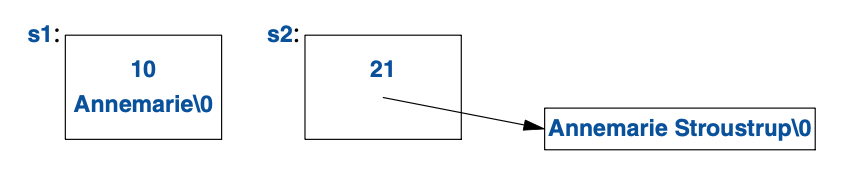
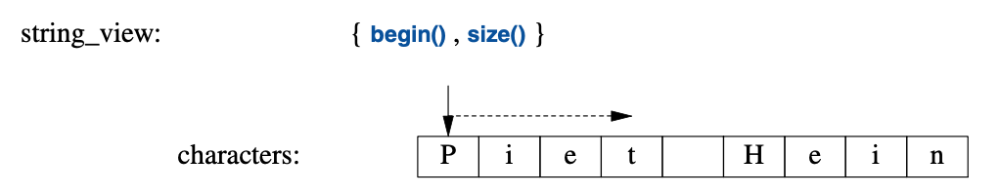

<a class="en-page-number" id="111"></a>

<div class="chapter-number"><p class="chapter-number">{{ page.ch }}</p></div>

# 字符串和正则表达式 {#strings-and-regular-expressions}

> 使用规范的语言。
>
> <span title="出自 上海译文出版社 1992年12月 出版的《英文写作指南》 由 陈一鸣 译，出自该书第157页的“提示二十一”。"。>—— 斯特伦克 和 怀特</span>[^1]

## 9.1 导言 {#9.1}

文本操占据了多数程序的大部分工作。C++标准库提供了一个 `string` 类型，
以解救大多数用户，不必再通过指针进行字符串数组的 C 风格字符串操作。
`string_view`类型可以操作字符序列，
无论其存储方式如何（比如：在 `std::string`或`char[]`中）。
此外，还提供了正则表达式匹配，以便在文本中寻找模式。
正则表达式的形式与大多数现代语言中呈现的方式类似。
无论`string`还是`regex`对象，都可以使用多种字符类型（例如：Unicode）。

## 9.2 字符串 {#9.2}

标准库提供了`string`类型，用以弥补字符串文本(§1.2.1)的不足；
`string`是个`Regulae`类型(§7.2, §12.7)类型，
用于持有并操作一个某种类型字符的序列。
`string`提供了丰富有用的字符串操作，比方说连接字符串。例如：

<a class="en-page-number" id="112"></a>

```cpp
string compose(const string& name, const string& domain)
{
    return name + '@' + domain;
}

auto addr = compose("dmr","bell−labs.com");
```

此处，`addr`被初始化为字符序列`dmr@bell−labs.com`。
`string`“加法”的意思是连接操作。
你可以把一个`string`、一个字符串文本、C-风格字符串或者一个字符连接到`string`上。
标准`string`有个转移构造函数，所以就算是传值返回很长的`string`也很高效($5.2.2)。

在大量应用中，最常见的字符串连接形式是把什么东西添加到某个`string`的末尾。
此功能可以直接使用`+=`操作。例如：

```cpp
void m2(string& s1, string& s2)
{
    s1 = s1 + '\n'; // 追加换行
    s2 += '\n';     // 追加换行
}
```

这两种附加到`string`末尾的方式语意等价，但我更青睐后者，
对于所执行的内容来说，它更明确、简练并可能更高效。

`string`是可变的，除了`=`、`+=`，还支持取下标（使用 `[]`）、取自字符串操作。例如：

```cpp
string name = "Niels Stroustrup";

void m3()
{
    string s = name.substr(6,10);   // s = "Stroustrup"
    name.replace(0,5,"nicholas");   // name 变成 "nicholas Stroustrup"
    name[0] = toupper(name[0]);     // name 变成 "Nicholas Stroustrup"
}
```

`substr()`操作返回一个`string`，该`string`是其参数标示出的子字符串的拷贝。
第一个参数是指向`string`的下标（一个位置），第二个参数是所需子字符串的长度。
由于下标从`0`开始，`s`的值便是`Stroustrup`。

`replace()`操作以某个值替换某个子字符串。
本例中，子字符串是始自`0`，长度`5`的`Niels`；它被替换为`nicholas`。
最后，我将首字符替换为其大写字符。
因此，`name`最终的值便是`Nicholas Stroustrup`。
请留意，替代品字符串无需与被替换的子字符串长度相同。

`string`有诸多便利操作，诸如赋值（使用`=`），
取下标（使用`[]`或像`vecor`那样使用`at()`；§11.2.2），
相等性比较（使用`==`和`!=`），以及字典序比较（使用`<`、`<=`、`>`和`>=`），
遍历（像`vector`那样使用迭代器；§12.2），输入（§10.3）和流（§10.8）。

显然，`string`可以相互之间比较，与C-风格字符串比较（§1。7.1），与字符串文本比较，例如：

<a class="en-page-number" id="113"></a>

```cpp
string incantation;

void respond(const string& answer)
{
    if (answer == incantation) {
        // 施放魔法
    }
    else if (answer == "yes") {
        // ...
    }
    // ...
}
```

如果你需要一个C-风格字符串（零结尾的`char`数组），
`string`为其持有的字符提供一个只读访问。例如：

```cpp
void print(const string& s)
{
    printf("For people who like printf: %s\n",s.c_str());   // s.c_str() 返回一个指针，指向 s 持有的那些字符
    cout << "For people who like streams: " << s << '\n';
}
```

从定义方面讲，字符串文本就是一个 `const char*`。
要获取一个`std::string`类型的文本，请用`s`后缀。例如：

```cpp
auto s = "Cat"s;    // 一个 std::string
auto p = "Dog";     // 一个C-风格字符串，也就是： const char*
```

要启用`s`后缀，你需要使用命名空间`std::literals::string_literals`（§5.4.4）。

### 9.2.1 `string`的实现 {#9.2.1}

实现一个字符串类，是个讨喜并有益的练习。不过，对于广泛的用途来说，
就算费尽心力的打磨的处女作，也罕能与标准库的`sting`便利及性能匹敌。
如今，`string`通常使用 *短字符串优化(short-string optimization)*来实现。
就是说，较短的字符串值保留在`string`对象内部，只有较长的字符串会置于自由存储区。
考虑此例：

```cpp
string s1 {"Annemarie"};                // shor t string
string s2 {"Annemarie Stroustrup"};     // long string
```

其内存配置将类似于这样：



当某个`string`的值从短字符串变成长字符串（或相反），其内存配置也将相应调整。
一个“短”字符串应该有多少个字符呢？这由实现定义，但是“14个字符左右”当相去不远。

<a class="en-page-number" id="114"></a>

`string`的具体性能严重依赖运行时环境。尤其在多线程实现中，内存分配的代价相对高昂。
并且，在使用大量长度参差不齐的字符串时，将产生内存碎片。
这些因素就是短字符串优化如此普遍应用的原因。

为处理多种字符集，`string`实际上是采用字符类型`char`的通用模板`basic_string`的别名：

```cpp
template<typename Char>
class basic_string 
{
    // ... string of Char ...
};

using string = basic_string<char>;
```

用户可定义任意字符类型的字符串。例如：假设我们有个日文字符类型`Jchar`，就可以这么写：

```cpp
using Jstring = basic_string<Jchar>;
```

现在，就可以针对`Jstring`——日文字符的字符串——进行所有常规操作了。

## 9.3 字符串视图 {#9.3}

针对字符串序列，最常见的用途是将其传给某个函数读取。
此操作可以有多种方式达成，将`string`传值，传字符串的引用，或者是C-风格字符串。
在许多系统中，还有进一步的替代方案，例如未由标准提供的字符串类型。
所有这些情形中，当我们想传递一个子字符串，就要涉及额外的复杂度。
为了解决这个问题，标准库提供了`string_view`；
`string_view`基本上是个(指针，长度)对，以表示一个字符序列：



`string_view`为一段连续的字符序列提供了访问方式。
这些字符可以多种方式储存，包括在`string`中以及C-风格字符串中。
`string_view`像是一个指针或引用，就是说，它不拥有其指向的那些字符。
在这一点上，它与一个由迭代器（§12.3）构成的STL pair相似。

考虑以下这个简单的函数，它连接两个字符串：

<a class="en-page-number" id="115"></a>

```cpp
string cat(string_view sv1, string_view sv2) 
{
    string res(sv1.length()+sv2.length());
    char∗ p = &res[0];
    for (char c : sv1)              // 一种复制方式
        ∗p++ = c;
    copy(sv2.begin(),sv2.end(),p);  // 另一种方式
    return res;
}
```

可以这样调用`cat()`：

```cpp
string king = "Harold";
auto s1 = cat(king,"William");              // 字符串和 const char*
auto s2 = cat(king,king);                   // 字符串和字符串
auto s3 = cat("Edward","Stephen"sv);        // const char * 和 string_view
auto s4 = cat("Canute"sv,king);
auto s5 = cat({&king[0],2},"Henry"sv);      // HaHenry
auto s6 = cat({&king[0],2},{&king[2],4});   // Harold
```

跟接收`const string&`参数的`compose()`（§9.2）相比，这个`cat()`具有三个优势：

- 它可被用于多种不同方式管理的字符序列。
- 不会为C-风格字符串参数创建临时的`string`参数。
- 可以轻松的传入子字符串。

请注意`sv`(“string_view”)后缀的使用，要启用它，需要：

```cpp
using namespace std::literals::string_view_literals;    // § 5.4.4
```

何必要多此一举？原因是，当我们传入`Edward`时，
需要从`const char*`构建出`string_view`，因而就需要给这些字符串计数。
而对于`"Stephen"sv`，其长度在编译期就计算。

当返回`string_view`时，请谨记这与指针非常相像；它需要指向某个东西：

```cpp
string_view bad()
{
    string s = "Once upon a time";
    return {&s[5],4};       // 糟糕：返回了指向局部变量的指针
}
```

此处返回了一个指针，指向一些位于某个`string`内的字符，
而此`string`将在我们用到这些字符之前被销毁。

`string_view`有个显著的限制，它是其中那些字符的一个只读视图。
例如，对于一个将其参数修改为小写字符的函数，你无法使用`string_view`。
这种情况下，请考虑采用`gsl::span`或`gsl::string_span`(§13.3)。

`string_view`越界访问的行为是 未指明的(unspecified)。
如果你需要一个确定性的越界检查，使用`at()`，它为越界访问抛出`out_of_range `异常，
使用`gsl::string_span`(§13.3)，或者“加点儿小心”就是了。

<a class="en-page-number" id="116"></a>

## 9.4 正则表达式 {#9.4}

正则表达式是文本处理的强大工具。
它提供一个容易而简洁方式来描述文本中的模式
（例如：诸如`TX 77845`的美国邮编，或者诸如`2009-06-07`的ISO-风格日期）
并能够高效地发现这些模式。
在`regex`中，标准库为正则表达式提供了支持，其形式是`std::regex`类和配套函数。
作为`regex`风格的浅尝，我们定义并打印出一个模式：

```cpp
regex pat {R"(\w{2}\s∗\d{5}(−\d{4})?)"}; // 美国邮编模式: XXddddd-dddd 及变体
```

在任何语言中用过正则表达式的人都能发现`\w{2}\s∗\d{5}(−\d{4})?`很眼熟。
它指定了一个模式以两个字母`\w{2}`开头，其后紧跟的一些空格`\s*`是可选的，
接下来是五位数字`\d{5}`以及可选的连接号加四位数字`-\d{4}`。
如果你不熟悉正则表达式，这应该是个学习它的好时机（[Stroustrup,2009], [Maddock,2009], [Friedl,1997]）。

为了表示这个模式，我用了个以`R"(`开头和`)`结尾的
*原始字符串文本（raw string literal）*。
这使得反斜杠和引号可直接用在字符串中(无需转义——译注)。
原始字符串特别适用于正则表达式，因为正则表达式往往包含大量的反斜杠。
如果我用了传统字符串，该模式的定义就会是：

```cpp
regex pat {"\\w{2}\\s∗\\d{5}(−\\d{4})?"}; // 美国邮编模式
```

在`<regex>`中，标准库为正则表达式提供了如下支持：

- `regex_match()`：针对一个（长度已知的）字符串进行匹配（§9.4.2）。
- `regex_search()`：在一个（任意长度的）数据流中查找匹配某个正则表达式的一个字符串（§9.4.1）。
- `regex_replace()`：在一个（任意长度的）数据流中查找匹配某个正则表达式的那些字符串并替换之。
- `regex_iterator()`：在匹配和子匹配中进行遍历（§9.4.3）。
- `regex_token_iterator()`：在未匹配中进行遍历。

### 9.4.1 查找 {#9.4.1}

对一个模式最简单的应用就是在某个流中进行查找：

```cpp
int lineno = 0;
for (string line; getline(cin,line); ) {    // 读进行缓冲区
    ++lineno;
    smatch matches;                         // 保存匹配到的字符串
    if (regex_search(line,matches,pat))     // 在 line 中查找 pat
        cout << lineno << ": " << matches[0] << '\n';
}
```

`regex_search(line,matches,pat)`在`line`中进行查找，
查找任何可匹配存储在`pat`中正则表达式的内容，并将匹配到的任何内容存储在`matches`里。
如果未发现匹配，`regex_search(line,matches,pat)`返回`false`。
`matches`变量的类型是`smatch`。其中的“s”代表“子（sub）”或者“字符串（string）”，
一个`smatch`是个承载`string`类型子匹配的`vector`。
第一个元素，此处为`matches[0]`，是完整的匹配。
`regex_match()`的结果是一个匹配内容的集合，通常以`smatch`表示：

<a class="en-page-number" id="117"></a>

```cpp
void use()
{
    ifstream in("file.txt");    // 输入文件
    if (!in)                    // 检查文件是否打开
        cerr << "no file\n";
    regex pat {R"(\w{2}\s∗\d{5}(−\d{4})?)"};    // 美国邮编模式

    int lineno = 0;
    for (string line; getline(in,line); ) {
        ++lineno;
        smatch matches;     // 保存匹配到的字符串
        if (regex_search(line, matches, pat)) {
            cout << lineno << ": " << matches[0] << '\n';   // 完整匹配
            if (1<matches.size() && matches[1].matched)     // 如果有子模式
                                                            // 并且匹配成功
                cout << "\t: " << matches[1] << '\n';       // 子匹配
        } 
    }
}
```

此函数寻找一个文件寻找美国邮编，例如`TX77845`和`DC 20500-0001`。
`smatch`类型是个正则匹配结果的容器。
此处，`matches[0]`是整个匹配，而`matches[1]`是可选的四位数字子模式。

换行符`\n`可以是模式的组成部分，因此可以查找多行模式。
显然，如果要查找多行模式，就不该每次只读取一行。

正则表达式的语法和语意是有意设计如此的，目的是编译成状态机以便高效执行[Cox,2007]。
`regex`类型在运行时执行该编译过程。

### 9.4.2 正则表达式表示法 {#9.4.2}

`regex`库可以识别正则表达式表示法的多个变体。
此处，我使用默认的表示法，ECMA 标准用于 ECMAScript（俗称JavaScript） 的一个变体。

正则表达式的语法基于具备特殊意义的字符们：

<table style="width:90%;margin-left:auto;margin-right:auto;">
	<tbody>
		<tr>
			<th colspan="2" style="text-align: center"><strong>正则表达式特殊字符</strong></th>
		</tr>
		<tr>
			<td style="width:50%"><code>.</code>任意单个字符（“通配符”）</td>
			<td style="width:50%"><code>\</code>下一个字符具有特殊意义</td>
		</tr>
		<tr>
			<td><code>[</code>字符类起始</td>
			<td><code>*</code>零个或更多（后缀操作）</td>
		</tr>
        <tr>
			<td><code>]</code>字符类终止</td>
			<td><code>+</code>一个或更多（后缀操作）</td>
		</tr>
        <tr>
			<td><code>{</code>计数起始</td>
			<td><code>?</code>可选的（零或一个）（后缀操作）</td>
		</tr>
        <tr>
			<td><code>}</code>计数终止</td>
			<td><code>|</code>可替换的（或）</td>
		</tr>
        <tr>
			<td><code>(</code>分组起始</td>
			<td><code>^</code>行首；取反</td>
		</tr>
        <tr>
			<td><code>)</code>分组终止</td>
			<td><code>$</code>行尾</td>
		</tr>
	</tbody>
</table>

例如，可以指定一行文本以零或多个`A`开头，后跟一或多个`B`，

<a class="en-page-number" id="118"></a>

再跟一个可选的`C`，就像这样：

```cpp
ˆA∗B+C?$
```

可匹配的范例如下：

```text
AAAAAAAAAAAABBBBBBBBBC
BC
B
```

不可匹配的范例如下：

```cpp
AAAAA       // 没有 B
 AAAABC     // 以空格开头
AABBCC      // C 太多了
```

模式的一部分若被括在小括号中，则被视为子模式（可单独从`smatch`中提取）。例如：

```cpp
\d+−\d+         // 无子模式
\d+(−\d+)       // 一个子模式
(\d+)(−\d+)     // 两个子模式
```

模式可借助后缀设置为可选的或者重复多次（默认有且只能有一次）：

|重复|
|-|
|`{n}` 恰好`n`次|
|`{n,}` `n`或更多次|
|`{n,m}` 至少`n`次并且不超过`m`次|
|`*` 零或多次，即`{0,}`|
|`+` 一或多次，即`{1,}`|
|`?` 可选的（零或一次），即`{0,1}`|

例如：

```cpp
A{3}B{2,4}C∗
```

可匹配范例如：

```text
AAABBC
AAABBB
```

不可匹配范例如：

```cpp
AABBC           // A 不够
AAABC           // B 不够
AAABBBBBCCC     // B 太多了
```

在任意的重复符号（`?`、`*`、`+`和`{}`）后添加后缀`?`，
可令该模式匹配行为“懒惰”或者“不贪婪”。
就是说，在寻找模式的时候，它将寻找最短而非最长的匹配。
默认情况下，模式匹配总是寻找最长匹配；这被称为*最长匹配规则（Max Munch rule）*，
考虑：

```cpp
ababab
```

<a class="en-page-number" id="119"></a>

模式`(ab)+`匹配整个`ababab`，而`(ab)+?`仅匹配第一个`ab`。

最常见的字符分类如下：

|字符分类|
|-|
|`alnum` 任意字母和数字字符|
|`alpha` 任意字母字符|
|`blank` 非行分割符的任意空白字符|
|`cntrl` 任意控制字符|
|`d` 任意十进制数字字符|
|`digit` 任意十进制数字字符|
|`graph` 任意绘图字符|
|`lower` 任意小写字符|
|`print` 任意可打印字符|
|`punct` 任意标点符号|
|`s` 任意空白字符|
|`space` 任意空白字符|
|`upper` 任意大写字符|
|`w` 任意成词字符（字母数字字符外加下划线）|
|`xdigit` 任意十六进制数字字符|

在正则表达式中，字符分类的类名必须用中括号`[:` `:]`括起来。
例如`[:digit:]`匹配一个十进制数字字符。
另外，要代表一个字符分类，它们必须被置于一对中括号`[]`中。

有多个字符串分类支持速记表示法：

<table style="width:90%;margin-left:auto;margin-right:auto;">
	<tbody>
		<tr>
			<th colspan="3" style="text-align: center"><strong>字符分类简写</strong></th>
		</tr>
		<tr>
			<td style="width:10%"><code>\d</code></td>
			<td style="width:70%">一个十进制数字字符</td>
			<td style="width:20%"><code>[[:digit:]]</code></td>
		</tr>
		<tr>
			<td><code>\s</code></td>
			<td>一个空白字符（空格、制表符等等）</td>
			<td><code>[[:space:]]</code></td>
		</tr>
        <tr>
			<td><code>\w</code></td>
			<td>一个字母（<code>a-z</code>）或数字字符（<code>0-9</code>）或下划线（<code>_</code>）</td>
			<td><code>[_[:alnum:]]</code></td>
		</tr>
        <tr>
			<td><code>\D</code></td>
			<td>非<code>\d</code></td>
			<td><code>[^[:digit:]]</code></td>
		</tr>
        <tr>
			<td><code>\S</code></td>
			<td>非<code>\s</code></td>
			<td><code>[^[:space:]]</code></td>
		</tr>
        <tr>
			<td><code>\W</code></td>
			<td>非<code>\w</code></td>
			<td><code>[^_[:alnum:]]</code></td>
		</tr>
	</tbody>
</table>

此外，支持正则表达式的语言常常会提供：

<table style="width:50%;margin-left:auto;margin-right:auto;">
	<tbody>
		<tr>
			<th colspan="3" style="text-align: center"><strong>字符分类简写</strong></th>
		</tr>
		<tr>
			<td style="width:10%"><code>\l</code></td>
			<td>一个小写字符</td>
			<td style="width:20%"><code>[[:lower:]]</code></td>
		</tr>
		<tr>
			<td><code>\u</code></td>
			<td>一个大写字符</td>
			<td><code>[[:upper:]]</code></td>
		</tr>
        <tr>
			<td><code>\L</code></td>
			<td>非<code>\l</code></td>
			<td><code>[^[:lower:]]</code></td>
		</tr>
        <tr>
			<td><code>\U</code></td>
			<td>非<code>\u</code></td>
			<td><code>[^[:upper:]]</code></td>
		</tr>
	</tbody>
</table>

为最大化可移植性，请使用字符分类名而非这些简写。

作为一个例子，请考虑写一个模式以描述C++的标志符：
一个下划线或字母，后跟一个可能为空的序列，该序列由字母、数字字符或下划线组成。
为阐明细微的差异，我列出了几个错误的范例：

<a class="en-page-number" id="120"></a>

```cpp
[:alpha:][:alnum:]∗             // 错误： ":alpha:"集合中的字符后跟...
[[:alpha:]][[:alnum:]]∗         // 错误： 不接受下划线 （'_' 不是字母）
([[:alpha:]]|_)[[:alnum:]]∗     // 错误： 下划线也不属于 alnum

([[:alpha:]]|_)([[:alnum:]]|_)∗     // OK：但略显笨拙
[[:alpha:]_][[:alnum:]_]∗           // OK：在字符分类里包括了下划线
[_[:alpha:]][_[:alnum:]]∗           // 也 OK
[_[:alpha:]]\w∗                     // \w 等价于 [_[:alnum:]]
```

最后，这里有个函数使用`regex_match()`（§9.4.1）的最简形式测试某字符串是否标志符：

```cpp
bool is_identifier(const string& s)
{
    regex pat {"[_[:alpha:]]\\w∗"}; // 下划线或字母
                                    // 后跟零或多个下划线、字母、数字字符
    return regex_match(s,pat);
}
```

注意，在常规字符串文本里使用的双反斜杠用于引入一个反斜杠。
可用原始字符串文本，以缓解特殊字符带来的麻烦。例如：

```cpp
bool is_identifier(const string& s)
{
    regex pat {R"([_[:alpha:]]\w∗)"};
    return regex_match(s,pat);
}
```

以下是一些模式的范例：

```cpp
Ax∗             // A, Ax, Axxxx
Ax+             // Ax, Axxx     而非 A
\d−?\d          // 1-2, 12      而非 1--2
\w{2}−\d{4,5}   // Ab-1234, XX-54321, 22-5432   数字字符包含在\w中
(\d∗:)?(\d+)    // 12:3, 1:23, 123, :123    而非 123:
(bs|BS)         // bs, BS       而非 bS
[aeiouy]        // a, o, u      英文元音字母, 而非 x
[ˆaeiouy]       // x, k         不是英文元音字母, 而非 e
[aˆeiouy]       // a, ˆ, o, u   英文元音字母或者 ˆ
```

可能通过`sub_match`形式体现的`group`（子模式）由小括号界定。
如果你需要一对小括号但却不想定义一个子模式，要使用`(?:`而非常规的`(`。例如：

```cpp
(\s|:|,)∗(\d∗)      // 可选的空白字符、冒号、和/或逗号，其后跟随一个可选的数字
```

假设我们不关心数字之前那些字符（比方说是分隔符之类的），就可以这么写：

```cpp
(?:\s|:|,)∗(\d∗)    // 可选的空白字符、冒号、和/或逗号，其后跟随一个可选的数字
```

这样可以避免正则表达式引擎存储第一个字符：用`(?:`这个版本只有一个子模式。

<a class="en-page-number" id="121"></a>

<table style="width:80%;margin-left:auto;margin-right:auto;">
	<tbody>
		<tr>
			<th colspan="2" style="text-align: center"><strong>正则表达式群组示例</strong></th>
		</tr>
		<tr>
			<td style="width:30%"><code>\d*\s\w+</code></td>
			<td>无群组（子模式）</td>
		</tr>
		<tr>
			<td><code>(\d∗)\s(\w+)</code></td>
			<td>两个群组</td>
		</tr>
        <tr>
			<td><code>(\d∗)(\s(\w+))+</code></td>
			<td>两个群组（群组不能嵌套）</td>
		</tr>
        <tr>
			<td><code>(\s∗\w∗)+</code></td>
			<td>一个群组；一个或更多子模式；</br>只有最后一个子模式保存为<code>sub_match</code></td>
		</tr>
        <tr>
			<td><code>&lt;(.∗?)&gt;(.∗?)&lt;/\1&gt;</code></td>
			<td>三个群组；<code>\1</code>的意思是（同群组1）</td>
		</tr>
	</tbody>
</table>

表中最后一个模式在解析XML的时候非常好用。它查找 标签/尾标签 的记号。
注意，我为标签和尾标签间的子模式用了一个不贪婪匹配（懒惰匹配），`.*?`。
如果我用了常规的`.*`，以下输入将引发一个问题：

```xml
Always look on the <b>bright</b> side of <b>life</b>.
```

针对第一个子模式的*贪婪匹配*将匹配到第一个`<`和最后一个`>`。
那也是正确的行为，但却不太可能是程序员想要的。

有关正则表达式更详尽的阐述，请见 [Friedl,1997]。

### 9.4.3 迭代器 {#9.4.3}

可以定义一个`regex_iterator`去遍历一个字符序列，寻找符合某个模式的匹配。
例如，可使用`sregex_iterator`（即`regex_iterator<string>`），
去输出某个`string`中所有空白字符分割的单词：

```cpp
void test()
{
    string input = "aa as; asd ++eˆasdf asdfg";
    regex pat {R"(\s+(\w+))"};
    for (sregex_iterator p(input.begin(),input.end(),pat); p!=sregex_iterator{}; ++p)
        cout << (∗p)[1] << '\n';
}
```

输出是：

```text
as
asd
asdfg
```

我们丢掉了第一个单词，`aa`，因为它前面没有空白字符。
如果把模式简化成`R"((\w+))"`，就会得到：

```text
aa
as
asd
e
asdf
asdfg
```

`regex_iterator`是双向迭代器，故无法将其在`istream`（仅提供输入迭代器）上直接遍历。
另外，也无法经由`regex_iterator`进行写操作，
默认的`regex_iterator`（`regex_iterator{}`）是唯一可能的序列末尾。

<a class="en-page-number" id="122"></a>

## 9.5 忠告 {#9.5}

- [1] 用`std::string`去持有字符序列；§9.2；[CG: SL.str.1]。
- [2] 多用`string`，而非C-风格的字符串函数；§9.1。
- [3] 用`string`去声明变量和成员，而非用作基类；§9.2。
- [4] 以传值方式返回`string`（依赖转移语意）；§9.2，§9.2.1。
- [5] 以直接或间接的方式，通过`substr()`读子字符串，`replace()`写子字符串；§9.2。
- [6] `string`可按需变长或缩短；§9.2。
- [7] 当你需要越界检查的时候，用`at()`而非迭代器或`[]`；§9.2。
- [8] 当你需要优化速度，用迭代器和`[]`，而非`at()`；§9.2。
- [9] `string`输入不会溢出；§9.2，§10.3。
- [10] （仅）在你需要的时候，用`c_str()`为`string`生成一个C风格字符串的形式；§9.2。
- [11] 用`stringstream`或者通用的值提取函数（如`to<X>`）做字符串的数值转换；§10.8。
- [12] `basic_string`可用于生成任意类型字符的字符串；§9.2.1。
- [13] `s`后缀用于字符串文本，意思是要标准库的`string`；§9.3 [CG: SL.str.12]。
- [14] 在待读取的字符序列存储方式多种多样的时候，以`string_view`作为函数参数；§9.3 [CG: SL.str.2]。
- [15] 在待写入的字符序列存储方式多种多样的时候，以`gsl::string_span`作为函数参数；§9.3 [CG: SL.str.2] [CG: SL.str.2]。
- [16] 把`string_view`看作附有长度的指针；它并不拥有那些字符；§9.3。
- [17] `sv`后缀用于字符串文本，意思是要标准库的`string_view`；§9.3。
- [18] 对于绝大多数常规的正则表达式使用`regex`;§9.4。
- [19] 除了最简单的模式，请采用原始字符串文本；§9.4。
- [20] 用`regex_match()`去匹配完整的输入；§9.4，§9.4.2。
- [21] 用`regex_search()`在输入流中查找模式；§9.4.1。
- [22] 正则表达式符号可以针对多种标准进行调整；§9.4.2。
- [23] 默认的正则表达式符号遵循 ECMAScript；§9.4.2。
- [24] 请保持克制，正则表达式很容易沦为 [只写语言](https://zh.m.wikipedia.org/zh-cn/%E5%8F%AA%E5%86%99%E8%AF%AD%E8%A8%80)；§9.4.2。
- [25] 记住，`\i`可以表示同前面某个子模式；§9.4.2。
- [26] 用`?`把模式变得“懒惰”；§9.4.2。
- [27] 用`regex_iterator`在流中遍历查找模式；§9.4.3。

[^1]: 出自 上海译文出版社 1992年12月 出版的《英文写作指南》（陈一鸣 译），引用内容出现在该书第157页的“提示二十一”。 —— 译者注
