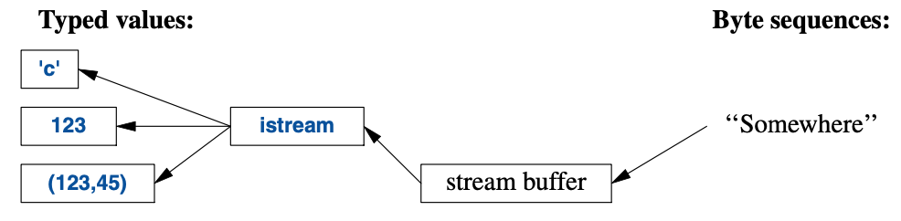

<a class="en-page-number" id="123"></a>

<div class="chapter-number"><p class="chapter-number">{{ page.ch }}</p></div>

# 输入和输出 {#input-and-output}

> 不见即不得。
>
> <span title="这句话的原文是“What you see is all you get.”，没找到出处，可见于他的维基百科页面 https://en.wikipedia.org/wiki/Brian_Kernighan ，未见官方翻译，有一个译法是 [所见即全部所得](https://www.ituring.com.cn/article/17869)，但我理解这里强调的是“某些内容被抛弃”，故按此翻译。"。>—— Brian W. Kernighan</span>[^1]

## 10.1 导言 {#10.1}

I/O流库为文本和数字值提供格式化以及未格式化的缓冲输入输出。

`ostream`将带有类型的对象转化成字符（字节）流：


<a class="en-page-number" id="124"></a>

`istream`将字符（字节）流转化成带有类型的对象：



这些有关`istream`和`ostrean`的操作在 §10.2 和 §10.3 叙述。
这些操作是类型安全、大小写敏感的，并且可扩展去处理用户那些定义类型（§10.5）。

其它形式的用户交互，例如图形I/O，可通过程序库处理，它们并非ISO标准的组成部分，
因此此处不加赘述。

这些流可用于二进制的 I/O，用于多种字符类型，可进行本地化，还可以采用高级缓冲策略，
但这些主题不在本书的讨论范畴之内。

这些流可用于输入进或输出自`string`（§10.3），可格式化进`string`缓冲（§10.8），
以及文件 I/O（§10.10）。

I/O 流相关的类全都具有析构函数，这些函数会释放所拥有的全部资源（比如缓冲以及文件句柄）。
也就是说，它们是“资源请求即初始化”（RAII；§5.3）的示例。

## 10.2 输出 {#10.2}

I/O流库在`<ostream>`中为每种内建类型定义了输出。
此外，为用户定义类型定义输出也很不难（§10.5）。
操作符`<<`（“输出到”）被用作指向`ostream`类型对象的输出操作符。
默认情况下，写到`cout`的那些值会被转化成一个字符流。
例如，要输出十进制数字`10`，可以这样写：

```cpp
void f()
{
    cout << 10;
}
```

这将把字符`1`后带字符`0`放置到标准输出流中。

还可以写成这样的等价形式：

```cpp
void g()
{
    int x{10};
    cout << x;
}
```

不同的类型在输出时可通过显而易见的方式组合：

<a class="en-page-number" id="125"></a>

```cpp
void h(int i)
{
    cout << "the value of i is ";
    cout << i;
    cout << '\n';
}
```

对于`h(10)`，将会输出：

```text
the value of i is 10
```

输出多个相关内容的时候，人们很快就会厌倦反复敲打输出流的名字。
好在，输出表达式的结果可用于后续输出，例如：

```cpp
void h2(int i)
{
    cout << "the value of i is " << i << '\n';
}
```

`h2()`的输出跟`h()`一样。

字符常量是由单引号包围的字符。请注意，字符会作为字符输出而非一个数值。例如：

```cpp
void k()
{
    int b = 'b';    // 注意：char 被隐式转换为 int
    char c = 'c';
    cout << 'a' << b << c;
}
```

`'b'`的整数值是`98`（在C++实现所采用的ASCII编码中），因此输出是`a98c`。

## 10.3 输入 {#10.3}

标准库在`<istream>`中提供了`istream`用于输入。
与`ostream`相似，`istream`也处理以字符串形式表现的内建类型，也不难处理用户定义类型。

操作符`>>`（提取自）被用作输入操作符；`cin`是标准输入流。
`>>`的右操作数类型决定了可接受的输入内容和输入对象。例如：

```cpp
void f()
{
    int i;
    cin >> i;   // 把一个整数读入 i

    double d;
    cin >> d;   // 把一个双精度浮点数读入 d
}
```

<a class="en-page-number" id="126"></a>

以上操作从标准输入读取一个数字，例如`1234`，进入变量`i`，
以及一个浮点数，例如`12.34e5`，进入双精度浮点数变量`d`。

与输出操作相似，输入操作也可以链式进行，因此可以写作等价的：

```cpp
void f()
{
    int i;
    double d;
    cin >> i >> d;   // 读入 i 和 d
}
```

在以上两例中，整数的读取会被任何非数字字符终止。
默认情况下，`>>`会忽略起始的空白字符，因此一个适宜的完整输入可以是：

```text
1234
12.34e5
```

通常，我们需要读取一个字符序列。一个便捷的方式是将其读进一个`string`。例如：

```cpp
void hello()
{
    cout << "Please enter your name\n";
    string str;
    cin >> str;
    cout << "Hello, " << str << "!\n";
}
```

如果你输入`Eric`，输出将是：

```text
Hello, Eric!
```

默认情况下，任意空白字符，例如空格或换行，会终止输入，
因此，如果你假装自己是命运多舛约克之王而输入`Eric Bloodaxe`，输出仍会是：

```text
Hello, Eric!
```

你可以用`getline()`函数读取一整行。例如：

```cpp
void hello_line()
{
    cout << "Please enter your name\n";
    string str;
    getline(cin,str);
    cout << "Hello, " << str << "!\n";
}
```

借助这段程序，输入的`Eric Bloodaxe`就能产生预想的输出：

```text
Hello, Eric Bloodaxe!
```

终止此行内容的换行符被丢弃了，所以`cin`就已经为下一行输入做好准备了。

使用格式化的 I/O 操作通常不易出错，高效，也比一个个字符的操作代码量少。
特别是，`istream`还会操心内存管理和越界检查。
可以用`stringstream`进行针对内存中的格式化输入和输出（§10.8）。

<a class="en-page-number" id="127"></a>

这个标准字符串具有良好的可扩展性质，可保存你放入其中的内容；你无需预计算最大长度。
因此，如果你输入几兆字节的分号，此程序会回显好几页的分号给你。

## 10.4 I/O状态 {#10.4}

一个`iostream`具有一个状态，可以查询它以确定某个操作是否成功。
最常见的操作是读取一连串的值：

```cpp
vector<int> read_ints(istream& is)
{
    vector<int> res;
    for (int i; is>>i; )
        res.push_back(i);
    return res;
}
```

这段代码从`is`中进行的读取，直到遇到非数字的内容。该内容通常会成为输入的结尾。
此处的情形是`is>>i`操作返回`is`的引用，
并检测`iostream`是否产生了`true`并为下一个操作做好准备。

通常，I/O状态持有待读取和写入全部信息，例如格式化信息（§10.6），
错误状态（例如，遭遇 输入的结尾(end-of-input)了吗？），以及所使用缓冲的类型。
另外，用户可以设置这些状态，以反映某个错误的发生（§10.5）
以及清除该状态，如果它不是严重问题。
例如，可以想象`read_ints()`的某个版本接收一个终止字符串：

```cpp
vector<int> read_ints(istream& is, const string& terminator)
{
    vector<int> res;
    for (int i; is >> i; )
        res.push_back(i);

    if (is.eof())       // 很好：文件末尾
        return res;

    if (is.fail()) {    // 没能读取一个 int，它否终止符？
        is.clear();     // 重置状态为 good()
        is.unget();     // 把这个非数字字符放回到流里
        string s;
        if (cin>>s && s==terminator)
            return res;
        cin.setstate(ios_base::failbit);    // 把 fail() 添加到 cin 的状态
    }
    return res;
}
auto v = read_ints(cin,"stop");
```

<a class="en-page-number" id="128"></a>

## 10.5 用户定义类型的I/O {#10.5}

除了针对内建类型和`string`的 I/O，`iostream`库还允许程序员为他们自己的类型定义I/O。
例如，考虑一个简单的类型`Entry`，可用它表示一个电话薄的条目：

```cpp
struct Entry {
    string name;
    int number;
};
```

可以定义一个简单的输出操作符，使用*{"name",number}*格式将其打印出来，
该格式与代码中初始化它的时候类似：

```cpp
ostream& operator<<(ostream& os, const Entry& e)
{
    return os << "{\"" << e.name << "\", " << e.number << "}";
}
```

用户定义的输出操作符接收输出流（传引用）作为第一个参数，并返回这个流作为结果。

对应的输入操作符相对复杂一些，因为此操作需要检查格式的正确性，并处理错误：

```cpp
istream& operator>>(istream& is, Entry& e)
    // 读取 { "name" , number } 对。注意：使用 { " " 和 } 进行格式化
{
    char c, c2;
    if (is>>c && c=='{' && is>>c2 && c2=='"') { // 以 { " 开头
    string name;                    // 字符串的默认值是空字符串： ""
    while (is.get(c) && c!='"')     // " 前的所有内容都是 name 部分
        name+=c;
        if (is>>c && c==',') {
            int number = 0;
            if (is>>number>>c && c=='}') {  // 读取 number 和一个 }
                e = {name,number};          // 赋值给这条记录
                return is;
            }
        }
    }
    is.setstate(ios_base::failbit);     // 在流中标记 失败
    return is;
}
```

输入操作返回一个指向其`istream`的引用，可用于检测操作是否成功。
例如：可以使用一个条件，`is>>c`表示“是否成功从`is`读取一个`char`置入`c`？”

`is>>c`默认会跳过空白字符，但是`is.get(c)`不会，
因此这个`Entry`-输入 操作符忽略（跳过）name字符串外的空白字符，而不是其中的。例如：

<a class="en-page-number" id="129"></a>

```text
{ "John Marwood Cleese", 123456     }
{"Michael Edward Palin", 987654}
```

可以这样从输入读取这对值进入一个`Entry`：

```cpp
for (Entry ee; cin>>ee; )   // 从 cin 读入 ee
    cout << ee << '\n';     // 把 ee 写出到 cout
```

输出是：

```text
{"John Marwood Cleese", 123456}
{"Michael Edward Palin", 987654}
```

对于更系统化的在字符流中识别模式的技术（正则表达式匹配），请参阅 §9.4。

## 10.6 格式化 {#10.6}

`iostream`库提为控制输入和输出格式化供了大量的控制操作。
最简单的格式化控制叫做*操控符（manipulator）*，
可见于`<ios>`、`<istrean>`、`<ostream>`和`<iomanip>`（针对接收参数的操控符）。
例如，可以将整数作为（默认的）十进制、八进制或十六进制数字输出：

```cpp
cout << 1234 << ',' << hex << 1234 << ',' << oct << 1234 << '\n';   // 打印1234,4d2,2322
```

可以显示为浮点数设置输出格式：

```cpp
constexpr double d = 123.456;

cout << d << "; "                   // 为 d 默认格式
     << scientific << d << "; "     // 为 d 使用 1.123e2 风格的格式
     << hexfloat << d << "; "       // 为 d 使用十六进制表示法
     << fixed << d << "; "          // 为 d 使用123.456 风格的格式
     << defaultfloat << d << '\n';  // 为 d 默认格式
```

这将输出：

```text
123.456; 1.234560e+002; 0x1.edd2f2p+6; 123.456000; 123.456
```

浮点数的精度是一个决定了其显示位数的整数：

- *常规（general）*格式（`defaultfloat`）让实现去选择格式去呈现一个值，
    该格式对于可用的空间可最好地展示其值。此精度可指定最大位数。
- *科学计数法（scientific）*格式以小数点前一位数字和一个幂呈现一个值。
    此精度可指定小数点后的最大位数。
- *固定（fixed）*格式以整数部分后跟一个小数点再跟小数部分呈现一个值，
    此精度可指定小数点后数字的最大位数。

浮点数会被四舍五入而不是截断，`precision()`不会影响整数的输出。例如：

<a class="en-page-number" id="130"></a>

```cpp
cout.precision(8);
cout << 1234.56789 << ' ' << 1234.56789 << ' ' << 123456 << '\n';

cout.precision(4);
cout << 1234.56789 << ' ' << 1234.56789 << ' ' << 123456 << '\n';
cout << 1234.56789 << '\n';
```

这将输出：

```text
1234.5679 1234.5679 123456
1235 1235 123456
1235
```

这些浮点数操控符是“有粘性的（sticky）”；就是说，它们的效果会对后续浮点数操作都生效。

## 10.7 文件流 {#10.7}

在`<fstream>`中，标准库提供了针对文件的输入和输出：

- `ifstream` 用于从一个文件进行读取
- `ofstream` 用于向一个文件进行写入
- `fstream` 用于对一个文件进行读取和写入

例如：

```cpp
ofstream ofs {"target"}; // “o” 的意思是 “输出（output）”
if (!ofs)
    error("couldn't open 'target' for writing");
```

测试一个文件流是否正确打开，通常要检测其状态。

```cpp
ifstream ifs {"source"}; // “i” 的意思是 “输入（input）”
if (!ifs)
    error("couldn't open 'source' for reading");
```

假设这些测试都成功了，那么`ofs`可以像普通`ostream`（类似`cout`）那样使用，
`ifs`可以像普通`istream`（类似`cin`）那样使用。

文件定位，以及更详尽的文件打开控制都是可行的，但这些不在本书的范畴中。
对于文件名和文件系统的操作，请参阅 §10.10。

## 10.8 字符串流 {#10.8}

在`<sstream>`中，标准库提供了针对`string`的写入和读出的操作：

- `istringstream` 用于从一个`string`进行读取
- `ostringstream` 用于向一个`string`进行写入
- `stringstream` 用于对一个`string`进行读取和写入。

例如：

<a class="en-page-number" id="131"></a>

```cpp
void test()
{
    ostringstream oss;
    oss << "{temperature," << scientific << 123.4567890 << "}";
    cout << oss.str() << '\n';
}
```

`ostringstream`的结果可以通过`str()`进行读取。
`ostringstream`的常用操作是把结果交给GUI之前进行格式化。
类似地，从GUI接收的字符串可置于`istringstream`中进行格式化读取（§10.3）。

`stringstream`即可用于读取也可用于输出。例如，可以定义一个操作，
对于任何可呈现为`string`的类型，将其转换为另一个可呈现为`string`的类型：

```cpp
template<typename Target =string, typename Source =string>
Target to(Source arg)           // 从 Source 转换到 Target
{
    stringstream interpreter;
    Target result;

    if (!(interpreter << arg)               // 把 arg 写入到流
        || !(interpreter >> result)         // 从流里读取结果
        || !(interpreter >> std::ws).eof()) // 还有东西剩在流中吗？
        throw runtime_error{"to<>() failed"};

    return result;
}
```

只有在无法被推断出或者没有默认值的情况下，模板参数才需要显式指定，所以可以这样写：

```cpp
auto x1 = to<string,double>(1.2);   // 非常明确（并且多余）
auto x2 = to<string>(1.2);          // Source 被推断为 double
auto x3 = to<>(1.2);                // Target 使用了默认的 string； Source 被推断为 double
auto x4 = to(1.2);                  // <> 冗余了；
                                    // Target 使用了默认的 string； Source 被推断为 double
```

如果所有函数模板参数都有默认值，`<>`可以省略。

我认为这是个有关借助语言特性和标准库构件达成通用性和易用性的好例子。

## 10.9 C-风格I/O {#10.9}

C++标准库也支持C标准库的I/O，包括`printf()`和`scanf()`。
以特定的安全视角来看，这个库的大量应用是不安全的，因此我不推荐其应用。
特别是，在输入的安全和便利性方面非常难用。
它不支持用户定义类型。如果你*不*使用C风格I/O并且在意I/O的性能，调用：

<a class="en-page-number" id="132"></a>

```cpp
ios_base::sync_with_stdio(false); // 避免显著的开销
```

没有这个调用，`iostream`会为了兼容C风格I/O而被显著拖慢。

## 10.10 文件系统 {#10.10}

多数系统都有一个*文件系统（file system）*的概念，
以*文件（file）*的形式对持久化的信息提供访问。
很不幸，文件系统的属性和操作它们的方式五花八门。
为应对这个问题，`<filesystem>`中的文件系统库为多数文件系统的多数构件提供了统一的接口。
借助`<filesystem>`，我们能够可移植地：

- 表示文件系统路径并在其中漫游
- 检查文件类型以及与之关联的权限

文件系统库克处理 unicode，但解释其实现方式则不在本书范畴内。
有关更详尽的信息，我推荐 cppreference[Cppreference] 和 Boost文件系统文档[Boost]。

考虑一个例子：

```cpp
path f = "dir/hypothetical.cpp";    // 命名一个文件

assert(exists(f));          // f 必须存在

if (is_regular_file(f))     // f 是个普通文件吗？
    cout << f << " is a file; its size is " << file_size(f) << '\n';
```

注意，操作文件系统的程序通常跟其它程序运行在同一台电脑上。
因此，文件系统的内容可能在两条命令之间发生变化。
例如，尽管我们事先精心地确保了`f`存在，但是在运行到下一行，
当我们询问`f`是否为普通文件的时候它可能就没了。

`path`是个相当复杂的类，足以处理本地字符集以及大量操作系统的习惯。
特别是，它能处理来自命令行的文件名，如`main()`中呈现的那样；例如：

```cpp
int main(int argc, char∗ argv[])
{
    if (argc < 2) {
        cerr << "arguments expected\n";
        return 1;
    }

    path p {argv[1]};   // 从命令行参数创建一个 path

    cout << p << " " << exists(p) << '\n'; // 注意：path可以像字符串那打印出来
    // ...
}
```

直到使用之前，一个`path`不会被检测有效性。
就算到使用的时候，其有效性也取决于该程序所运行系统的习惯。

<a class="en-page-number" id="133"></a>

显而易见，`path`可用来打开一个文件

```cpp
void use(path p)
{
    ofstream f {p};
    if (!f) error("bad file name: ", p);
    f << "Hello, file!";
}
```

除了`path`，`<filesystem>`还提供了用于遍历目录以及查询所见文件属性的类型：

<table style="width:80%;margin-left:auto;margin-right:auto;">
	<tbody>
		<tr>
			<th colspan="2" style="text-align: center"><strong>文件系统中的类型（部分）</strong></th>
		</tr>
		<tr>
			<td style="width:35%"><code>path</code></td>
			<td>目录路径</td>
		</tr>
		<tr>
			<td><code>filesystem_error</code></td>
			<td>文件系统异常</td>
		</tr>
        <tr>
			<td><code>directory_entry</code></td>
			<td>目录入口</td>
		</tr>
        <tr>
			<td><code>directory_iterator</code></td>
			<td>用于遍历一个目录</td>
		</tr>
        <tr>
			<td><code>recursive_directory_iterator</code></td>
			<td>用于遍历一个目录和其子目录</td>
		</tr>
	</tbody>
</table>

考虑一个简单但完整的假想例子：

```cpp
void print_directory(path p)
try
{
    if (is_directory(p)) {
        cout << p << ":\n";
        for (const directory_entry& x : directory_iterator{p})
            cout << " " << x.path() << '\n';
    }
}
catch (const filesystem_error& ex) {
    cerr << ex.what() << '\n';
}
```

字符串可以隐式地转换成`path`，因此可以这样运用`print_directory`：

```cpp
void use() {
    print_directory(".");       // 当前目录
    print_directory("..");      // 父目录
    print_directory("/");       // Unix 根目录
    print_directory("c:");      // Windows C 盘

    for (string s; cin>>s; )
        print_directory(s);
}
```

如果我也想列出子目录，应该写`recursive_directory_iterator{p}`。
如果我想以字典序列出条目，就该把这些`path`复制到一个`vector`中并排序后输出。

<a class="en-page-number" id="134"></a>

`path`类提供很多常见且有用的操作：

<table style="width:90%;margin-left:auto;margin-right:auto;">
	<tbody>
		<tr>
			<th colspan="2" style="text-align: center">
                <strong>路径操作（部分）</strong></br>
                <code>p</code>和<code>p2</code>都是<code>path</code>
            </th>
		</tr>
		<tr>
			<td style="width:35%"><code>value_type</code></td>
			<td>
                本地系统用于文件系统编码的字符类型：</br>
                POSIX上是<code>char</code>，Windows上是<code>wchar_t</code>
            </td>
		</tr>
		<tr>
			<td><code>string_type</code></td>
			<td><code>std::basic_string&lt;value_type&gt;</code></td>
		</tr>
        <tr>
			<td><code>const_iterator</code></td>
			<td><code>value_type</code>为<code>path</code>的<code>const</code> BidirectionalIterator</td>
		</tr>
        <tr>
			<td><code>iterator</code></td>
			<td><code>const_iterator</code>的别名</td>
		</tr>
        <tr>
            <td></td><td></td>
		</tr>
        <tr>
			<td><code>p=p2</code></td>
			<td>把<code>p2</code>赋值给<code>p</code></td>
		</tr>
        <tr>
			<td><code>p/=p2</code></td>
			<td>把<code>p</code>和<code>p2</code>用文件名分隔符(默认是/)连接</td>
		</tr>
        <tr>
			<td><code>p+p2</code></td>
			<td>把<code>p</code>和<code>p2</code>连接（无分隔符）</td>
		</tr>
        <tr>
			<td><code>p.native()</code></td>
			<td><code>p</code>的本地系统格式</td>
		</tr>
        <tr>
			<td><code>p.string()</code></td>
			<td><code>p</code>以其所在的本地系统格式表示的<code>string</code></td>
		</tr>
        <tr>
			<td><code>p.geeric_string()</code></td>
			<td><code>p</code>以通用格式表示的<code>string</code></td>
		</tr>
        <tr>
			<td><code>p.filename()</code></td>
			<td><code>p</code>的文件名部分</td>
		</tr>
        <tr>
			<td><code>p.stem()</code></td>
			<td><code>p</code>的主干部分（不带扩展名的文件名——译注）</td>
		</tr>
        <tr>
			<td><code>p.extension()</code></td>
			<td><code>p</code>的文件扩展名部分</td>
		</tr>
        <tr>
			<td><code>p.begin()</code></td>
			<td><code>p</code>的元素序列的起始</td>
		</tr>
        <tr>
			<td><code>p.end()</code></td>
			<td><code>p</code>的元素序列的终止</td>
		</tr>
        <tr>
			<td><code>p==p2</code>，<code>p!=p2</code></td>
			<td><code>p</code>和<code>p2</code>的相等、不等性判定</td>
		</tr>
        <tr>
			<td><code><code>p&lt;p2</code>，<code>p&lt;=p2</code>，<code>p&gt;p2</code>，<code>p&gt;=p2</code></code></td>
			<td>字典序比对</td>
		</tr>
        <tr>
			<td><code><code>is&gt;&gt;p</code>，<code>os&lt;&lt;p</code></code></td>
			<td>进入/取出<code>p</code>的流I/O操作</td>
		</tr>
        <tr>
			<td><code>u8path(s)</code></td>
			<td>以UTF-8编码的源字符串<code>s</code>构造一个路径</td>
		</tr>
	</tbody>
</table>

例如：

```cpp
void test(path p)
{
    if (is_directory(p)) {
        cout << p << ":\n";
        for (const directory_entry& x : directory_iterator(p)) {
            const path& f = x;      // 指向一个目录条目的路径部分
            if (f.extension() == ".exe")
                cout << f.stem() << " is a Windows executable\n";
            else {
                string n = f.extension().string();
                if (n == ".cpp" || n == ".C" || n == ".cxx")
                    cout << f.stem() << " is a C++ source file\n";
            }
        }
    }
}
```

我们把`path`当作一个字符串（即：f.extension）使用，
还可以从`path`中提取各种类型的字符串（即：f.extension().string()）。

<a class="en-page-number" id="135"></a>

请当心，命名习惯、自然语言以及字符串编码的复杂度非常高。
文件系统库的抽象提供了可移植性和极大的简化。

<table style="width:90%;margin-left:auto;margin-right:auto;">
	<tbody>
		<tr>
			<th colspan="2" style="text-align: center">
                <strong>文件系统操作（部分）</strong></br>
                <code>p</code>，<code>p1</code>和<code>p2</code>都是<code>path</code>；
                <code>e</code>是个<code>error_code</code>；
                <code>b</code>是个标志成功或失败的布尔值
            </th>
		</tr>
		<tr>
			<td style="width:35%"><code>exists(p)</code></td>
			<td>
                <code>p</code>指向的文件系统对象是否存在？
            </td>
		</tr>
		<tr>
			<td><code>copy(p1,p2)</code></td>
			<td>把<code>p1</code>的文件或目录复制到<code>p2</code>；将错误以异常形式报告</td>
		</tr>
        <tr>
			<td><code>copy(p1,p2,e)</code></td>
			<td>复制的文件或目录；将错误以错误码形式报告</td>
		</tr>
        <tr>
			<td><code>b=copy_file(p1,p2)</code></td>
			<td>把<code>p1</code>的文件内容复制到<code>p2</code>；将错误以异常形式报告</td>
		</tr>
        <tr>
			<td><code>b=create_directory(p)</code></td>
			<td>创建名为<code>p</code>的新目录；通向<code>p</code>的中间目录必须存在</td>
		</tr>
        <tr>
			<td><code>b=create_directories(p)</code></td>
			<td>创建名为<code>p</code>的新目录；通向<code>p</code>的中间目录一并创建</td>
		</tr>
        <tr>
			<td><code>p=current_path()</code></td>
			<td><code>p</code>是当前工作目录</td>
		</tr>
        <tr>
			<td><code>current_path(p)</code></td>
			<td>让<code>p</code>成为当前工作目录</td>
		</tr>
        <tr>
			<td><code>s=file_size(p)</code></td>
			<td><code>s</code>是<code>p</code>的字节数</td>
		</tr>
        <tr>
			<td><code>b=remove(p)</code></td>
			<td>如果<code>p</code>是个文件或空目录，移除它</td>
		</tr>
	</tbody>
</table>

许多操作存在接收额外参数的重载，例如操作系统权限。
这类操作大大超出了本书的范畴，所以在需要的时候去查找吧。

像`copy()`一样，所有的操作都有两个版本：

- 像表中列出那样的基础版本，即`exists(p)`。如果操作失败，函数将抛出`filesystem_error`。
- 带有额外`error_code`参数的版本，即`exists(p,e)`。检测`e`查看操作是否成功。

当操作在常规使用中预期会频繁失败时使用错误码，当出错是异常状况时用抛出异常的操作。

通常，使用查询函数是检查文件属性最简单、最直接的方式。
`<filesystem>`库知晓几个常见的文件类型，并将其余的归类为“其它”：

<table style="width:90%;margin-left:auto;margin-right:auto;">
	<tbody>
		<tr>
			<th colspan="2" style="text-align: center">
                <strong>文件类型</strong></br>
                <code>f</code>是个<code>path</code>或者<code>file_status</code>
            </th>
		</tr>
		<tr>
			<td style="width:35%"><code>is_block_file(f)</code></td>
			<td><code>f</code>是个块设备吗？</td>
		</tr>
		<tr>
			<td><code>is_character_file(f)</code></td>
			<td><code>f</code>是个字符设备吗？</td>
		</tr>
        <tr>
			<td><code>is_directory(f)</code></td>
			<td><code>f</code>是个目录吗？</td>
		</tr>
        <tr>
			<td><code>is_empty(f)</code></td>
			<td><code>f</code>是个空的文件或目录吗？</td>
		</tr>
        <tr>
			<td><code>is_fifo(f)</code></td>
			<td><code>f</code>是个命名管道吗？</td>
		</tr>
        <tr>
			<td><code>is_other(f)</code></td>
			<td><code>f</code>是其他类型的文件吗？</td>
		</tr>
        <tr>
			<td><code>is_regular_file(f)</code></td>
			<td><code>f</code>是个常规（普通）文件吗？</td>
		</tr>
        <tr>
			<td><code>is_socket(f)</code></td>
			<td><code>f</code>是个命名的IPC socket 吗？</td>
		</tr>
        <tr>
			<td><code>is_symlink(f)</code></td>
			<td><code>f</code>是个符号链接吗？</td>
		</tr>
        <tr>
			<td><code>status_known(f)</code></td>
			<td><code>f</code>的文件状态已知吗？</td>
		</tr>
	</tbody>
</table>

<a class="en-page-number" id="136"></a>

## 10.11 忠告 {#10.11}

- [1] `iostream` 是类型安全、大小写敏感并可扩展的；§10.1。
- [2] 只在不得不的时候再用字节级别的输入；§10.3； [CG: SL.io.1]。
- [3] 在读取的时候，永远该考虑格式错误的输入；§10.3； [CG: SL.io.2]。
- [4] 避免使用`endl`（如果你不知道什么是`endl`，你没漏读任何内容）；[CG: SL.io.50]。
- [5] 为其值是有意义文本形式的用户定义类型定义`<<`和`>>`；§10.1；§10.2；§10.3。
- [6] 把`cout`输出常规内容，而`cerr`输出错误信息；§10.1。
- [7] 针对普通字符和宽字符有不同的`iostream`，你还可以为任意字符类型定义`iostream`；§10.1。
- [8] 支持二进制 I/O；§10.1。
- [9] 对标准I/O流有标准的`iostream`，文件和`string`也都有对应的标准流；§10.2；§10.3；§10.7；§10.8。
- [10] 为简明的符号使用链式 `<<`；§10.2。
- [11] 为简明的符号使用链式 `>>`；§10.3。
- [12] 往`string`里输入不会导致溢出；§10.3。
- [13] 默认情况下，`>>`会跳过起始的空白字符；§10.3。
- [14] 对于可能修复的I/O错误，使用流状态`fail`去处理；§10.4。
- [15] 可以为你自定义的类型定义`<<`和`>>`操作符；§10.5。
- [16] 为了添加新的`<<`和`>>`，不需要修改`istream`和`ostream`；§10.5。
- [17] 使用操控符去控制格式化；§10.6。
- [18] `precision()`规格会对应用到其后所有的浮点数输出操作；§10.6。
- [19] 浮点数格式化规格（即`scientific`）会对应用到其后所有的浮点数输出操作；§10.6。
- [20] 需要使用标准操控符时就`#include <ios>`；§10.6。
- [21] 需要使用带参数的标准操控符时就`#include <iomanip>`；§10.6。
- [22] 别尝试复制文件流。
- [23] 在使用前记得检查文件流确定关联到了某个文件；§10.7。
- [24] 对内存中的格式化使用`stringstream`；§10.8。
- [25] 可以对任何具有字符串表示的两个类型之间定义转换操作；§10.8。
- [26] C-风格的I/O操作不是类型安全的；§10.9。
- [27] 除非你需要 printf 相关的函数，否则应该调用`ios_base::sync_with_stdio(false)`；§10.9； [CG: SL.io.10]。
- [28] 使用<filesystem>而非特定操作系统的接口；§10.10。

[^1] 这句话的原文是“What you see is all you get.”，没找到出处，
可见于他的维基百科页面 https://en.wikipedia.org/wiki/Brian_Kernighan ，
未找到官方翻译，有一个译法是 [**所见即全部所得**](https://www.ituring.com.cn/article/17869)，但我理解这里强调的是“某些内容被抛弃”，故按此翻译。 —— 译者注
