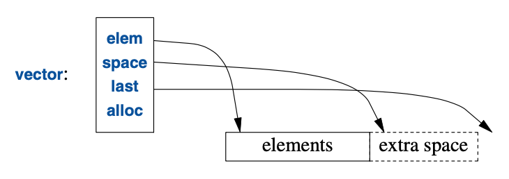
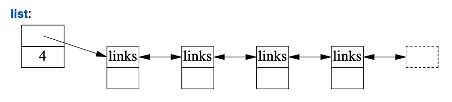
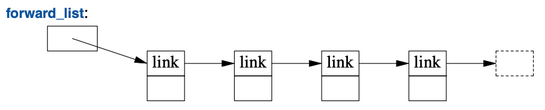
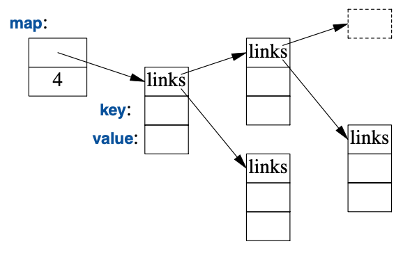
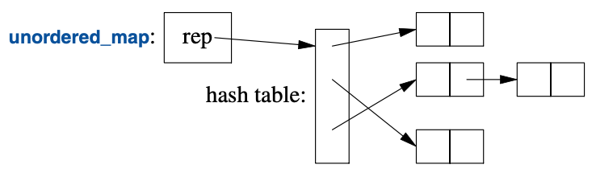

<a class="en-page-number" id="137"></a>

<div class="chapter-number"><p class="chapter-number">{{ page.ch }}</p></div>

# 容器 {#container}

> 它新颖。
>
> 它卓越。
>
> 它简洁。
>
> 它必将成功！
>
> <span title="这句话的原文出自“The Letters of Lord Nelson to Lady Hamilton, Vol II.”书中的“LETTER LX.”，该书可在网址 https://www.gutenberg.org/ebooks/15437 查阅，未发现中文译本。"。>—— 霍雷肖·纳尔逊</span>[^1]

## 11.1 导言 {#11.1}

大多数计算都要涉及创建值的集合，并且还要操作这些集合。
把一些字符读进一个`string`再打印出这个`string`就是简单的例子。
如果某个类的主要用途是装载一些对象，它通常被称为*容器（container）*。
在构建程序过程中，有个至关重要的任务：
为给定任务提供合适的容器，并使用便利的基础操作为它们提供支持。

为阐明标准库容器，请考虑一个程序用于保存名字和电话号码。
对于不同背景的人，这个程序会以不同的方法归类到“简单且明了”的分类中。
§10.5 中的 `Entry`类可用于保存一个简单的电话簿条目。
此处，我们有意忽略了现实世界的许多复杂性，
例如“很多电话号码无法以32位`int`表示”的这个情况。

<a class="en-page-number" id="138"></a>

## 11.2 `vector` {#11.2}

最有用的标准库容器是`vector`。`vector`是给定类型元素的一个序列。
这些元素在内存中连续存储。
`vector`典型的实现（§4.2.2，§5.2）会包含一些指针，指向首元素、
最后一个元素后的位置、已分配空间后的位置（§12.1）（或以指针加偏移表示的等价信息）：



此外，它还会包含一个内存分配器（此处的`alloc`），
`vector`可以用它为元素申请内存。
默认的内存分配器使用`new`和`delete`对内存进行申请和释放（§13.6）。

可以用一组元素类型的值对`vector`进行初始化：

```cpp
vector<Entry> phone_book = {
    {"David Hume",123456},
    {"Karl Popper",234567},
    {"Bertrand Arthur William Russell",345678}
};
```

元素可以通过下标进行访问。假设已经为`Entry`定义了`<<`，可以写：

```cpp
void print_book(const vector<Entry>& book)
{
    for (int i = 0; i!=book.size(); ++i)
        cout << book[i] << '\n';
}
```

按惯例，下标自`0`开始，因此`book[0]`保存着`David Hume`的条目。
`vector`的成员函数`size()`给出元素的数量。

`vector`的元素构成一个区间，因此可以应用区间-`for`循环（§1.7）：

```cpp
void print_book(const vector<Entry>& book)
{
    for (const auto& x : book)  // 关于 "auto"， 见 §1.4
        cout << x << '\n';
}
```

定义一个`vector`的时候，会给它一个初始容量（元素的初始数量）：

```cpp
vector<int> v1 = {1, 2, 3, 4};  // 容量为 4
vector<string> v2;              // 容量为 0
vector<Shape*> v3(23);          // 容量为 23；初始元素值：nullptr
vector<double> v4(32,9.9);      // 容量为 32；初始元素值：9.9
```

<a class="en-page-number" id="139"></a>

显式的容量由一对普通的小括号包围，例如`(23)`，默认情况下，
这些元素被初始化为元素类型的默认值（即：指针为`nullptr`，而数值为`0`）。
如果你不想使用默认值，可以通过第二个参数指定一个值
（即：`9.9`之于`v4`的`32`个元素那样）。

初始容量可变的。
`vector`最有用的一个操作是`push_back()`，
它在`vector`末尾添加一个新元素，并将其容量加一。
例如，假设我们为`Entry`定义了`>>`，就可以这样写：

```cpp
void input()
{
    for (Entry e; cin>>e; )
        phone_book.push_back(e);
}
```

这段代码从标准输入读取`Entry`放到`phone_book`中，
遇到输入结束（end-of-input）（即 到达文件末尾）或读取操作遭遇格式错误都会停止。

标准库中`vector`的具体实现确保了反复通过`push_back()`增长这个操作的效率。
为演示其方法，请考虑这个精致的简化版`Vector`（第4章和第6章），其结构如上图所示：

```cpp
template<typename T>
class Vector {
    T* elem;    // 指向首个元素的指针
    T* space;   // 指向首个未使用（且未初始化）的空位的指针
    T* last;    // 指向最后一个空位的指针
public:
    // ...
    int size();                 // 元素数量 (space-elem)
    int capacity();             // 可容纳元素的数量 (last-elem)
    // ...
    void reserve(int newsz);    // 增加 capacity() 到 newsz
    // ...
    void push_back(const T& t); // 把 t 复制进 Vector
    void push_back(T&& t);      // 把 t 移动进 Vector
};
```

标准库的`vector`具有成员`capacity()`、`reverse()`和`push_back()`。
`reserve()`供`vector`的用户和其它成员函数使用，用途是为将来的元素预留空间。
它可能不得不分配新的内存，此时，它会将当前的元素移至新分配的内存里。

有了`capacity()`和`reverse()`，实现`push_back()`就轻而易举了：

```cpp
template<typename T>
void Vector<T>::push_back(const T& t)
{
    if (capacity()<size()+1)            // 确保有空间保存 t
        reserve(size()==0?8:2*size());  // 把容量翻倍
    new(space) T{t};                    // 将 *space 初始化为 t
    ++space;
}
```

<a class="en-page-number" id="140"></a>

如此一来，分配内存和移动元素位置就不至于很频繁。
我曾经试图利用`reserve()`提高性能，但结果是白费力气：
总的来说，`vector`的方法优于我的臆测，因此，我目前只会在用指针指向其元素时，
才显式调用`reserve()`，以避免元素移动位置（而导致指针空悬——译者）。

`vector`可以在赋值和初始化的时候被复制。例如：

```cpp
vector<Entry> book2 = phone_book;
```

`vector`的复制和移动经由构造函数和赋值运算符实现，详情请见 §5.2。
赋值`vector`涉及复制其元素。
因此，在`book2`初始化后，`book2`和`phone_book`为每个`Entry`分别保存副本。
当一个`vector`存有大量元素，这种看似人畜无害的赋值和初始化就会代价高昂。
在不该执行复制操作的地方，应该使用引用或指针（§1.7），或者移动操作（§5.2.2）。

标准库的`vector`非常灵活而高效。请把它作为你默认的容器；
就是说，除非你有足够的理由使用其它容器，否则就应该用它。
如果你出于“效率”考量方面的担忧而打算弃用`vector`，请测试一下效率。
在容器使用的性能方面，我们的直觉往往漏洞百出。

### 11.2.1 元素 {#11.2.1}

与所有标准库容器相似，`vector`是个某种类型`T`元素的容器，
简言之是个`vector<T>`。
任何类型都可以成为元素类型：内建的数值类型（例如`char`、`int`和`double`），
用户定义类型（例如`string`、`Entry`、`list<T>`及`Matrix<double,2>`），
以及指针（例如`const char*`、`Shape*`和`double*`）。
当你插入一个新元素，它的值会被复制进入容器。
例如，当你把一个值为`7`的整数放进元素，所产生元素的值为`7`。
该元素不是指向某个装载着`7`的对象的引用或指针。
这样做可令容器优雅、紧凑且访问迅速。
对于在意内存消耗以及运行时性能的用户，这至关重要。

如果你有一个类体系（§4.5），该体系依赖于`virtual`函数以实现多态行为，
别直接在容器里保存对象。用指针（或者智能指针；§13.2.1）取代它。例如：

```cpp
vector<Shape> vs;               // 别这么做——没有空间容纳 Circle 或 Smiley
vector<Shape*> vps;             // 好一些，参看 §4.5.3
vector<unique_ptr<Shape>> vups; // OK
```

### 11.2.2 越界检查 {#11.2.2}

标准库`vector`不保证进行越界检查。例如：

```cpp
void silly(vector<Entry>& book)
{
    int i = book[book.size()].number; // book.size() 越界了
    // ...
}
```

<a class="en-page-number" id="141"></a>

那条初始化语句很可能给`i`一个不确定的值，而不是报错。
这可不合时宜，而且越界访问（out-of-range）是个常见的问题。
因此，我通常使用一个带有越界检查的`vector`修改版：

```cpp
template<typename T>
class Vec : public std::vector<T> {
public:
    using vector<T>::vector;            // （以名称Vec）使用vector的构造函数

    T& operator[](int i)                // 越界检查
        { return vector<T>::at(i); }

    const T& operator[](int i) const    // const 对象的越界检查； §4.2.1
        { return vector<T>::at(i); }
};
```

除了为越界检查重定义过的取下标操作以外，`Vec`从`vector`继承了所有内容。
`at()`是个`vector`的取下标操作，如果其参数越界了，
它将抛出`out_of_range`类型的异常（§3.5.1）。

对于`Vec`来说，越界访问将抛出异常供用户捕获。例如：

```cpp
void checked(Vec<Entry>& book)
{
    try {
        book[book.size()] = {"Joe",999999}; // 将会抛出异常
        // ...
    }
    catch (out_of_range&) {
        cerr << "range error\n";
    }
}
```

这将会抛出异常，然后被捕获（§3.5.1）。
如果用户不捕获某个异常，程序会以良好定义的方式终止，
而不是继续运行或导致未定义的行为。
有个方法会尽可能避免未捕获异常导致的慌乱，
就是用`try`-块作为`main()`的函数体。
例如：

```cpp
int main()
try {
    // 你的代码
}
catch (out_of_range&) {
    cerr << "range error\n";
}
catch (...) {
    cerr << "unknown exception thrown\n";
}
```

这提供了缺省的的异常处理，对于漏掉的异常，
会有一条错误信息输出到标准错误诊断流`cerr`（§10.2）。

<a class="en-page-number" id="142"></a>

为什么标准不确保越界检查呢？
许多追求性能的应用程序使用`vector`，而对所有的取下标操作意味着10%的性能损失。
显而易见，该性能损失对于不同的硬件、优化器和执行的取下标操作而有所不同。
然而，经验显示此代价会导致人们转而采用安全性奇差的内建数组。
尽管对此代价的些许担忧会导致弃用。
`vector`在debug时仍易于进行越界检查，
而且还可以在未检查的默认版本上构建提供检查的版本。
某些编译器提供了带有越界检查的`vector`版本（即：使用编译器选项），
以解除你定义`Vec`（或等价物）的烦恼。

区间-`for`借助迭代器在[`bdgin()`:`end()`)区间访问元素以避免越界错误。
只要其迭代器参数有效，标准库中的算法以同样的机制确保越界错误不会发生。

如果你可以在代码中直接使用`vector::at()`，就无需使用我那个`Vec`变通方案。
另外，某些标准库具备带有越界检查的`vector`实现，提供了比`Vec`更完善的检查。

## 11.3 `list` {#11.3}

标准库提供了一个名为`list`的双向链表：



对于某些序列，需要在插入和删除元素时避免移动其它元素，此时我们为其应用`list`。
对于电话薄，插入和删除是常规操作，因此用`list`表示电话薄就很适宜。例如：

```cpp
list<Entry> phone_book = {
    {"David Hume",123456},
    {"Karl Popper",234567},
    {"Bertrand Arthur William Russell",345678}
};
```

在使用链表时，通常不会像使用vector那样以取下标的方式访问元素。
相反，会为了找到某个给定值而对链表进行查找操作。
为此，我们要借助第12章提及的“`list`是个序列”这一优势：

```cpp
int get_number(const string& s)
{
    for (const auto& x : phone_book)
        if (x.name==s)
            return x.number;
    return 0;   // 用 0 表示“号码未发现”
}
```

<a class="en-page-number" id="143"></a>

对`s`的查找自链表的头部开始一路向后执行，直至找到`s`或者抵达`phone_book`的尾部。

有时候，我们需要确定`list`中的某个元素。
例如，可能需要删除某个元素或在其前面插入一个元素。
此操作需要使用*迭代器（iterator）*：`list`的迭代器确定`list`中的某个元素，
还可以用于遍历（iterate）该`list`（并由此得名）。
所有的标准库容器都提供`begin()`和`end()`函数，
它们分别返回指向首元素和尾元素之后一个位置
（one-beyond-the-end）的迭代器（第12章）。
使用迭代器可以——略失优雅地——这样写`get_number()`：

```cpp
int get_number(const string& s)
{
    for (auto p = phone_book.begin(); p!=phone_book.end(); ++p)
        if (p->name==s)
            return p->number;
    return 0;   // 用 0 表示“号码未发现”
}
```

实际上，编译器大致就是这样实现了更简洁且更不易出错的区间-`for`。
给定一个迭代器`p`，`*p`就是它指向的元素，`++p`自增`p`，使之指向下一个元素，
当`p`指向一个具有成员`m`的类，`p->m`等价于`(*p).m`。

向`list`添加和从中删除元素都很简单：

```cpp
void f(const Entry& ee, list<Entry>::iterator p, list<Entry>::iterator q) {
    phone_book.insert(p,ee);    // 在 p 指向的元素前插入 ee
    phone_book.erase(q);        // 移除 q 指向的元素
}
```

对于`list`，`insert(p,elem)`在`p`指向的元素前插入`elem`的一个副本作为元素。
此处，`p`可能是一个指向`list`尾元素后一个位置的迭代器。
反之，`erase(p)`移除`p`指向的元素并销毁它。

这些`list`的例子都可以使用`vector`并以相同的方式去写，
并且（惊人的是，除非你理解机器架构）在一个小`vector`上的性能优于小`list`。
如果我们只需要一个元素的序列，那就用`vector`。
`vector`在遍历（即`find()`和`count()`）及排序和查找（即`sort()`、
`equal_range()`；§12.6，§13.4.3）方面的性能更好。

标准库还提供了一个名为`forward_list`的单链表：



`forward_list`跟`list`的区别是它仅允许前向遍历。其目的是节约存储空间。
它无需在每个节点上都保存前一个元素的指针，
并且空`forward_list`只占用一个指针的空间。
`forward_list`甚至不保存其元素数量，如果你需要知道元素数量，就得数一遍。
如果你无法承担计数元素数量的开销，可能就不该用`forward_list`。

<a class="en-page-number" id="144"></a>

## 11.4 `map` {#11.4}

通过写代码，在一个*(name,number)*对的列表里面查找某个name相当烦冗。
另外，线性查找对于短列表以外的情况都效率低下。
标准库还提供一个名为`map`的平衡二叉树（通常是红黑树）：



在其它语境中，`map`也被称为关联数组或字典。它以平衡二叉树的方式实现。

标准库`map`是一个承载 值对 的容器，针对查找进行了优化。
可以跟`list`和`vector`以相同的方式进行初始化（§11.2，§11.3）：

```cpp
map<string,int> phone_book {
    {"David Hume",123456},
    {"Karl Popper",234567},
    {"Bertrand Arthur William Russell",345678}
};
```

当使用其中第一个类型（被称为*键（key）*）的值去索引时，`map`返回对应的第二个类型
（被称为 *值（value）* 或 *映射类型（mapped type）*）的值。例如：

```cpp
int get_number(const string& s)
{
    return phone_book[s];
}
```

换句话说，对`map`取下标基本上就是我们称之为`get_number()`的查找操作。
如果没找到`key`，那么它就跟`value`的默认值一起被插入`map`。
整数的默认值是`0`；恰恰是我选取的用于表示无效电话号码的值。

如果要避免将无效号码插入电话薄，可以用`find()`和`insert()`替代`[]`。

## 11.5 `unordered_map` {#11.5}

`map`的查找开销是`O(log(n))`，其中`n`是`map`的元素数量。这已经相当好了。
比方说对于具有 1,000,000 个元素的`map`，
只需要大约20次比对和转向即可找到某个元素。

<a class="en-page-number" id="145"></a>

不过，在很多情况下，使用哈希（hash）查找而非`<`这样的排序比对函数，还能更进一步。
标准库的哈希容器被称为“无序（unordered）”，是因为他们不需要一个排序比对函数：



例如，可以用`<unordered_map>`中的`unordered_map`实现电话薄：

```cpp
unordered_map<string,int> phone_book {
    {"David Hume",123456},
    {"Karl Popper",234567},
    {"Bertrand Arthur William Russell",345678}
};
```

就像使用`map`那样，可以对`unordered_map`取下标：

```cpp
int get_number(const string& s)
{
    return phone_book[s];
}
```

标准库为`string`和其它内建及标准库类型提供了缺省的哈希函数。
如果有必要，你可以提供你自己的版本（§5.4.6）。

对于“定制的”哈希函数，最常见的需求可能就来自于我们要为自己的类型创建无序容器。
哈希函数通常以函数对象（§6.3.2）的形式提供。例如：

```cpp
struct Record {
    string name;
    int product_code;
    // ...
};

struct Rhash {  // 针对 Record 的哈希函数
    size_t operator()(const Record& r) const
    {
        return hash<string>()(r.name) ˆ hash<int>()(r.product_code);
    }
};

unordered_set<Record,Rhash> my_set; // Record类型的set，使用Rhash进行查找
```

良好哈希函数的设计是一门艺术，有时候需要对使用它的数据有一定的了解。
把现有的哈希函数用异或（`^`）进行组合从而创建一个新哈希函数很简单，通常也很高效。

如果定义成标准库`hash`的一个特化，就不必显式传递`hash`操作了：

<a class="en-page-number" id="146"></a>

```cpp
namespace std { // 给 Record 弄个哈希函数
    template<> struct hash<Record> {
        using argument_type = Record;
        using result_type = std::size_t;

        size_t operator()(const Record& r) const
        {
            return hash<string>()(r.name) ˆ hash<int>()(r.product_code);
        }
    };
}
```

请注意`map`和`unordered_map`之间的差异：

- `map`需要一个排序比对函数（默认情况下是`<`）并产生一个有序的序列
- `unordered_map`需要一个相等性判定函数（默认情况下是`==`）；
    它不会维护元素间的顺序。

给定一个好的哈希函数，对于大容量的容器，`unordered_map`会比`map`快很多。
不过，对于糟糕的哈希函数，`unordered_map`的最差情况又比`map`差很多。

## 11.6 容器概览 {#11.6}

标准库提供了某些最常规且有用的容器类型，以便程序员从中挑选最适合的去构建应用：

<table style="width:80%;margin-left:auto;margin-right:auto;">
	<tbody>
		<tr>
			<th colspan="2" style="text-align: center">
                <strong>标准容器概要</strong></br>
            </th>
		</tr>
		<tr>
			<td style="width:30%"><code>vector&lt;T&gt;</code></td>
			<td>长度可变的数组（§11.2）</td>
		</tr>
		<tr>
			<td><code>list&lt;T&gt;</code></td>
			<td>双向链表（§11.3）</td>
		</tr>
        <tr>
			<td><code>forward_list&lt;T&gt;</code></td>
			<td>单链表</td>
		</tr>
        <tr>
			<td><code>deque&lt;T&gt;</code></td>
			<td>双向队列</td>
		</tr>
        <tr>
			<td><code>set&lt;T&gt;</code></td>
			<td>集合（有key无value的<code>map</code>）</td>
		</tr>
        <tr>
			<td><code>multiset&lt;T&gt;</code></td>
			<td>同一个值可以存在多份的集合</td>
		</tr>
        <tr>
			<td><code>map&lt;K,V&gt;</code></td>
			<td>关联数组（§11.4）</td>
		</tr>
        <tr>
			<td><code>multimap&lt;K,V&gt;</code></td>
			<td>同一个key可以存在多份的map</td>
		</tr>
        <tr>
			<td><code>unordered_map&lt;K,V&gt;</code></td>
			<td>使用哈希查找的map（§11.5）</td>
		</tr>
        <tr>
			<td><code>unordered_multimap&lt;K,V&gt;</code></td>
			<td>使用哈希查找的multimap</td>
		</tr>
        <tr>
			<td><code>unordered_set&lt;T&gt;</code></td>
			<td>使用哈希查找的set</td>
		</tr>
        <tr>
			<td><code>unordered_multiset&lt;T&gt;</code></td>
			<td>使用哈希查找的multiset</td>
		</tr>
	</tbody>
</table>

无序容器为通过key（通常是字符串）查找而优化；换句话说它们是用哈希表实现的。

这些容器定义在命名空间`std`中，
并放置在`vector`、`list`、`map`等头文件（§8.3）里。
另外，标准库还提供容器适配器`queue<T>`、`stack<T>`、`priority_queue<T>`。
如果你需要，请查找它们。
标准库还提供更多特化的类容器（container-like）类型，

<a class="en-page-number" id="147"></a>

例如`array<T,N>`（§13.4.1）和`bitset<N>`（§13.4.2）。

从书写形式的角度看，标准容器及其基本操作被设计得相互形似。
而且，对于不同容器而言操作的语意是等价的。
可应用于每种容器的，有意义且实现高效的基本操作包括：

<table style="width:90%;margin-left:auto;margin-right:auto;">
	<tbody>
		<tr>
			<th colspan="2" style="text-align: center">
                <strong>标准容器操作（部分）</strong></br>
            </th>
		</tr>
		<tr>
			<td style="width:35%"><code>value_type</code></td>
			<td>
                元素的类型
            </td>
		</tr>
        <tr><td colspan="2"></td></tr>
		<tr>
			<td><code>p=c.begin()</code></td>
			<td>
                <code>p</code>指向<code>c</code>的首个元素；
                还有返回<code>const</code>迭代器的<code>cbegin()</code>
            </td>
		</tr>
        <tr>
			<td><code>p=c.end()</code></td>
			<td>
                <code>p</code>指向<code>c</code>的尾元素后的位置；
                还有返回<code>const</code>迭代器的<code>cend()</code>
            </td>
		</tr>
        <tr>
			<td><code>k=c.size()</code></td>
			<td>
                <code>k</code>是<code>c</code>中元素的数量
            </td>
		</tr>
        <tr>
			<td><code>c.empty()</code></td>
			<td><code>c</code>是否为空？</td>
		</tr>
        <tr>
			<td><code>k=c.capacity()</code></td>
			<td>
                <code>k</code>是<code>c</code>无需申请新内存的情况下所能承载的元素数量
            </td>
		</tr>
        <tr>
			<td><code>c.reserve(k)</code></td>
			<td>把capacity变成<code>k</code></td>
		</tr>
        <tr>
			<td><code>c.resize(k)</code></td>
			<td>把元素数量改成<code>k</code>；新增元素的值为<code>value_type{}</code></td>
		</tr>
        <tr>
			<td><code>c[k]</code></td>
			<td><code>c</code>的第<code>k</code>个元素；不做越界检查</td>
		</tr>
        <tr>
			<td><code>c.at(k)</code></td>
			<td>
                <code>c</code>的第<code>k</code>个元素；若越界则抛出<code>out_of_range</code>
            </td>
		</tr>
        <tr>
			<td><code>c.push_back(x)</code></td>
			<td>
                把<code>x</code>添加到<code>c</code>末尾；并把<code>c</code>的size加一
            </td>
		</tr>
        <tr>
			<td><code>c.emplace_back(a)</code></td>
			<td>
                把<code>value_type{a}</code>添加到<code>c</code>末尾；并把<code>c</code>的size加一
            </td>
		</tr>
        <tr>
			<td><code>q=c.insert(p,x)</code></td>
			<td>
                在<code>c</code>中把<code>x</code>添加到<code>p</code>前
            </td>
		</tr>
        <tr>
			<td><code>q=c.erase(p)</code></td>
			<td>
                从<code>c</code>中删除<code>p</code>
            </td>
		</tr>
        <tr><td colspan="2"></td></tr>
        <tr>
			<td><code>c=c2</code></td>
			<td>赋值</td>
		</tr>
        <tr>
			<td><code>b=(c==c2)</code>，以及<code>!=</code></td>
			<td>
                <code>c</code>和<code>c2</code>中的元素是否全相等；如果相等<code>b==true</code>
            </td>
		</tr>
        <tr>
			<td><code>x=(c&lt;c2)</code>，
            以及<code>&lt;=</code>、<code>&gt;</code>、<code>&gt;=</code></td>
			<td>
                <code>c</code>和<code>c2</code>的字典序：
                若小于则<code>x&lt;0</code>，
                若相等则<code>x==0</code>，
                若大于则<code>0&lt;x</code>
            </td>
		</tr>
	</tbody>
</table>

这种符号跟语意的一致性使得程序员能够创造新的容器类型，并能在用法上与标准容器类似。
提供越界检查的vector，`Vector`（§3.5.2，第4章）就是这样的例子。
容器接口的一致性让我们能够定义独立于特定容器类型的算法。可惜，有一利就有一弊。
比方说，对`vector`取下标和遍历开销小且易操作。
但是`vector`在插入或移除元素的时候，要对元素进行移动；`list`的特性则刚好相反。
请注意，对于小元素构成的较短序列，`vector`通常比`list`高效
（就连`insert()`和`erase()`也是如此）。
我推荐标准库的`vector`作为元素序列的默认类型：
如果你选择其它容器，就需要找到足够的理由。

考虑一下单链表，`forward_list`，一种专为空序列而优化的容器（§11.3）。
一个空的`forward_list`仅占据一个机器字的空间，而空`vector`要占三个。
空序列或者仅存放一或两个元素的序列，出乎意料地常见且有用。

在容器内直接构造元素（emplace）的操作，比如`emplace_back()`，
为一个元素的构造函数接收参数，并在容器中新分配的空间上构造出这个对象，
而不是把对象复制进入容器。
比如，对于`vector<pair<int,string>>`可以这么写[^2]：

```cpp
v.push_back({1,"copy or move"});    // 构造一个 pair 并移进 v
v.emplace_back(1,"build in place"); // 在 v 里构造一个 pair
```

<a class="en-page-number" id="148"></a>

## 11.7 忠告 {#11.7}

- [1] 一个 STL 容器定义一个序列；§11.2。
- [2] STL 容器是资源执柄；§11.2，§11.3，§11.4，§11.5。
- [3] 把`vector`作为你的默认容器；§11.2，§11.6；[CG: SL.con.2]。
- [4] 为容器的简单遍历使用 区间-`for`
    或者迭代器的 begin/end 对；§11.2，§11.3。
- [5] 使用`reserve()`以避免指向元素的指针和迭代器失效；§11.2。
- [6] 未经测试的情况下，别对`reserve()`的性能优势抱有期待；§11.2。
- [7] 在容器上`push_back()`或`resize()`，而不是在数组上`realloc()`；§11.2。
- [8] 别用迭代器访问resize过的`vector`；§11.2。
- [9] 别期待`[]`会进行越界检查；§11.2。
- [10] 需要确保进行越界检查的情况下用`at()`；§11.2，[CG: SL.con.3]。
- [11] 用 区间-`for` 和标准库算法可以零成本避免越界访问错误；§11.2.2。
- [12] 元素进入容器的方式是复制；§11.2.1。
- [13] 为保留元素的多态行为，请存储指针；§11.2.1。
- [14] `vector`的插入操作，例如`insert()`和`push_back()`，
    效率通常意外的好；§11.3。
- [15] 为通常置空的序列使用`forward_list`；§11.6。
- [16] 涉及性能的时候，别主观臆断，先测试；§11.2。
- [17] `map`通常是以红黑树的方式实现的；§11.4.
- [18] `unordered_map`是个哈希表；§11.5.
- [19] 以引用的方式传递容器，作为返回值的时候以值的方式返回；§11.2。
- [20] 对于容器，用`()`-初始化 语法指定size，
    `{}`-初始化 语法指定元素列表；§4.2.3，§11.2。
- [21] 优先使用紧凑连续的数据结构；§11.3。
- [22] `list`的遍历操作相对高昂；§11.3。
- [23] 如果需要在大规模数据中迅速查找，使用 unordered 容器；§11.5。
- [24] 如果需要按顺序遍历元素，请使用有序的关联容器（即`map`和`set`）；§11.4。
- [25] 为不需要常规顺序（即，不存在合理的`<`）
    的元素类型使用unordered 容器；§11.4。
- [26] 做试验以确保哈希函数是否可接受；§11.5。
- [27] 用异或操作（`^`）将元素的标准哈希结果组合起来的哈希函数通常不错；§11.5。
- [28] 去了解标准库容器并优先使用它们，
    而不要使用私下里手工打造的数据结构；§11.6。

[^1]: 这句话的原文出自“The Letters of Lord Nelson to Lady Hamilton, Vol II.”书中的“LETTER LX.”，该书可在网址 https://www.gutenberg.org/ebooks/15437 查阅，未发现中文译本。 —— 译者注

[^2]: 原书第一行代码是`v.push_back(pair{1,"copy or move")); // make a pair and move it into v`，无法通过编译，我改了一下。 —— 译者注
