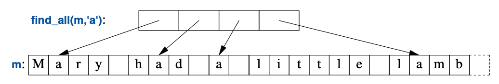

<a class="en-page-number" id="149"></a>

<div class="chapter-number"><p class="chapter-number">{{ page.ch }}</p></div>

# 算法 {#algorithm}

> 若无必要，勿增实体。
>
> <span title="著名的“奥卡姆剃刀”法则，此处作者可能误会了说这短引言作者的名字，因为其名字应该是“William of Occam”，意思是“奥卡姆这个地方的威廉”，作者的写法里“奥卡姆”是他的姓。该名词的维基百科页面为： https://zh.wikipedia.org/wiki/%E5%A5%A5%E5%8D%A1%E5%A7%86%E5%89%83%E5%88%80"。>—— 威廉·奥卡姆</span>[^1]

## 12.1 导言 {#12.1}

vector和list这些数据结构，如果单打独斗，用途颇为有限。
使用时，我们需要添加和删除元素这些基本操作（就像`list`和`vector`实现的那样）。
不过，仅仅用容器存储对象的寥寥无几。
而是会排序、打印、提取子集、移除元素、查找对象等等。
相应地，标准库除了最常见的容器类型之外，还为这些容器提供了最常见的算法。
例如，我们可以轻而易举且高效地把`Entry`的`vector`进行排序，
并为`vector`中每个不重复的元素在`list`中创建副本：

```cpp
void f(vector<Entry>& vec, list<Entry>& lst)
{
    sort(vec.begin(),vec.end());                    // 用 < 进行排序
    unique_copy(vec.begin(),vec.end(),lst.begin()); // 不复制相邻的等值元素
}
```

<a class="en-page-number" id="150"></a>

要让这段代码运行，必须为`Entry`定义小于（`<`）和等于（`==`）操作。例如：

```cpp
bool operator<(const Entry& x, const Entry& y) // 小于
{
    return x.name<y.name;           // 用 name 给 Entry 排序
}
```

标准算法以元素的（半开）序列的方式表示。
一个*序列（sequence）*以指向首元素和尾元素后位置的一对迭代器表示：


在本例中，`sort()`为`vec.begin()`和`vec.end()`定义的迭代器对定义的序列排序，
该迭代器对恰好就是`vector`的全部元素。
对于写（输出），仅需指定待写入的首元素。
如果有不止一个元素输出，起始元素后的元素会被覆盖。
就是说，要避免出错，`lst`的元素数量至少跟`vec`中不重复值的数量一样多。

如果要把不重复元素放进一个新容器里，应该这么写：

```cpp
list<Entry> f(vector<Entry>& vec)
{
    list<Entry> res;
    sort(vec.begin(),vec.end());
    unique_copy(vec.begin(),vec.end(),back_inserter(res));  // 添加到 res 尾部
    return res;
}
```

`back_inserter(res)`这个调用为`res`在容器末尾构造一个迭代器，
并用它添加这些元素，为它们扩展容器提供存储空间。
这给我们省了麻烦，不必去先分配一块特定数量的空间，而后在填充它。
这样，标准容器加上`back_inserter()`消灭了对`realloc()`的需求，
这个易出错的显示C-风格内存管理。
标准库容器`list`有个转移构造函数（§5.2.2），
它可以令`res`的传值返回变得高效（哪怕是装载了成千上万元素的`list`）。

如果你觉得这个迭代器对风格的代码——例如`sort(vec.begin(),vec.end())`——繁琐，
还可以定义容器版本的算法，然后这么写`sort(vec)`（§12.8）。

## 12.2 迭代器应用 {#12.2}

对于某个容器，有几个指向特定元素的迭代器可以获取；
`begin()`和`end()`就是这种例子。
另外，很多算法也会返回迭代器。
例如，标准算法`find()`在某个序列中查找一个值并返回指向该元素的迭代器：

<a class="en-page-number" id="151"></a>

```cpp
bool has_c(const string& s, char c)     // s 是否包含字符 c ？
{
    auto p = find(s.begin(),s.end(),c);
    if (p!=s.end())
        return true;
    else
        return false;
}
```

与很多标准库查找算法相似，`find()`返回`end()`以表示“未找到（not found）”。
一个等价的、较短的`has_c()`定义是：

```cpp
bool has_c(const string& s, char c)     // s 是否包含字符 c ？
{
    return find(s.begin(),s.end(),c)!=s.end();
}
```

一个更有意思的练习时找到一个字符在某字符串中出现的所有位置。
可以返回以承载`string`迭代器的`vector`表示的出现位置集合。
返回`vector`是高效的，因为它提供了转移语意（§5.2.1）。
假设我们想修改发现的位置，需要传入非-`const`字符串：

```cpp
vector<string::iterator> find_all(string& s, char c)    // 查找s中出现的所有c
{
    vector<string::iterator> res;
    for (auto p = s.begin(); p!=s.end(); ++p)
        if (∗p==c)
            res.push_back(p);
    return res;
}
```

我们用一个常规的循环在这个字符串中进行遍历，借助`++`每次把迭代器`p`向前移动一个元素，
并利用解引用操作符`*`查看这些元素。可以这样测试`find_all()`：

```cpp
void test() {
    string m {"Mary had a little lamb"};
    for (auto p : find_all(m,'a'))
        if (∗p!='a')
            cerr << "a bug!\n";
}
```

上面的`find_all()`调用可图示如下：



<a class="en-page-number" id="152"></a>

对于每个有意义的使用而言，迭代器和标准算法在标准容器上的应用都是等效的。
因此，可以这样泛化`find_all()`：

```cpp
template<typename C, typename V>
vector<typename C::iterator> find_all(C& c, V v) {  // 查找v中出现的所有c
    vector<typename C::iterator> res;
    for (auto p = c.begin(); p!=c.end(); ++p)
        if (∗p==v)
            res.push_back(p);
    return res;
}
```

为告知编译器`C`的`iterator`应该被推断为类型而非一个值，比方说整数`7`，
那个`typename`是必须的。
可以为`iterator`引入一个类型别名（§6.4.2）以隐藏着歌实现细节：

```cpp
template<typename T>
using Iterator = typename T::iterator;          // T的迭代器

template<typename C, typename V>
vector<Iterator<C>> find_all(C& c, V v)         // 查找v中出现的所有c
{
    vector<Iterator<C>> res;
    for (auto p = c.begin(); p!=c.end(); ++p)
        if (∗p==v)
            res.push_back(p);
    return res;
}
```

现在可以这样写：

```cpp
void test()
{
    string m {"Mary had a little lamb"};

    for (auto p : find_all(m,'a'))      // p是个string::iterator
        if (∗p!='a')
            cerr << "string bug!\n";

    list<double> ld {1.1, 2.2, 3.3, 1.1};
    for (auto p : find_all(ld,1.1))     // p是个list<double>::iterator
        if (∗p!=1.1)
            cerr << "list bug!\n";

    vector<string> vs { "red", "blue", "green", "green", "orange", "green" }; 
    for (auto p : find_all(vs,"red"))   // p是个vector<string>::iterator
        if (∗p!="red")
            cerr << "vector bug!\n";
```

<a class="en-page-number" id="153"></a>

```cpp
    for (auto p : find_all(vs,"green"))
        ∗p = "vert";
}
```

迭代器的作用是分离算法和容器。
算法通过迭代器操作数据，并对元素所在的容器一无所知。
反之，容器也对操作元素的算法不得而知；
它所做的不过是按需提供迭代器（即`begin()`和`end()`）而已。
这种把数据存储和算法分离的模型催生出了泛化且灵活的软件。

## 12.3 迭代器类型 {#12.3}

到底什么是迭代器？任何迭代器都是某种类型的一个对象。
只不过，有着很多种不同的迭代器类型，
因为一个迭代器需要为特定的容器类型保存作业所需的信息。
这些迭代器类型可以像容器那般多种多样，还可以按实际情况进行特化。
例如，`vector`的迭代器可以是普通的指针，
因为指针是个相当合理的指向`vector`元素的方式：


或者，`vector`迭代器也可以实现为指向`vector`的指针外加一个索引：


使用这种迭代器可以进行越界检查。

`list`迭代器不得不比指向元素的指针更复杂一些，
因为一般来说`list`的元素并不知道该`list`中下一个元素在哪儿。
因此，`list`的迭代器有可能是个指向链接的指针：


所有迭代器共通的部分是它们的语意和操作的命名。
例如，对任何迭代器应用`++`都产生一个指向指向下一个元素的迭代器。
以及，用`*`可以得到该迭代器指向的元素。

<a class="en-page-number" id="154"></a>

实际上，任何对象，只要符合几个诸如此类的简单规则就是一个迭代器
——*迭代器（Iterator）*是个概念（§7.2，§12.7）。
另外，用户极少需要知道具体迭代器的类型；每个容器都“知道”其迭代器类型，
并按照惯例命名为`iterator`和`const_iterator`提供它们。
例如，`list<Entry>::iterator`就是`list<Entry>`的通用迭代器类型。
我们几乎没必要操心该类型定义的细节。

## 12.4 流迭代器 {#12.4}

在处理容器中的元素序列时，迭代器是个通用且便利的概念。
但是，容器并非元素序列栖身的唯一所在。
例如，一个输入流产生一个值序列，以及我们会向输出流写入值序列。
所以，迭代器符号应用于输入和输出方面也颇为有用。

要得到一个`ostream_iterator`，需要指定使用的流以及待写入对象的类型。
例如：

```cpp
ostream_iterator<string> oo {cout}; // 向cout写入string
```

给`*oo`赋值待结果就是把该值写入到`cout`。例如：

```cpp
int main()
{
    ∗oo = "Hello, ";    // 意思是cout<<"Hello, "
    ++oo;
    ∗oo = "world!\n";   // 意思是cout<<"world!\n"
}
```

这是另一种向标准输出正规消息的方式。`++oo`模拟了利用指针向数组写入的行为。

类似地，`istream_iterator`允许我们把一个输入流作为只读容器使用。
同样，还是要制定使用的流和待读取对象的类型：

```cpp
istream_iterator<string> ii {cin};
```

输入迭代器通常成对出现来表示一个序列，因此还需要提供一个`istream_iterator`
以表示输入的末尾。这就是默认的`istream_iterator`：

```cpp
istream_iterator<string> eos {};
```

一般来说，`istream_iterator`和`ostream_iterator`不会直接拿来就用。
而是会作为参数传递给算法。
例如，可以写个简单的程序读取一个文件，为读到的单词排序、去重，
然后把结果写入到另一个文件：

```cpp
int main()
{
    string from, to;
    cin >> from >> to;                      // 获取源文件名和目标文件名

    ifstream is {from};                     // 以"from"文件作为输入流
    istream_iterator<string> ii {is};       // 流的输入迭代器
    istream_iterator<string> eos {};        // 输入截止信号
```

<a class="en-page-number" id="155"></a>

```cpp
    ofstream os {to};                       // 以"to"文件作为输出流
    ostream_iterator<string> oo {os,"\n"};  // 流的输出迭代器

    vector<string> b {ii,eos};              // b 是个以输入流初始化的vector
    sort(b.begin(),b.end());                // 给缓存排序

    unique_copy(b.begin(),b.end(),oo);      // 把缓存复制到输出流，丢弃重复的值

    return !is.eof() || !os;                // 返回错误状态（§1.2.1， §10.4）
}
```

`ifstream`是个可附着到文件上的`istream`，
而一个`ofstream`是个可以附着到文件的`ostream`（§10.7）。
`ostream_iterator`的第二个参数用于分割输出值。

实际上，此程序没必要写这么长。
我们将字符串读取到`vector`，然后给它们`sort()`,继而去重再输出。
更优雅的方案是根本不存储重复值。
要做到这一点，可以把`string`存储在`set`中，
`set`不会保存重复的值，并且会维持元素的顺序（§11.4）。
这样，可以把使用`vector`的两行代码以使用`set`的一行取代，
并使用更简单的`copy()`取代`unique_copy()`：

```cpp
set<string> b {ii,eos};         // 从输入流收集字符串
copy(b.begin(),b.end(),oo);     // 把缓存复制到输出流
```

`ii`、`eos`和`oo`都只用了一次，因此可以进一步缩减程序的代码量：

```cpp
int main()
{
    string from, to;
    cin >> from >> to;      // 获取源文件名和目标文件名

    ifstream is {from};     // 以"from"文件作为输入流
    ofstream os {to};       // 以"to"文件作为输出流

    set<string> b {istream_iterator<string>{is},istream_iterator<string>{}};    // 读输入流
    copy(b.begin(),b.end(),ostream_iterator<string>{os,"\n"});                  // 复制到输出流

    return !is.eof() || !os;    // 返回错误状态（§1.2.1， §10.4）
}
```

至于最后一部简化是否提高可读性，取决于个人便好和经验。

## 12.5 谓词 {#12.5}

到目前为止，例子中的算法对序列中的元素执行简单的“内建（built in）”操作。
但是，我们经常需要把这个操作作为参数传给算法。
比方说，算法`find`（§12.2，§12.6）提供了便捷的方式查找特定的值。
有个更通用的变体可以查找一个符合特定条件——*谓词（predicate）*——的元素。
例如，我们可能需要在一个`map`里查找第一个大于`42`的值。
`map`对其元素以*(key,value)*对的序列的方式提供访问，
因此，可以在`map<string,int>`查找一个其`int`大于`42`的`pair<const string,int>`：

<a class="en-page-number" id="156"></a>

```cpp
void f(map<string,int>& m)
{
    auto p = find_if(m.begin(),m.end(),Greater_than{42});
    // ...
}
```

此处，`Greater_than`是个函数对象（§6.3.2）持有`42`以便用于比对：

```cpp
struct Greater_than {
    int val;
    Greater_than(int v) : val{v} { }
    bool operator()(const auto& r) const { return r.second>val; }
};
```

此外，还可以使用lambda表达式（§6.3.2）：

```cpp
auto p = find_if(m.begin(), m.end(), [](const auto& r) { return r.second>42; });
```

谓词不能对其访问的元素进行修改。

## 12.6 算法概览 {#12.6}

算法的通用定义是
“由规则组成的有限集合，这些规则为解决一组特定问题规定一系列操作，（并）具有五个重要特性：
有限性……确定性……输入……输出……高效性” [Knuth,1968,§1.1]。
在C++标准库的语境里，算法是一个对元素序列执行操作的函数模板。

标准库提供了数十种算法。这些算法定义在命名空间`std`中，
呈现在`<algorithm>`头文件里。
这些标准库算法全都以序列作为输入。
一个从`b`到`e`的半开区间序列表示为[`b`:`e`)。
一下是几个例子：

<table style="width:90%;margin-left:auto;margin-right:auto;">
    <tbody>
        <tr>
            <th colspan="2" style="text-align: center">
                <strong>部分标准库算法 &lt;algorithm&gt;</strong></br>
            </th>
        </tr>
        <tr>
            <td style="width:30%"><code>f=for_each(b,e,f)</code></td>
            <td>为[<code>b</code>:<code>e</code>)中的每个元素执行<code>f(x)</code></td>
        </tr>
        <tr>
            <td><code>p=find(b,e,x)</code></td>
            <td><code>p</code>是[<code>b</code>:<code>e</code>)中第一个满足<code>*p==x</code>的<code>p</code></td>
        </tr>
        <tr>
            <td><code>p=find_if(b,e,f)</code></td>
            <td><code>p</code>是[<code>b</code>:<code>e</code>)中第一个满足<code>f(*p)</code>的<code>p</code></td>
        </tr>
        <tr>
            <td><code>n=count(b,e,x)</code></td>
            <td><code>n</code>是[<code>b</code>:<code>e</code>)中满足<code>*q==x</code>的元素<code>*q</code>的数量</td>
        </tr>
        <tr>
            <td><code>n=count_if(b,e,f)</code></td>
            <td><code>n</code>是[<code>b</code>:<code>e</code>)中满足<code>f(*q)</code>的元素<code>*q</code>的数量</td>
        </tr>
        <tr>
            <td><code>replace(b,e,v,v2)</code></td>
            <td>在[<code>b</code>:<code>e</code>)中用<code>v2</code>替换满足<code>*q==v</code>的元素<code>*q</code></td>
        </tr>
        <tr>
            <td><code>replace_if(b,e,f,v2)</code></td>
            <td>在[<code>b</code>:<code>e</code>)中用<code>v2</code>替换满足<code>f(*q)</code>的元素<code>*q</code></td>
        </tr>
        <tr>
            <td><code>p=copy(b,e,out)</code></td>
            <td>从[<code>b</code>:<code>e</code>)复制到[<code>out</code>:<code>p</code>)</td>
        </tr>
        <tr>
            <td><code>p=copy_if(b,e,out,f)</code></td>
            <td>从[<code>b</code>:<code>e</code>)复制满足<code>f(*q)</code>的元素<code>*q</code>到[<code>out</code>:<code>p</code>)</td>
        </tr>
        <tr>
            <td><code>p=move(b,e,out)</code></td>
            <td>从[<code>b</code>:<code>e</code>)移动到[<code>out</code>:<code>p</code>)</td>
        </tr>
        <tr>
            <td><code>p=unique_copy(b,e,out)</code></td>
            <td>从[<code>b</code>:<code>e</code>)复制到[<code>out</code>:<code>p</code>)；相邻的重复元素不复制</td>
        </tr>
        <tr>
            <td><code>sort(b,e)</code></td>
            <td>以<code>&lt;</code>作为排序依据，对[<code>b</code>:<code>e</code>)中的元素进行排序</td>
        </tr>
        <tr>
            <td><code>sort(b,e,f)</code></td>
            <td>以<code>f</code>作为排序依据，对[<code>b</code>:<code>e</code>)中的元素进行排序</td>
        </tr>
        <tr>
            <td><code>(p1,p2)=equal_range(b,e,v)</code></td>
            <td>[<code>p1</code>:<code>p2</code>)是有序序列[<code>b</code>:<code>e</code>)的值为<code>v</code>的子序列；大体上就是针对<code>v</code>的二分查找</td>
        </tr>
    </tbody>
</table>

<a class="en-page-number" id="157"></a>

<table style="width:90%;margin-left:auto;margin-right:auto;">
    <tbody>
        <tr>
            <th colspan="2" style="text-align: center">
                <strong>部分标准库算法 &lt;algorithm&gt;（续表）</strong></br>
            </th>
        </tr>
        <tr>
            <td style="width:30%"><code>p=merge(b,e,b2,e2,out)</code></td>
            <td>把[<code>b</code>:<code>e</code>)和[<code>b2</code>:<code>e2</code>)两个有序序列和并进[<code>out</code>:<code>p</code>)</td>
        </tr>
        <tr>
            <td><code>p=merge(b,e,b2,e2,out,f)</code></td>
            <td>把[<code>b</code>:<code>e</code>)和[<code>b2</code>:<code>e2</code>)两个有序序列和并进[<code>out</code>:<code>p</code>)，以<code>f</code>作为比对依据</td>
        </tr>
    </tbody>
</table>

这些算法和其它的一些（见 §14.3），可容器元素、`string`和内建数组。

有些算法，例如`replace()`和`sort()`，修改元素值，但没有元素将容器元素增加或减少。
原因是，一个序列并不识别持有此元素序列的容器。
要增加或删除元素，你需要某个了解该容器的事物（比方 `back_inserter`；§12.1）
或者直接在容器上进行操作（即 `push_back()`或`erase()`；§11.2）。

Lambda表达式经常作为操作以参数的形式传递，例如：

```cpp
    vector<int> v = {0,1,2,3,4,5};
    for_each(v.begin(),v.end(),[](int& x){ x=x∗x; }); // v=={0,1,4,9,16,25}
```

标准库容器相对于手写的循环，通常更小心、更有针对性地进行设计和实现，
因此，去了解并使用它们，以避免重复造轮子。

## 12.7 概束 {12.7}

在C++20中，标准库算法会被指定概束（第7章）。
相关的初期准备工作请参考 Ranges Technical Specification[RangesTS]。
其具体实现可以在互联网上找到。
对于C++20，区间这个概束定义在`<ranges>`中。

`Range`是借由`begin()`/`end()`定义的C++98序列的一个泛化。
`Range`是个指定元素序列概念的概束。它的定义包括：

- 一个迭代器的`{begin,end}`对
- 一个`{begin,n}`对，其中`begin`是个迭代器，`n`是元素数量
- 一个`begin,pred`对，其中`begin`是个迭代器，`pred`是个谓词；
    如果对于迭代器`p`来说，`pred(p)`为`true`，
    我们就到达了序列的末尾。
    这给了我们数不清的序列，并且序列可以“随时按需（on the fly）”生成。

`Range`这个概束让我们可以用`sort(v)`取代`sort(v.begin(),v.end())`，
后者是自1994年开始使用STL的方式。例如：

```cpp
template<BoundedRange R>
    requires Sortable<R>
void sort(R& r)
{
    return sort(begin(r),end(r));
}
```

`Sortable`的关系默认是`less`。

一般来说，在标准库算法要求用一对迭代器表示一个序列的地方，
C++20就允许使用一个`Range`作为简化的替代写法。

<a class="en-page-number" id="158"></a>

除`Range`之外，C++20还提供许多便利的概束。
这些概束定义在头文件`<ranges>`、`<iterator>`和`concepts`中。

<table style="width:90%;margin-left:auto;margin-right:auto;">
    <tbody>
        <tr>
            <th colspan="2" style="text-align: center">
                <strong>核心语言概束&lt;concepts&gt;</strong></br>
            </th>
        </tr>
        <tr>
            <td style="width:30%"><code>Same&lt;T,U&gt;</code></td>
            <td><code>T</code>和<code>U</code>是相同的类型</td>
        </tr>
        <tr>
            <td><code>DerivedFrom&lt;T,U&gt;</code></td>
            <td><code>T</code>继承自<code>U</code></td>
        </tr>
        <tr>
            <td><code>ConvertibleTo&lt;T,U&gt;</code></td>
            <td>一个<code>T</code>可以转化成一个<code>U</code></td>
        </tr>
        <tr>
            <td><code>CommonReference&lt;T,U&gt;</code></td>
            <td><code>T</code>和<code>U</code>的共通引用类型相同</td>
        </tr>
        <tr>
            <td><code>Common&lt;T,U&gt;</code></td>
            <td><code>T</code>和<code>U</code>的共通类型相同</td>
        </tr>
        <tr>
            <td><code>Integral&lt;T&gt;</code></td>
            <td><code>T</code>是个整数类型</td>
        </tr>
        <tr>
            <td><code>SignedIntegral&lt;T&gt;</code></td>
            <td><code>T</code>是个有符号整数类型</td>
        </tr>
        <tr>
            <td><code>UnsignedIntegral&lt;T&gt;</code></td>
            <td><code>T</code>是个无符号整数类型</td>
        </tr>
        <tr>
            <td><code>Assignable&lt;T,U&gt;</code></td>
            <td><code>U</code>可以赋值给<code>T</code></td>
        </tr>
        <tr>
            <td><code>SwappableWith&lt;T,U&gt;</code></td>
            <td><code>T</code>和<code>U</code>可以被<code>std:swap()</code></td>
        </tr>
        <tr>
            <td><code>Swappable&lt;T&gt;</code></td>
            <td>SwappableWith&lt;T,T&gt;</td>
        </tr>
    </tbody>
</table>

`Common`在定义算法时很重要，该算法应用于多个相关类型的时候还要具备数学上的合理性。
`Common<T,U>`是指某个类型`C`，可以把`T`和`U`都先转换成`C`进行比对。
例如，当我们需要把`std::string`跟C-风格字符串（`char*`），
或者把`int`跟`double`进行比对，而非`std::string`和`int`时。
在用于定义`Common`时，为确保对`common_type_t`的特化，适宜的方式为：

```cpp
using common_type_t<std::string,char∗> = std::string;
using common_type_t<double,int> = double;
```

`Common`的定义略需点技巧，但解决了一个很困难的基本问题。
幸运的是，除非需要进行操作的混合类型在库中（尚）无适当的定义，
我们不必为`common_type_t`定义一个特化。
在定义那些需要对不同的类型做比对的概束和算法时，
多数都用到了`Common`或`CommonReference`。

与比对相关的概束受到了来自 [Stepanov,2009] 的重要影响：

<table style="width:90%;margin-left:auto;margin-right:auto;">
    <tbody>
        <tr>
            <th colspan="2" style="text-align: center">
                <strong>比对相关的概束&lt;concepts&gt;</strong></br>
            </th>
        </tr>
        <tr>
            <td style="width:30%"><code>Boolean&lt;T&gt;</code></td>
            <td><code>T</code>可用作布尔类型（Boolean）</td>
        </tr>
        <tr>
            <td><code>WeaklyEqualityComparableWith&lt;T,U&gt;</code></td>
            <td><code>T</code>与<code>U</code>可使用<code>==</code>和<code>!=</code>进行相等性比对</td>
        </tr>
        <tr>
            <td><code>WeaklyEqualityComparable&lt;T&gt;</code></td>
            <td><code>WeaklyEqualityComparableWith&lt;T,T&gt;</code></td>
        </tr>
        <tr>
            <td><code>EqualityComparableWith&lt;T,U&gt;</code></td>
            <td><code>T</code>和<code>U</code>可使用<code>==</code>做等价性比对</td>
        </tr>
        <tr>
            <td><code>EqualityComparable&lt;T&gt;</code></td>
            <td><code>EqualityComparableWith&lt;T,T&gt;</code></td>
        </tr>
        <tr>
            <td><code>StrictTotallyOrderedWith&lt;T,U&gt;</code></td>
            <td>
                <code>T</code>和<code>U</code>可使用
                <code>&lt;</code>、<code>&lt;=</code>、
                <code>&gt;</code>和<code>&gt;=</code>
                进行比对，得出全序关系
            </td>
        </tr>
        <tr>
            <td><code>StrictTotallyOrdered&lt;T&gt;</code></td>
            <td><code>StrictTotallyOrderedWith&lt;T,T&gt;</code></td>
        </tr>
    </tbody>
</table>

`WeaklyEqualityComparableWith`和`WeaklyEqualityComparable`二者的使用，
揭示了（到目前为止都）被忽视的重载机会。

<a class="en-page-number" id="159"></a>

<table style="width:90%;margin-left:auto;margin-right:auto;">
    <tbody>
        <tr>
            <th colspan="2" style="text-align: center">
                <strong>对象概束&lt;concepts&gt;</strong></br>
            </th>
        </tr>
        <tr>
            <td style="width:30%"><code>Destructible&lt;T&gt;</code></td>
            <td><code>T</code>可被销毁且可用一元的<code>&</code>获取其地址</td>
        </tr>
        <tr>
            <td><code>Constructible&lt;T,Args&gt;</code></td>
            <td><code>T</code>可通过一个<code>Args</code>类型的参数列表构造</td>
        </tr>
        <tr>
            <td><code>DefaultConstructible&lt;T&gt;</code></td>
            <td><code>T</code>有默认构造函数</td>
        </tr>
        <tr>
            <td><code>MoveConstructible&lt;T&gt;</code></td>
            <td><code>T</code>有移动构造函数</td>
        </tr>
        <tr>
            <td><code>CopyConstructible&lt;T&gt;</code></td>
            <td><code>T</code>有拷贝构造函数和移动构造函数</td>
        </tr>
        <tr>
            <td><code>Movable&lt;T&gt;</code></td>
            <td>
                <code>MoveConstructible&lt;T&gt;</code>、
                <code>Assignable&lt;T&,T&gt;</code>和
                <code>Swapable&lt;T&gt;</code>
            </td>
        </tr>
        <tr>
            <td><code>Copyable&lt;T&gt;</code></td>
            <td>
                <code>CopyConstructable&lt;T&gt;</code>、
                <code>Movable&lt;T&gt;</code>和
                <code>Assignable&lt;T,const T&&gt;</code>
            </td>
        </tr><tr>
            <td><code>Semiregular&lt;T&gt;</code></td>
            <td>
                <code>Copyable&lt;T&gt;</code>和
                <code>DefaultConstructable&lt;T&gt;</code>
            </td>
        </tr><tr>
            <td><code>Regular&lt;T&gt;</code></td>
            <td>
                <code>SemiRegular&lt;T&gt;</code>和
                <code>EqualityComparable&lt;T&gt;</code>
            </td>
        </tr>
    </tbody>
</table>

`Regular`是类型的理想状态。`Regular`类型用起来大体和`int`差不多，
还在类的用法（§7.2）方面简大大化了思考。
类中默认`==`的缺失，意味着多数类只能以`SemiRegular`的形式面世，
尽管它们中的多数都本可以并应该成为`Regular`。

<table style="width:90%;margin-left:auto;margin-right:auto;">
    <tbody>
        <tr>
            <th colspan="2" style="text-align: center">
                <strong>可调用概束&lt;concepts&gt;</strong></br>
            </th>
        </tr>
        <tr>
            <td style="width:30%"><code>Invocable&lt;F,Args&gt;</code></td>
            <td><code>F</code>可通过一个<code>Args</code>类型的参数列表调用</td>
        </tr>
        <tr>
            <td><code>InvocableRegular&lt;F,Args&gt;</code></td>
            <td>
                <code>F</code>可通过一个<code>Args</code>类型的参数列表调用，并
                <a href="https://en.cppreference.com/w/cpp/concepts/invocable#Equality_preservation" title="std::regular_invocable"><strong>维持等同性</strong></a>
            </td>
        </tr>
        <tr>
            <td><code>Predicate&lt;F,Args&gt;</code></td>
            <td><code>F</code>可通过一个<code>Args</code>类型的参数列表调用，返回bool值</td>
        </tr>
        <tr>
            <td><code>Relation&lt;F,T,U&gt;</code></td>
            <td><code>Predicate&lt;F,T,U&gt;</code></td>
        </tr>
        <tr>
            <td><code>StrictWeakOrder&lt;F,T,U&gt;</code></td>
            <td>
                可确保
                <a href="https://en.cppreference.com/w/cpp/concepts/strict_weak_order" title="std::strict_weak_order"><strong>严格弱序</strong></a>
                的<code>Relation&lt;F,T,U&gt;</code>
            </td>
        </tr>
    </tbody>
</table>

对于某个函数`f()`，如果`x==y`可导致`f(x)==f(y)`，
则该函数是*维持等同性（equality preserving）*的。

严格弱序（strict weak ordering）是标准库针对顺序比对的常见推断，比如`<`；
如果你觉得有必要了解就查一下（或者点击表格中该名称的链接——译者）。

`Relation`和`StrictWeakOrder`仅在语意上有所差别。
我们（目前）还无法在代码层面表示这一差异，因此这两个命名仅体现了我们的意图。

<table style="width:90%;margin-left:auto;margin-right:auto;">
    <tbody>
        <tr>
            <th colspan="2" style="text-align: center">
                <strong>迭代器概束&lt;iterators&gt;</strong></br>
            </th>
        </tr>
        <tr>
            <td style="width:30%"><code>Iterator&lt;I&gt;</code></td>
            <td><code>I</code>可被<code>++</code>自增或<code>*</code>解引用</td>
        </tr>
        <tr>
            <td><code>Sentinel&lt;S,I&gt;</code></td>
            <td>
                <code>S</code>是某个<code>Iterator</code>类型的哨兵，
                就是说，<a href="https://en.cppreference.com/w/cpp/iterator/sentinel_for" title="此处较费解，请参阅 std::sentinel_for"><code>S</code>是个用于<code>I</code>的值类型的谓词</a>
            </td>
        </tr>
        <tr>
            <td><code>SizedSentinel&lt;S,I&gt;</code></td>
            <td><code>S</code>是个哨兵，且可以用<code>-</code>运算符和<code>I</code>运算（即<code>s-i</code>——译者）</td>
        </tr>
        <tr>
            <td><code>InputIterator&lt;I&gt;</code></td>
            <td><code>I</code>是个输入迭代器，<code>*</code>可用于只读操作</td>
        </tr>
        <tr>
            <td><code>OutputIterator&lt;I&gt;</code></td>
            <td><code>I</code>是个输出迭代器，<code>*</code>可用于只写操作</td>
        </tr>
        <tr>
            <td><code>ForwardIterator&lt;I&gt;</code></td>
            <td>
                <code>I</code>是个前向迭代器，支持
                <a href="https://en.cppreference.com/w/cpp/iterator/forward_iterator#Semantic_requirements" title="此术语详情请参阅 std::forward_iterator"><strong>multi-pass</strong></a>
            </td>
        </tr>
        <tr>
            <td><code>BidirectionalIterator&lt;I&gt;</code></td>
            <td>
                <code>I</code>是个<code>ForwardIterator</code>，支持<code>--</code>
            </td>
        </tr>
        <tr>
            <td><code>RandomAccessIterator&lt;I&gt;</code></td>
            <td>
                <code>I</code>是个<code>BidirectionalIterator</code>，
                支持<code>+</code>、<code>-</code>、<code>+=</code>、<code>-=</code>和<code>[]</code>
            </td>
        </tr>
        <tr>
            <td><code>Permutable&lt;I&gt;</code></td>
            <td>
                <code>I</code>是个<code>ForwardIterator</code>，
                并且<code>I</code>支持移动和交换元素
            </td>
        </tr>
        <tr>
            <td><code>Mergeable&lt;I1,I2,R,O&gt;</code></td>
            <td>
                可以按<code>Relation&lt;R&gt;</code>把有序序列<code>I2</code>和<code>I2</code>合并入<code>O</code>
            </td>
        </tr>
        <tr>
            <td><code>Sortable&lt;I&gt;</code></td>
            <td>
                可以按<code>less</code>把承载<code>I</code>的序列进行排序
            </td>
        </tr>
        <tr>
            <td><code>Sortable&lt;I,R&gt;</code></td>
            <td>
                可以按<code>Relation&lt;R&gt;</code>把承载<code>I</code>的序列进行排序
            </td>
        </tr>
    </tbody>
</table>

<a class="en-page-number" id="160"></a>

对于给定的算法，迭代器的不同类型（分类）可用于选择最优的方式；
见 §7.2.2 和 §13.9.1。对于`InputIterator`的范例，请参见 §12.4。

哨兵的基本思路是这样的：我们针对某个区间进行迭代，
该区间始自一个迭代器，直到谓词对于某个元素为 true 终止。
这样，一个迭代器`p`和一个哨兵`s`就定义了一个区间`[p:s(*p)]`。
例如，为了遍历以指针作为迭代器的C-风格字符串，
可以为其哨兵定义一个谓词：

```cpp
[](const char∗ p) {return ∗p==0; }
```

`Mergeable`和`Sortable`的简介比在C++20中的定义简化过了。

<table style="width:90%;margin-left:auto;margin-right:auto;">
    <tbody>
        <tr>
            <th colspan="2" style="text-align: center">
                <strong>区间概束&lt;ranges&gt;</strong></br>
            </th>
        </tr>
        <tr>
            <td style="width:30%"><code>Range&lt;R&gt;</code></td>
            <td><code>R</code>是个区间，由一个起始迭代器和一个哨兵界定</td>
        </tr>
        <tr>
            <td><code>SizedRange&lt;R&gt;</code></td>
            <td><code>R</code>是个区间，其size可在常数时间内获知</td>
        </tr>
         <tr>
            <td><code>View&lt;R&gt;</code></td>
            <td><code>R</code>是个区间，其复制、移动和赋值的执行是常数时间</td>
        </tr>
        <tr>
            <td><code>BoundedRange&lt;R&gt;</code></td>
            <td><code>R</code>是个区间，其迭代器和哨兵的类型一致</td>
        </tr>
        <tr>
            <td><code>InputRange&lt;R&gt;</code></td>
            <td><code>R</code>是个区间，其迭代器类型符合 InputIterator 的要求</td>
        </tr>
        <tr>
            <td><code>OutputRange&lt;R&gt;</code></td>
            <td><code>R</code>是个区间，其迭代器类型符合 OutputIterator 的要求</td>
        </tr>
        <tr>
            <td><code>ForwardRange&lt;R&gt;</code></td>
            <td><code>R</code>是个区间，其迭代器类型符合 ForwardIterator 的要求</td>
        </tr>
        <tr>
            <td><code>BidirectionalRange&lt;R&gt;</code></td>
            <td><code>R</code>是个区间，其迭代器类型符合 BidirectionalIterator 的要求</td>
        </tr>
        <tr>
            <td><code>RandomAccessRange&lt;R&gt;</code></td>
            <td><code>R</code>是个区间，其迭代器类型符合 RandomAccessIterator 的要求</td>
        </tr>
    </tbody>
</table>

`<ranges>`里还有几个别的概束，但此表也够入门的了。

## 12.8 容器算法 {#12.8}

在等不及 Range 概束的情况下，我们可以定义简化的区间算法。
例如，提供`sort(v)`这种简短写法取代`sort(v.begin(),v.end())`可谓轻而易举：

```cpp
namespace Estd {
    using namespace std;

    template<typename C>
    void sort(C& c)
    {
        sort(c.begin(),c.end());
    }

    template<typename C, typename Pred>
    void sort(C& c, Pred p)
    {
        sort(c.begin(),c.end(),p);
    }

    // ...
}
```

我把容器版本的`sort()`（和其它算法）置于它们自己的命名空间`Estd`

<a class="en-page-number" id="161"></a>

（“extended `std`”）中，以免跟使用命名空间`std`的其它程序员产生冲突，
也便于用`Range`版本取代这个权宜之计。

## 12.9 并行算法 {#12.9}

当对大量数据项执行同样的操作时，只要针对不同数据项的运算相互独立，
就能够以并行的方式去执行：

- *并行执行（parallel execution）*：
    任务在多个线程上执行（通常运行在多个处理器核心上）
- *向量化执行（vectorized execution）*：
    任务在单一线程上以矢量化（vectorization）方式执行，
    也称作*SIMD（“Single Instruction, Multiple Data”）*。

标准库对这两种都提供支持，还可以指定顺序执行，在`<execution>`中有：

- `seq`：顺序执行
- `par`：（在可行的情况下）并行执行
- `par_unseq`：（在可行的情况下）并行执行 和/或 非顺序（向量化）执行。

以`std::sort()`为例：

```cpp
sort(v.begin(),v.end());            // 顺序执行
sort(seq,v.begin(),v.end());        // 顺序执行（与默认方式相同）
sort(par,v.begin(),v.end());        // 并行执行
sort(par_unseq,v.begin(),v.end());  // 并行执行 和/或 向量化执行
```

至于并行执行 和/或 向量化执行是否划算，要取决于算法、
序列中元素的数量、硬件，以及运行该程序的机器的利用率等等。
因此*执行策略标志（execution policy indicators）*仅仅是个暗示。
编译器 和/或 运行时调度器将决定在多大程度上采用并发。
这些是很重要的，并且有关“切勿未经测试就对性能下断言”的规则在此处尤为重要。

绝大多数标准库算法，包括 §12.6 表中除`equal_range`外的全部，
都能像`sort()`使用`par`和`par_unseq`那样被并行化和向量化。
为什么`equal_range()`不行呢？因为到目前为止，它尚无有益的并行算法。

很多并行算法主要用于数值数据；参见 §14.3.1。

采用并行执行时，请确保避免数据竞争（§15.2）和死锁（§15.5）。

## 12.10 忠告 {#12.10}

- [1] 一个 STL 算法可操作一个或多个序列；§12.1。
- [2] 输入序列是由一对迭代器定义的半开区间；§12.1。
- [3] 在进行查找时，算法通常返回输入序列的结尾以表示“未找到”；§12.2。
- [4] 算法不会直接在其参数序列中增添或删减元素；§12.2，§12.6。
- [5] 写循环时，考虑一下能否以一个通用算法实现；§12.2。

<a class="en-page-number" id="162"></a>

- [6] 用谓词和其它函数对象为标准算法赋予更广泛的意义；§12.5，§12.6。
- [7] 谓词绝不可修改其参数；§12.5。
- [8] 请通晓标准库算法，并用其代替手写的循环；§12.6。
- [9] 在迭代器对的风格显得冗长时，可以引入一个 容器/区间 版本的算法；§12.8。

[^1]: 著名的“奥卡姆剃刀”法则，此处作者可能误会了说这短引言作者的名字，因为其名字应该是“William of Occam”，意思是“奥卡姆这个地方的威廉”，作者的写法里“奥卡姆”是他的姓。该名词有专门的的[维基百科页面](https://zh.wikipedia.org/wiki/%E5%A5%A5%E5%8D%A1%E5%A7%86%E5%89%83%E5%88%80) —— 译者注
