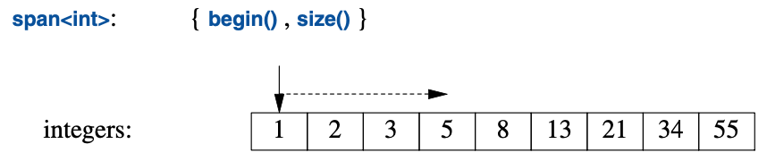

<a class="en-page-number" id="163"></a>

<div class="chapter-number"><p class="chapter-number">{{ page.ch }}</p></div>

# 实用功能 {#utilities}

> 你乐于挥霍的时间，都不能算作浪费。
>
> <span title="此引言的出处略复杂，详情请见 https://quoteinvestigator.com/2010/06/11/time-you-enjoy/ ，译法取自网络。">—— 伯特兰·罗素</span>[^1]

## 13.1 导言 {#13.1}

并非所有标准库组件都置身于“容器”或“I/O”这样显而易见的分类中。
本节将为短小却用途广泛的组件给出用例。
因为在描述设计和编程时被用作基本词汇，
这些组件（类或模板）也常被称为*词汇表类型（vocabulary types）*。
对于更强大的库设施，包括标准库的其它组件而言，这些库组件通常充当零件。
一个有用的函数或者类型，无需很复杂，也无需跟其它函数和类紧密关联起来。

<a class="en-page-number" id="164"></a>

## 13.2 资源管理 {#13.2}

只要不是小打小闹的程序，其重要的任务之一就是管理资源。
资源就是需要先申请，用后要进行（显示或隐式）释放的东西。
比方说内存、锁、套接字、线程执柄，以及文件执柄等等。
对于长时间运行的程序，不及时释放资源（“泄漏”）会导致严重的性能下降，
甚至可能导致糟糕的崩溃。
即便是较短的程序，资源泄露也会弄得很尴尬，
比方说因为资源不足而导致运行时间增加几个数量级。

标准库组件在设计层面力求避免资源泄露。
为此，它们依赖成对的 构造函数/析构函数 这种基础语言支持，
以确保资源随着持有它的对象一起释放。
`Vector`中管理器元素生命期的 构造函数/析构函数对 就是个范例（§4.2.2），
所有标准库容器都是以类似方式实现的。
重要的是，此方法与利用异常的错误处理方法配合良好。
例如，以下技法用于标准库的锁类：

```cpp
mutex m;    // used to protect access to shared data
// ...
void f()
{
    scoped_lock<mutex> lck {m}; // acquire the mutex m
    // ... manipulate shared data ...
}
```

在`lck`的构造函数获取`mutex`（§15.5）之前，该`thread`不会继续执行。
对应的析构函数会释放此资源。
因此在本例中，在控制线程离开`f()`时（`return`、“经由函数末尾”或抛出异常），
`scoped_lock`的析构函数会释放`mutex`。

这是 RAII（“资源请求即初始化”技术；§4.2.2）的一个应用。
RAII是C++中约定俗成管理资源方式的基础。
容器（例如`vector`、`map`、`string`和`iostream`）
就以类似的方式管理其资源（比如文件执柄和缓存）。

### 13.2.1 `unique_ptr` 和 `shared_ptr` {#13.2.1}

到目前为止的示例都仅涉及作用域内的对象，在离开作用域时释放申请的资源，
那么分配在自由存储区域内对象的情形又如何呢？
在`<memory>`中，标准库提供了两个“智能指针”用于管理自由存储中的对象：

- [1] `unique_ptr`用于独占所有权
- [2] `shared_ptr`用于共享所有权

这些“智能指针”最基本的用途是避免粗心大意导致的内存泄漏。例如：

```cpp
void f(int i, int j) // X* vs. unique_ptr<X>
{
    X∗ p = new X;               // new一个X
    unique_ptr<X> sp {new X};   // new一个X，并将其指针交给unique_ptr
    // ...
```

<a class="en-page-number" id="165"></a>

```cpp
    if (i<99) throw Z{};        // 可能会抛出异常
    if (j<77) return;           // 可能会“提前”return
    // ... 使用 p 和 sp ..
    delete p;   // 销毁 *p
}
```

此处，如果`i<99`或`j<77`，我们就“忘记了”删除`p`。
另一方面，无论以怎样的方式离开`f()`（抛出异常、执行`return`或“经由函数末尾”），
`unique_ptr`都会确保其对象妥善销毁。
搞笑的是，本可以轻易地解决这个问题，只要*不*使用指针且*不*使用`new`就行：

```cpp
void f(int i, int j) // 使用局部变量
{
    X x;
    // ...
}
```

不幸的是，`new`（以及指针和引用）的滥用是个日益严重的问题。

无论如何，在你切实需要使用指针语意的时候，与裸指针的妥善使用相比，
`unique_ptr`是个轻量级机制，没有额外空间和时间开销。
它的一个进阶用法是，把分配在自由存储区的对象传入或传出函数：

```cpp
unique_ptr<X> make_X(int i)
    // 分配一个X并直接交给一个unique_ptr
{
    // ... 检查i，以及其它操作. ...
    return unique_ptr<X>{new X{i}};
}
```

`unique_ptr`是个单个对象（或数组）的执柄，这与`vector`是对象序列的执柄如出一辙。
都（借由RAII）控制其它对象的生命期，也都依赖于转移语意实现简洁高效的`return`。

`shared_ptr`跟`unique_ptr`相似，区别是`shared_ptr`被复制而非被转移。
某个对象的所有`shared_ptr`共享其所有权；这些`shared_ptr`全部销毁时，
该对象也随之销毁。例如：

```cpp
void f(shared_ptr<fstream>);
void g(shared_ptr<fstream>);

void user(const string& name, ios_base::openmode mode)
{
    shared_ptr<fstream> fp {new fstream(name,mode)};
    if (!∗fp)   // 确保文件打开正常
        throw No_file{};

    f(fp);
    g(fp);
    // ...
}
```

<a class="en-page-number" id="166"></a>

此处，由`fp`的构造函数打开的文件会确保关闭
——在最后一个函数（显示或隐式地）销毁`fp`副本的时候。
请留意，`f()`或`g()`可能创建任务或以其它方式保存`fp`的一份副本，
该副本的生命期可能比`user()`要长。
这样，`shared_ptr`就提供了一种垃圾回收形式，
它遵守内存管理对象基于析构函数的资源管理方式。
这既非全无代价又非成本高昂，但它确实导致共享对象的生命期难以预测。
只有在确定需要共享所有权的时候再使用`shared_ptr`。

在自由存储区上创建对象，然后再将其指针传给某个智能指针，这个操作有点累赘。
它还容易出差错，比如忘记把指针传给`unique_ptr`，
或者把非自由存储区上的对象指针传给了`shared_ptr`。
为避免这些问题，标准库（在`<memory>`中）为构造对象并返回相应智能指针提供了函数
`make_shared()`和`make_unique()`。例如：

```cpp
struct S {
    int i;
    string s;
    double d;
    // ...
};

auto p1 = make_shared<S>(1,"Ankh Morpork",4.65);    // p1是个shared_ptr<S>
auto p2 = make_unique<S>(2,"Oz",7.62);              // p2是个unique_ptr<S>
```

此处`p2`是个`unique_ptr<S>`，指向分配在自由存储区上的`S`类型对象，
该对象的值为`{2,"Oz"s,7.62}`。

同使用`new`去构造对象，然后传给`shared_ptr`的分步操作相比，
`make_shared()`不光是便利，其效率也明显更好，
因为它不需要为引用计数单独执行一次内存分配，
对于`shared_ptr`的实现来说，引用计数是必须的。

有了`unique_ptr`和`shared_ptr`，
就可以给很多程序实现一个完全的“无裸`new`(no naked `new`)”策略（§4.2.2）。
不过这些“智能指针”在概念上仍然是指针，因此在资源管理方面只作为次选
——首选是容器和其它在更高层次上管理其资源的类型。
尤其是，`shared_ptr`自身并未为其所有者提供针对共享对象的 读 和/或 写 规则。
仅仅消除了资源管理问题，并不能解决数据竞争（§15.7）和其它形式的混乱。

我们该在何处使用（诸如`unique_ptr`的）“智能指针”，
而非（类似于`vector`或`thread`）带有为资源特意设计过操作的资源执柄呢？
理所当然，答案是“在我们需要指针语意的时候”。

- 在共享一个对象时，需要指针（或引用）来指向被共享的对象，
    于是`shared_ptr`就成为顺理成章的选择（除非有个显而易见的单一所有者）。
- 在经典的面向对象代码（§4.5）中指向一个多态对象时，需要指针（或引用），
    因为被引用对象的具体类型（甚至其容量）未知，因此`unique_ptr`就是个显而易见的选择。
- 被共享的多态对象通常需要`shared_ptr`。

*不*需要用指针从函数中返回对象的集合；容器是此情形下简单高效的资源执柄（§5.2.2）。

<a class="en-page-number" id="167"></a>

### 13.2.2 move() 和 forward() {#13.2.2}

转移和复制之间的选择通常是隐式的（§3.6）。
在对象将被销毁时（如`return`），编译器倾向于采用转移，
因为这被认为是更简洁、更有效的操作。
不过，有时候不得不显式指定。例如：某个`unique_ptr`是一个对象的唯一所有者。
因此，它无法被复制：

```cpp
void f1()
{
    auto p = make_unique<int>(2);
    auto q = p;         // 报错：无法复制 unique_ptr
    // ...
}
```

如果某个`unique_ptr`需要去在别处，就必须转移它。例如：

```cpp
void f1()
{
    auto p = make_unique<int>(2);
    auto q = move(p);       // p 现在持有 nullptr
    // ...
}
```

令人费解的是，`std::move()`并不移动任何事物。
相反，它只是将其参数转换成一个右值引用，
以此说明其参数不会再被使用，因此可以被转移（§5.2.2）。
它本应该取个别的函数名比如`rvalue_cast()`。
跟其它类型转换相似，它容易出错，最好避免使用。
它为某些特定情况而存在。参考以下这个简单的互换：

```cpp
template <typename T>
void swap(T& a, T& b)
{
    T tmp {move(a)};    // T 的构造函数见到右值并转移
    a = move(b);        // T 的赋值见到右值并转移
    b = move(tmp);      // T 的赋值见到右值并转移
}
```

我们不想反复复制可能很大的对象，因此用`std::move()`执行转移。

跟其它类型转换相似，`std::move()`的应用很诱人但危险。参考：

```cpp
string s1 = "Hello";
string s2 = "World";
vector<string> v;
v.push_back(s1);        // 使用"const string&"参数；push_back()将进行复制
v.push_back(move(s2));  // 使用转移构造函数
```

此处`s1`被（通过`push_back()`）复制，而`s2`则是被转移。
这（仅仅是）有时候会让`s2`的`push_back()`更节约些。
问题是这里遗留的移出对象（moved-from object）。如果再次使用`s2`就会出问题：

```cpp
cout << s1[2]; // 输出 ’l’
cout << s2[2]; // 崩溃？
```

我认为对`std::move()`的广泛应用太容易出错。

<a class="en-page-number" id="168"></a>

除非能证明有显著和必要的性能提升，否则别用它。
后续维护很可能不经意间就意想不到地用到了移出对象。

移出对象的状态通常来说是未指定的，但是所有标准库类型都会使之可销毁并且可被赋值。
如果不遵循这一惯例，可就不太明智了。
对于容器（如`vector`或`string`），移出状态将会是“置空”。
对于许多类型，默认值就是个很好的空状态：有意义且构建成本低廉。

参数转发是个转移操作的重要用途（§7.4.2）。
有时候，我们需要把一套参数原封不动地传递给另一个函数
（以达成“完美转发（perfect forwarding）”）：

```cpp
template<typename T, typename... Args>
unique_ptr<T> make_unique(Args&&... args)
{
    return unique_ptr<T>{new T{std::forward<Args>(args)...}};   // 转发每个参数
}
```

标准库`std::forward()`与简易的`std::move()`区别在于，
它能够正确处理左值和右值间细微的差异（§5.2.2）。
仅在转发的时候使用`std::forward()`，并且别把任何东西`forward()`两次；
一旦你把某个对象转发过，它就不再属于你了。

## 13.3 区间检查：`gsl::span` {#13.3}

按以往经验，越界错误是C和C++程序中严重错误的一个主要来源。
容器（第11章）、算法（第12章）和区间-`for`的使用显著减轻了这一问题，
但仍有改进的余地。
越界错误的一个关键原因在于人们传递指针（裸指针或智能指针），
而后依赖惯例去获取所指向元素的数量。
对资源执柄以外代码的最佳忠告是假设所指向的对象至多有一个[CG: F.22]，
但如果缺乏支持，此忠告就颇为棘手。
标准库的`string_view`（§9.3）有助于此，它是只读的，并且仅支持字符。
大多数程序员需要更多的支持。

C++ Core Guidelines [Stroustrup,2015] 提供了指导以及一个小型的
指导支持库（Guidelines Support Library）[GSL]，
其中有个`span`类型用于指向包含元素的区间。
这个`span`已经向标准提交，但如果目前需要它，只能下载使用。
大体上，`span`是个表示元素序列的(指针,长度)对：



`span`为包含元素的连续序列提供访问。
其中的元素可以按多种形式存储，包括`vector`和内建数组。
与指针相仿，`span`对其指向的内容并无所有权。
在这方面，它与`string_view`（§9.3）和STL的迭代器对（§12.3）颇为类似。

<a class="en-page-number" id="169"></a>

考虑这个常见的接口风格：

```cpp
void fpn(int∗ p, int n)
{
    for (int i = 0; i<n; ++i)
        p[i] = 0;
}
```

此处假设`p`指向`n`个整数。
遗憾的是，这种假设仅仅是个惯例，因此无法将其用于区间-`for`循环，
编译器也没办法实现一个低消耗高性能的越界检查。
此外，该假设还会出错：

```cpp
void use(int x)
{
    int a[100];
    fpn(a,100);     // OK
    fpn(a,1000);    // 我艹，手滑了！（fpn里越界错误）
    fpn(a+10,100);  // fpn里越界错误
    fpn(a,x);       // 可疑，但看上去无害
}
```

可利用`span`予以改进：

```cpp
void fs(span<int> p)
{
    for (int& x : p)
        x = 0;
}
```

`fs`用法如下：

```cpp
void use(int x)
{
    int a[100];
    fs(a);          // 隐式创建一个 span<int>{a,100} 
    fs(a,1000);     // 报错：需要一个 span
    fs({a+10,100}); // fs里报越界访问错误
    fs({a,x});      // 明显很可疑
}
```

此处，最常见的情形是直接由数组创建一个`span`，
于是获得了安全性（编译器计算元素数量）以及编码的简洁性。
至于其它情形，出错的概率降低了，因为程序员不得不显式构造一个span。

对于在函数间进行传递这种常见情形，`span`要比(指针,数量)接口简洁，
而且很明显还无需额外的越界检查：

```cpp
void f1(span<int> p);

void f2(span<int> p)
{
    // ...
    f1(p);
}
```

<a class="en-page-number" id="170"></a>

在用于取下标操作（即`r[i]`）时，会执行越界检查，
在触发越界错误情况下会抛出`gsl::fail_fast`。
对于极度追求性能的代码，越界检查是可以禁掉的。
在`span`被纳入标准时，我期待`std::span`能够按照
[Garcia,2016] [Garcia,2018]中的约定去管理针对越界访问的响应。

请留意，对于循环来说，越界检查只需要进行一次。
因此，对于函数体仅仅是针对`span`的循环这种常见情形而言，越界访问几乎没有开销。

针对字符的`span`会直接获得支持并被称为`gsl::string_span`。

## 13.4 专用容器 {#13.4}

标准库提供了几个未能全然符合STL框架的容器（第11章、第12章）。
比方说内建数组、`array`和`string`。
我有时候称之为“次容器（almost containers）”，但这么说有点略失公允：
它们承载了元素，因此也算是容器，但由于各自的局限性或附带的便利性，
使它们在STL的语境中略失和谐。将其单独介绍有助于简化STL的叙述。

<table style="width:90%;margin-left:auto;margin-right:auto;">
    <tbody>
        <tr>
            <th colspan="2" style="text-align: center">
                <strong>“次容器”</strong></br>
            </th>
        </tr>
        <tr>
            <td style="width:15%"><code>T[N]</code></td>
            <td>内建数组：定长且连续分配的<code>N</code>个<code>T</code>类型元素的序列；隐式转化为<code>T*</code></td>
        </tr>
        <tr>
            <td><code>array&lt;T,N&gt;</code></td>
            <td>定长且连续分配的<code>N</code>个<code>T</code>类型元素的序列；与内建数组类似，但消除了大部分问题</td>
        </tr>
        <tr>
            <td><code>bitset&lt;N&gt;</code></td>
            <td>定长的<code>N</code>个二进制位的序列</td>
        </tr>
        <tr>
            <td><code>vector&lt;bool&gt;</code></td>
            <td>一个以特化<code>vector</code>进行存储的紧凑二进制位的序列</td>
        </tr>
        <tr>
            <td><code>pair&lt;T,U&gt;</code></td>
            <td>包含<code>T</code>和<code>U</code>类型的两个元素</td>
        </tr>
        <tr>
            <td><code>tuple&lt;T...&gt;</code></td>
            <td>任意元素数量且元素间类型可各不相同的序列</td>
        </tr>
        <tr>
            <td><code>basic_string&lt;C&gt;</code></td>
            <td>字符类型为<code>C</code>的序列；提供字符串操作</td>
        </tr>
        <tr>
            <td><code>valarray&lt;T&gt;</code></td>
            <td>数值类型为<code>T</code>的数组；支持数值运算</td>
        </tr>
    </tbody>
</table>

标准库为何要提供这么多容器？它们针对普遍却略有差异（常有交叠）的需求。
如果标准库未能提供，许多人就不得不造轮子。例如：

- `pair`和`tuple`是异质的；其它所有容器都是同质的（所有元素类型都相同）。
- `array`、`vector`和`tuple`是连续分配的；
    `forward_list`和`map`都是链式结构。
- `bitset`和`vector<bool>`承载二进制位且通过代理对象提供访问；
    所有其它标准库容器都承载各种类型的元素且提供直接访问。
- `basic_string`规定其元素类型是某种形式的字符且提供字符串操作，
    例如字符串连接以及语境相关的操作。
- `valarray`要求其元素是数字且提供数值运算。

这些容器都提供特定的服务，这些服务对众多程序员社群是必要的。
这些服务无法用单一容器满足，因为其中某些需求相互矛盾，例如：
“长度可增”和“确保分配在特定位置”就相互矛盾，
“添加元素时元素位置不可变”和“分配必须连续”也是。

<a class="en-page-number" id="171"></a>

### 13.4.1 `array` {#13.4.1}

定义在`<array>`中的`array`是个给定类型的定长序列，其中的元素数量要在编译期指定。
因此，`array`的元素可以分配在栈上，在对象里或者在静态存储区。
元素被分配的作用域包含了该`array`的定义。
`array`的最佳理解方式是看做内置数组，其容量不能改变，
但不会被隐式、令人偶感诧异地转换成指针类型，还提供了数个便利的函数。
与内建数组相比，使用`array`不会带来（时间或空间上的）开销。
`array`并*不*遵循STL容器模型的“元素执柄”模型。
相反，`array`直接包含了它的元素。

`array`可以用初始化列表进行初始化：

```cpp
array<int,3> a1 = {1,2,3};
```

初始化列表中的元素数量必须等于或小于为`array`指定的数量。

元素数量是必选项：

```cpp
array<int> ax = {1,2,3}; // 报错，未指定容量
```

元素数量必须是常量表达式：

```cpp
void f(int n)
{
    array<string,n> aa = {"John's", "Queens' "};    // 报错：容量不是常量表达式
    //
}
```

如果需要用变量作为元素数量，请使用`vector`。

在必要的时候，`array`可以显式传给要求指针的C-风格函数。例如：

```cpp
void f(int∗ p, int sz);     // C-风格接口

void g()
{
    array<int,10> a;

    f(a,a.size());          // 报错：无隐式转换
    f(&a[0],a.size());      // C-风格用法
    f(a.data(),a.size());   // C-风格用法 

    auto p = find(a.begin(),a.end(),777);   // C++/STL-风格用法
    // ...
}
```

有了更加灵活的`vector`，为什么还要用`array`呢？`array`不那么灵活，所以更简单。
偶尔，与借助`vector`（执柄）访问自由存储区内的元素并将其回收相比，
直接访问栈上分配元素具有大幅度的性能优势。
反之，栈是个稀缺资源（尤其在嵌入式系统上），栈溢出也太恶心。

<a class="en-page-number" id="172"></a>

那么既然可以用内建数组，有何必用`array`呢？
`array`知悉其容量，因此易于搭配标准库算法使用，它还可以用`=`进行复制。
不过，我用`array`的主要原因是避免意外且讨厌地隐式转换为指针。考虑：

```cpp

void h()
{
    Circle a1[10];
    array<Circle,10> a2;
    // ...
    Shape∗ p1 = a1; // OK：灾难即将发生
    Shape∗ p2 = a2; // 报错：没有从array<Circle,10>到Shape*的隐式转换
    p1[3].draw();   // 灾难
}
```

带有“灾难”注视的那行代码假设`sizeof(Shape)<sizeof(Circle)`，
因此借助`Shape*`去对`Circle[]`取下标就得到了错误的偏移。
所有标准库容器都都提供这个优于内建数组的益处。

### 13.4.2 `bitset` {#13.4.2}

系统的某个特性，例如输入流的状态，经常是一组标志位，以表示二元状态，
例如 好/坏、真/假，和开/关。
C++支持对少量标志位的高效表示，其方法要借助整数的位运算（§1.4）。
`bitset<N>`类泛化了这种表示法，提供了针对`N`个二进制位`[0:N)`的操作，
其中`N`要在编译期指定。
对于无法装进`long long int`的二进制位集合，
用`bitset`比直接使用整数方便很多。
对于较小的集合，`bitset`通常也优化得比较好。
如果需要给这些位命名而不使用编号，可以使用`set`（§11.4）或者枚举（§2.5）。

`bitset`可以用整数或字符串初始化：

```cpp
bitset<9> bs1 {"110001111"};
bitset<9> bs2 {0b1'1000'1111}; // 使用数字分隔符的二进制数字文本(§1.4)
```

常规的位运算符（§1.4）以及左移与右移运算符（`<<`和`>>`）也可以用：

```cpp
bitset<9> bs3 = ~bs1        // 取补： bs3=="001110000"
bitset<9> bs4 = bs1&bs3;    // 全零
bitset<9> bs5 = bs1<<2;     // 向左移： bs5 = "000111100"
```

移位运算符（此处的`<<`）会“移入（shift in）”零。

`to_ullong()`和`to_string()`运算提供构造函数的逆运算。
例如，我们可以输出一个`int`的二进制表示：

```cpp
void binary(int i)
{
    bitset<8∗sizeof(int)> b = i;    // 假设字节为8-bit（详见 §14.7）
    cout << b.to_string() << '\n';  // 输出i的二进制位
}
```

这段代码从左到右打印出`1`和`0`的二进制位，最高有效位在最左面，
因此对于参数`123`将有如下输出：

```cpp
00000000000000000000000001111011
```

<a class="en-page-number" id="173"></a>

对此例而言，直接用`bitset`的输出运算符会更简洁：

```cpp
void binary2(int i)
{
    bitset<8∗sizeof(int)> b = i;    // 假设字节为8-bit（详见 §14.7）
    cout << b << '\n';              // 输出i的二进制位
}
// assume 8-bit byte (see also §14.7) // write out the bits of i
```

### 13.4.3 `pair`和`tuple` {#13.4.3}

我们时常会用到一些单纯的数据，就是说值的集合，
而非一个附带明确定义的语意及其值的不变式（§3.5.2）的类对象。
这种情况下，含有一组适当命名成员的简单`struct`通常就很理想了。
或者说，还可以让标准库替我们写这个定义。
例如，标准库算法`equal_range`返回一个表示符合某谓词子序列的迭代器`pair`：

```cpp

template<typename Forward_iterator, typename T, typename Compare>
    pair<Forward_iterator,Forward_iterator>
    equal_range(Forward_iterator first, Forward_iterator last, const T& val, Compare cmp);
```

给定一个有序序列[`first`:`last`)，`equal_range`
将返回一个`pair`，以表示符合谓词`cmp`的子序列。
可以用它对一个承载`Record`的有序序列进行查找：

```cpp
auto less = [](const Record& r1, const Record& r2) { return r1.name<r2.name;}; // compare names
void f(const vector<Record>& v) // 假设v按照其“name”字段排序
{
    auto er = equal_range(v.begin(),v.end(),Record{"Reg"},less);

    for (auto p = er.first; p!=er.second; ++p)  // 打印所有相等的记录
        cout << ∗p;                             // 假设定义过Record的<<
}
```

`pair`的第一个成员被称为`first`，第二个成员被称为`second`。
该命名略失一点创造力，乍看之下可能还有点怪异，
但在编写通用代码的时候，可在这种一致的命名中受益匪浅。
在`first`和`second`过于泛化的地方，可借助结构化绑定（§3.6.3）：

```cpp
void f2(const vector<Record>& v) // 假设v按照其“name”字段排序
{
    auto [first,last] = equal_range(v.begin(),v.end(),Record{"Reg"},less);

    for (auto p = first; p!=last; ++p)  // 打印所有相等的记录
        cout << ∗p;                     // 假设定义过Record的<<
}
```

标准库中（来自`<utility>`）的`pair`在标准库内外应用颇广。
如果其元素允许，`pair`就提供诸如`=`、`==`和`<`这些运算符。
类型推导简化了`pair`的创建，使之无需显示提及其类型。例如：

<a class="en-page-number" id="174"></a>

```cpp
void f(vector<string>& v)
{
    pair p1 {v.begin(),2};              // 一种方式
    auto p2 = make_pair(v.begin(),2);   // 另一种方式
    // ...
}
```

`p1`和`p2`的类型都是`pair<vector<string>::iterator,int>`。

如果所需的元素多于（或少于）两个，可以用（来自`<utility>`的）`tuple`。
`tuple`是个元素的异质序列，例如：

```cpp
tuple<string,int,double> t1 {"Shark",123,3.14};     // 显式指定了类型
auto t2 = make_tuple(string{"Herring"},10,1.23);    // 类型推导为tuple<string,int,double>
tuple t3 {"Cod"s,20,9.99};                          // 类型推导为tuple<string,int,double>
```

较旧的代码往往用`make_tuple()`，因为从构造函数推导模板参数类型是C++17的内容。

访问`tuple`成员需要用到`get()`函数模板：

```cpp
string s = get<0>(t1);  // 获取第一个元素： "Shark"
int x = get<1>(t1);     // 获取第二个元素： 123
double d = get<2>(t1);  // 获取第三个元素： 3.14
```

`tuple`的成员是数字编号的（从零开始），并且下标必须是常数。

通过下标访问`tuple`很普遍、丑陋，还颇易出错。
好在，`tuple`中具有唯一类型的元素可在该`tuple`中以其类型“命名（named）”：

```cpp
auto s = get<string>(t1);   // 获取string： "Shark"
auto x = get<int>(t1);      // 获取int： 123
auto d = get<double>(t1);   // 获取double： 3.14
```

`get<>()`还可用于写操作：

```cpp
get<string>(t1) = "Tuna";   // 写入到string
get<int>(t1) = 7;           // 写入到int
get<double>(t1) = 312;      // 写入到double
```

与`pair`类似，只要元素允许，`tuple`也可被赋值和进行算数比对。
与`tuple`类似，`pair`也可以通过`get<>()`访问。

如同应用于`pair`，结构化绑定（§3.6.3）也可用于`tuple`。
不过，在代码不必通用时，带有命名成员的简单结构体通常令代码更易于维护。

## 13.5 待选项 {#13.5}

标准库提供了三种类型来表示待选项：

- `variant`表示一组指定的待选项中的一个(在`<variant>`中）
- `optional`表示某个指定类型的值或者该值不存在（在`<optional>`中）
- `any`表示一组未指定待选类型中的一个（在`<any>`中）

这三种类型为用户提供相关功能。可惜它们接口并不一致。

<a class="en-page-number" id="175"></a>

### 13.5.1 `variant` {#13.5.1}

`variant<A,B,C>`通常是`union`（§2.4）显式应用的更安全、更便捷的替代品。
可能最简单的示例是在值和错误码之间返回其一：

```cpp
variant<string,int> compose_message(istream& s)
{
    string mess;
    // ... 从s读取并构造一个消息 ...
    if (no_problems)
        return mess;            // 返回一个string
    else
        return error_number;    // 返回一个int
}
```

当你用一个值给`variant`赋值或初始化，它会记住此值的类型。
后续可以查询这个`variant`持有的类型并提取此值。例如：

```cpp
    auto m = compose_message(cin);

    if (holds_alternative<string>(m)) {
        cout << m.get<string>();
    }
    else {
        int err = m.get<int>();
        // ... 处理错误 ...
    }
```

这种风格在不喜欢异常（参见 §3.5.3）的人们中颇受欢迎，但还有更有意思的用途。
例如，某个简单的编译器可能需要以不同的表示形式区分不同的节点：

```cpp
using Node = variant<Expression,Statement,Declaration,Type>;

void check(Node∗ p)
{
    if (holds_alternative<Expression>(∗p)) {
        Expression& e = get<Expression>(∗p);
        // ...
    }
    else if (holds_alternative<Statement>(∗p)) {
        Statement& s = get<Statement>(∗p);
        // ...
    }
    // ... Declaration 和 Type ...
}
```

此模式通过检查待选项以决定适当的行为，它非常普遍且相对低效，
故此有必要提供直接的支持：

<a class="en-page-number" id="176"></a>

```cpp
void check(Node∗ p)
{
    visit(overloaded {
        [](Expression& e) { /* ... */ },
        [](Statement& s) { /* ... */ },
        // ... Declaration 和 Type ...
    }, ∗p);
}
```

这大体上相当于虚函数调用，但有可能更快。
像所有关于性能的声明一样，在性能至关重要时，应该用测算去验证这个“有可能更快”。
对于多数应用，性能方面的差异并不显著。

很可惜，此处的`overloaded`是必须且不合标准的。它是个“小魔法（piece of magic）”，
可以用一组（通常是lambda表达式）的参数构造出一个重载：

```cpp
template<class... Ts>
struct overloaded : Ts... {
    using Ts::operator()...;
};

template<class... Ts>
    overloaded(Ts...) −> overloaded<Ts...>; // 推导指南（deduction guide）
```

此处的“访问者（visitor）”`visit`而后对`overloaded`应用`()`，
后者依据重载规则选择最适合的lambda表达式进行调用。

*推导指南（deduction guide）*是个用于解决细微二义性的机制，
主要用在基础类库中的模板类构造函数。

如果试图以某个类型访问`variant`，但与其中保存类型不符时，
将会抛出`bad_variant_access`。

### 13.5.2 `optional` {#13.5.2}

`optional<A>`可视作一个特殊的`variant`（类似一个`variant<A,nothing>`），
或者是个关于`A*`的一般化概念，它要么指向一个对象，要么是`nullptr`。

如果一个函数可能返回一个对象也可能不返回时，`optional`就派上用场了：

```cpp
optional<string> compose_message(istream& s)
{
    string mess;
    // ... 从s读取并构造一个消息 ...
    if (no_problems)
        return mess;
    return {};  // 空 optional
}
```

现在，可以这么用：

<a class="en-page-number" id="177"></a>

```cpp
if (auto m = compose_message(cin))
    cout << *m;     // 请留意这个解引用 (*)
else {
    // ... 处理错误 ...
}
```

这在不喜欢异常（参见 §3.5.3）的人们中颇受欢迎。请留意这个`*`古怪的用法。
`optional`被视为指向对象的指针，而非对象本身。

等效于`nullptr`的`optional`是空对象`{}`。例如：

```cpp
int cat(optional<int> a, optional<int> b)
{
    int res = 0;
    if (a) res+=∗a;
    if (b) res+=∗b;
    return res;
}

int x = cat(17,19);
int y = cat(17,{});
int z = cat({},{});
```

如果试图访问无值的`optional`，其结果未定义；而且*不*会抛出异常。
因此`optional`不确保类型安全。

### 13.5.3 `any` {#13.5.3}

`any`可以持有任意的类型，并在切实持有的情况下知悉这个类型。
它大体上就是个不受限版本的`variant`：

```cpp

any compose_message(istream& s)
{
    string mess;
    // ... 从s读取并构造一个消息 ...
    if (no_problems)
        return mess;            // 返回一个 string
    else
        return error_number;    // 返回一个 int
}
```

在你用某个值为一个`any`赋值或初始化的时候，它会记住该值的类型。
随后可以查询此`any`持有何种类型并提取其值。例如：

```cpp
auto m = compose_message(cin);
string& s = any_cast<string>(m);
cout << s;
```

如果试图以某个类型访问`any`，但与其中保存的类型不符时，
将会抛出`bad_variant_access`。
还有些不抛出异常的方法可用于访问`any`。

<a class="en-page-number" id="178"></a>

## 13.6 分配器 {#13.6}

默认情况下，标准库容器使用`new`分配空间。
操作符`new`和`delete`分配通用的自由存储区（也叫动态内存或者堆），
该存储器可存储任意容量的对象，其生命期由用户控制。
这意味着在很多情况下可以消除时间和空间的开销。
因此，在必要的时候，标准库容器允许使用特定语意的分配器。
这可以消除一系列烦恼，有关性能（如 内存池分配器）、安全（回收时擦除内存内容的分配器）、
线程内分配器，以及非一致性内存架构（[在特定内存区域上分配，这种内存搭配特定种类的指针]
(https://man7.org/linux/man-pages/man3/numa.3.html "详情请参阅链接文档——译者")）。
此处不是讨论这些技术的地方，尽管它们很重要、非常专业且通常是高级技术。
不过，我还是要举一个例子，它基于实际的问题，解决方案使用了内存池分配器。

某个重要、长期运行的系统使用事件队列（参见 §15.6），该队列以`vector`表示事件，
这些事件以`shared_ptr`的形式传递。因此，一个事件最后的用户隐式地删除了它：

```cpp
struct Event {
    vector<int> data = vector<int>(512);
};

list<shared_ptr<Event>> q;

void producer() {
    for (int n = 0; n!=LOTS; ++n) {
        lock_guardlk{m};    // m 是个 mutex （§15.5）
        q.push_back(make_shared<Event>());
        cv.notify_one();
    }
}
```

理论上讲这应该工作良好。它在逻辑上很简单，因此代码健壮而易维护。
可惜这导致了内存大规模的碎片化。在16个生产者和4个消费者间传递了100,000个事件后，
消耗了超过6GB的内存。

碎片化问题的传统解决方案是重写代码，使用内存池分配器。
内存池分配器管理固定容量的单个对象且一次性为大量对象分配空间，而不是一个个进行分配。
好在C++17直接为此提供支持。
内存池分配器定义在`std`的子命名空间`pmr`（“polymorphic memory resource”）中：

```cpp
pmr::synchronized_pool_resource pool;           // 创建内存池
struct Event {
    vector<int> data = vector<int>{512,&pool};  // 让 Events 使用内存池
};
list<shared_ptr<Event>> q {&pool};              // 让 q 使用内存池
```

<a class="en-page-number" id="179"></a>

```cpp
void producer() {
    for (int n = 0; n!=LOTS; ++n) {
        scoped_locklk{m};       // m 是个 mutex （§15.5）
        q.push_back(allocate_shared<Event,pmr::polymorphic_allocator<Event>>{&pool});
        cv.notify_one();
    }
}
```

现在，16个生产者和4个消费者间传递了100,000个事件后，消耗的内存不到3MB。
这是2000倍左右的提升！当然，实际利用（而非被碎片化浪费的）内存数量没变。
消灭了碎片之后，内存用量随时间推移保持稳定，因此系统可运行长达数月之久。

类似的技术在C++早期就已经取得了良好的效果，但通常需要重写代码才能用于专门的容器。
如今，标准容器以可选的方式接受分配器参数。默认情况下使用`new`和`delete`。

## 13.7 时间 {#13.7}

在`<chrono>`里面，标准库提供了处理时间的组件。
例如，这是给某个事物计时的基本方法：

```cpp
using namespace std::chrono;    // 在子命名空间 std::chrono中；参见 §3.4

auto t0 = high_resolution_clock::now();
do_work();
auto t1 = high_resolution_clock::now();
cout << duration_cast<milliseconds>(t1−t0).count() << "msec\n";
```

时钟返回一个`time_point`（某个时间点）。
把两个`time_point`相减就得到个`duration`（一个时间段）。
各种时钟按各自的时间单位给出结果（以上时钟按`nanoseconds`计时），
因此，把`duration`转换到一个已知的时间单位通常是个好点子。
这是`duration_cast`的业务。

未测算过时间的情况下，就别提“效率”这茬。臆测的性能总是不靠谱。

为了简化写法还少出错，`<chrono>`提供了时间单位后缀（§5.4.4）.例如：

```cpp
this_thread::sleep(10ms+33us); // 等等 10 毫秒和 33 微秒
```

时间后缀定义在命名空间`std::chrono_literals`里。

有个优雅且高效的针对`<chrono>`的扩展，支持更长时间间隔（如：年和月）、日历和时区，
将被添加到C++20的标准中。
它在当前已经可用并被广泛应用了[Hinnant,2018] [Hinnant,2018b]。可以这么写：

```cpp
auto spring_day = apr/7/2018;
cout << weekday(spring_day) << '\n'; // Saturday
```

它甚至能处理闰秒。

<a class="en-page-number" id="180"></a>

## 13.8 函数适配 {#13.8}

以函数作为参数传递的时候，参数类型必须跟被调用函数的参数声明中的要求丝毫不差。
如果预期的参数“差不离儿（almost matches expectations）”，
那有三个不错的替代方案：

- 使用lambda表达式（§13.8.1）。
- 用`std::mem_fn()`把成员函数弄成函数对象（§13.8.2）。
- 定义函数接受一个`std::function`（§13.8.3）。

还有些其它方法，但最佳方案通常是这三者之一。

### 13.8.1 lambda表达式适配 {13.8.1}

琢磨一下这个经典的“绘制所有图形”的例子：

```cpp
void draw_all(vector<Shape∗>& v)
{
    for_each(v.begin(),v.end(),[](Shape∗ p) { p−>draw(); });
}
```

跟所有标准库算法类似，`for_each()`使用传统的函数调用语法`f(x)`调用其参数，
但`Shape`的`draw()`却按OO惯例写作`x->f()`。
lambda表达式轻而易举化解了二者写法的差异。

### 13.8.2 `mem_fn()` {13.8.2}

给定一个成员函数，函数适配器`mem_fn(mf)`输出一个可按非成员函数调用的函数对象。例如：

```cpp
void draw_all(vector<Shape∗>& v)
{
    for_each(v.begin(),v.end(),mem_fn(&Shape::draw));
}
```

在lambda表达式被C++11引入之前，`men_fn()`及其等价物
是把面向对象风格的调用转化到函数风格的主要方式。

### 13.8.3 `function` {13.8.3}

标准库的`function`是个可持有任何对象并通过调用操作符`()`调用的类型。
就是说，一个`function`类型的对象是个函数对象（§6.3.2）。例如：

```cpp
int f1(double);
function<int(double)> fct1 {f1};                // 初始化为 f1

int f2(string);
function fct2 {f2};                             // fct2 的类型是 function<int(string)>

function fct3 = [](Shape∗ p) { p−>draw(); };    // fct3 的类型是 function<void(Shape*)>
```

对于`fct2`，我让函数的类型从初始化器推导出来：`int(string)`。

<a class="en-page-number" id="181"></a>

显然，`function`用途广泛：用于回调、将运算作为参数传递、传递函数对象等等。
但是与直接调用相比，它可能会引入一些运行时的性能损耗，
而且`function`作为函数对象无法参与函数重载。
如果需要重载函数对象（也包括lambda表达式），请考虑使用`overloaded`（§13.5.1）。

## 13.9 类型函数 {#13.9}

*类型函数（type function）*是这样的函数，它在编译期进行估值，
以某个类型作为参数，或者返回一个类型。
标准库提供丰富的类型函数，用于帮助程序库作者（以及普通程序员）在编码时
能从语言本身、标准库以及普通代码中博采众长。

对于数值类型，`<limits>`中的`numeric_limits`提供了许多有用的信息（§14.7）。
例如：

```cpp
constexpr float min = numeric_limits<float>::min(); // 最小的正浮点数
```

同样的，对象容量可以通过内建的`sizeof`运算符（§1.4）获取。例如：

```cpp
constexpr int szi = sizeof(int);    // int的字节数
```

这些类型函数是C++编译期计算机制的一部分，跟其它方式相比，
它们提供了更严格的类型检查和更好的性能。
这些特性的应用也被称为*元编程（metaprogramming）*
或者（在涉及模板的时候）叫*模板元编程（template metaprogramming）*。
此处，仅对标准库构件列举两个应用：
`iterator_traits`（§13.9.1）和类型谓词（§13.9.2）。

概束（§7.2）让此技术的一部分变得多余，在余下的那些中还简化了一部分，
但概束尚未进入标准且未得到广泛支持，因此这些技术仍有广泛的应用。

### 13.9.1 `iterator_traits` {#13.9.1}

标准库的`sort()`接收一对迭代器以便定义一个序列（第12章）。
此外，这些迭代器必须支持对序列的随机访问，就是说，
它们必须是*随机访问迭代器（random-access iterators）*。
某些容器，比方说`forward_list`，不满足这一点。
更有甚者，`forward_list`是个单链表，因此取下标操作代价高昂，
且缺乏合理的方式去找到前一个元素。
但是，与大多数容器类似，`forward_list`提供*前向迭代器（forward iterators）*，
可供标准算法对序列遍历，并用于`for`-语句（§6.2）。

标准库提供了一个名为`iterator_traits`的机制，可以对迭代器进行检查。
有了它，就可以改进 §12.8 中的区间`sort()`，
使之同时接受`vector`和`forward_list`。例如：

```cpp
void test(vector<string>& v, forward_list<int>& lst)
{
    sort(v);    // 排序vector
    sort(lst);  // 排序单链表
}
```

能让这段代码生效的技术具有普遍的用途。

<a class="en-page-number" id="182"></a>

首先要写两个辅助函数，它接受一个额外的参数，
以标示当前用于随机访问迭代器还是前向迭代器。
接收随机访问迭代器的版本无关紧要：

```cpp
template<typename Ran>                                              // 用于随机访问迭代器
void sort_helper(Ran beg, Ran end, random_access_iterator_tag) {    // 可在[beg:end)范围内取下标
    sort(beg,end);  // 直接排序
}
```

前向迭代器的版本仅仅将列表复制进`vector`、排序，然后复制回去：

```cpp
template<typename For>                                      // 用于前向迭代器
void sort_helper(For beg, For end, forward_iterator_tag)    // 可在[beg:end)范围内遍历
{
    vector<Value_type<For>> v {beg,end};    // 用[beg:end)初始化一个vector
    sort(v.begin(),v.end());                // 利用随机访问进行排序
    copy(v.begin(),v.end(),beg);            // 把元素复制回去
}
```

`Value_type<For>`是`For`的元素类型，被称为它的*值类型（value type）*。
每个标准库迭代器都有个成员`value_type`。
我通过定义一个类型别名（§6.4.2）来实现`Value_type<For>`这种写法：

```cpp
template<typename C>
    using Value_type = typename C::value_type;  // C的值类型
```

这样，对于`vector<X>`而言，`Value_type<X>`就是`X`。

真正的“类型魔法”在辅助函数的选择上：

```cpp
template<typename C> void sort(C& c)
{
    using Iter = Iterator_type<C>;
    sort_helper(c.begin(),c.end(),Iterator_category<Iter>{});
}
```

此处用了两个类型函数：`Iterator_type<C>`返回`C`的迭代器类型（即`C::iterator`），
然后，`Iterator_category<Iter>{}`构造一个“标签（tag）”值标示迭代器类型：

- `std::random_access_iterator_tag`： 如果`C`的迭代器支持随机访问
- `std::forward_iterator_tag`：如果`C`的迭代器支持前向迭代

这样，就可以在编译期在这两个排序算法间做出选择了。
这个技术被称为*标签分发（tag dispatch）*，
是标准库内外用于提升灵活性和性能的技术之一。

`Iterator_type`可定义如下：

```cpp
template<typename C>
    using Iterator_type = typename C::iterator; // C的迭代器类型
```

但是，要把这个思路扩展到缺乏成员类型的类型，比方说指针，
标准库对标签分发到支持就要以`<iterator>`中的`iterator_traits`形式出现。
为指针所做的特化会是这样：

<a class="en-page-number" id="183"></a>

```cpp
template<class T>
struct iterator_traits<T∗> {
    using difference_type = ptrdiff_t; using value_type = T;
    using pointer = T∗;
    using reference = T&;
    using iterator_category = random_access_iterator_tag;
};
```

现在可以这样写：

```cpp
template<typename Iter>
    using Iterator_category = typename std::iterator_traits<Iter>::iterator_category;   // Iter的类别
```

现在，尽管`int*`没有成员类型，仍可以用作随机访问迭代器；
`iterator_category<int*>`是`random_access_iterator_tag`。

由于概束（§7.2）的出现，许多 trait 和基于 trait 的技术都变得多余了。
琢磨一下`sort()`这个概束版本的例子：

```cpp
template<RandomAccessIterator Iter>
void sort(Iter p, Iter q); // 用于 std::vector 和其它支持随机访问的类型

template<ForwardIterator Iter>
void sort(Iter p, Iter q)
    // 用于 std::list 和其它仅支持前向遍历的类型
{
    vector<Value_type<Iter>> v {p,q};
    sort(v);                    // 使用随机访问排序sort
    copy(v.begin(),v.end(),p);
}

template<Range R> void sort(R& r)
{
    sort(r.begin(),r.end());    // 以适宜的方式排序
}
```

精进矣。

### 13.9.2 类型谓词 {#13.9.2}

标准库在`<type_trait>`里面提供了简单的类型函数，
被称为*类型谓词（type predicates）*，
为有关类型的一些基本问题提供应答。例如：

```cpp
bool b1 = std::is_arithmetic<int>();    // 对，int是个算数类型
bool b2 = std::is_arithmetic<string>(); // 错，std::string 不是算数类型
```

其它范例包括`is_class`、`is_pod`、`is_literal_type`、`has_virtual_destructor`，
以及`is_base_of`。它们主要在编写模板的时候发挥作用。例如：

<a class="en-page-number" id="184"></a>

```cpp
template<typename Scalar>
class complex {
    Scalar re, im;
public:
    static_assert(is_arithmetic<Scalar>(), "Sorry, I only support complex of arithmetic types");
    // ...
};
```

为提高可读性，标准库定义了模板别名。例如：

```cpp
template<typename T>
    constexpr bool is_arithmetic_v = std::is_arithmetic<T>();
```

我对`_v`后缀的写法不以为然，但这个定义别名的技术却大有作为。
例如，标准库这样定义`Regular`概束（§12.7）：

```cpp
template<class T>
    concept Regular = Semiregular<T> && EqualityComparable<T>;
```

### 13.9.3 `enable_if` {#13.9.3}

常见的类型谓词应用包括`static_assert`条件、编译期`if`，以及`enable_if`。
标准库的`enable_if`在按需选择定义方面应用广泛。
考虑定义一个“智能指针”：

```cpp
template<typename T>
class Smart_pointer {
    // ...
    T& operator∗();
    T& operator−>();    // -> 能且仅能在T是类的情况下正常工作
};
```

该且仅该`T`是个类类型时定义`->`。
例如，`Smart_pointer<vector<T>>`就应该有`->`，
而`Smart_pointer<int>`就不该有。

这里没办法用编译期`if`，因为不在函数里。但可以这么写：

```cpp
template<typename T> class Smart_pointer {
    // ...
    T& operator∗();
    std::enable_if<is_class<T>(),T&> operator−>();  // -> 在且仅在T是类的情况下被定义
};
```

如果`is_class<T>()`为`true`，`operator->()`的返回类型为`T&`；
否则`operator->()`的定义就被忽略了。

`enable_if`的语法有点怪，用起来也有点麻烦，
且在许多情况下会因为概束（§7.2）而显得多余。
不过，`enable_if`是大量当前模板元编程和众多标准库组件的基础。它依赖一个名为SFINAE
（“替换失败并非错误（Substitution Failure Is Not An Error）”）的语言特性。

## 13.10 忠告 {#13.10}

- [1] 有用的的程序库不一定要庞大或者复杂；§13.1。
- [2] 任何需要申请并（显式或隐式）释放的东西都是资源；§13.2。
- [3] 利用资源执柄去管理资源（RAII）；§13.2；[CG: R.1]。
- [4] 用`unique_ptr`去引用多态类的对象；§13.2.1；[CG: R.20]。
- [5] `shared_ptr`（仅）引用被共享的对象；§13.2.1；[CG: R.20]。
- [6] 优先采用附带专用语意的资源执柄，而非智能指针；§13.2.1。
- [7] 优先采用`unique_ptr`，而非`shared_ptr`；§5.3，§13.2.1。
- [8] 用`make_unique()`去构造`unique_ptr`；§13.2.1；[CG: R.22]。
- [9] 用`make_shared()`去构造`shared_ptr`；§13.2.1；[CG: R.23]。
- [10] 优先采用智能指针，而非垃圾回收；§5.3，§13.2.1。
- [11] 别使用`std::move()`；§13.2.2；[CG: ES.56]。
- [12] 仅在参数转发时使用`std::forward()`；§13.2.2。
- [13] 将某个对象`std::move()`或`std::forward()`之后，绝不能再读取它；§13.2.2。
- [14] 相较于 指针加容量 的方式，优先使用`span`§13.3；[CG: F.24]。
- [15] 在需要容量为 `constexpr` 序列的地方，采用`array`；§13.4.1。
- [16] 优先采用`array`，而非内建数组；§13.4.1；[CG: SL.con.2]。
- [17] 如果要用到`N`个二进制位，而`N`又不一定是内建整数类型位数的时候，
    用`bitset`；§13.4.2。
- [18] 别滥用`pair`和`tuple`；具名`struct`通常能让代码更具可读性；§13.4.3。
- [19] 使用`pair`时，利用模板参数推导或`make_pair()`，以避免冗余的类型指定§13.4.3。
- [20] 使用`tuple`时，利用模板参数推导或`make_tuple()`，以避免冗余的类型指定§13.4.3；[CG: T.44]。
- [21] 相较于显式的`union`，优先采用`variant`；§13.5.1； [CG: C.181]。
- [22] 利用分配器以避免产生内存碎片；§13.6。
- [23] 在效率方面取舍之前，先对程序执行时间进行测定；§13.7。
- [24] 使用`duration_cast`为输出测量结果选择合适的时间单位；§13.7。
- [25] 指定`duration`时，采用适当的时间单位；§13.7。
- [26] 在需要传统的函数调用方法的地方，
    用`men_fn()`或lambda表达式将成员函数转换成函数对象；§13.8.2。
- [27] 需要把待调用的东西保存起来时采用`function`；§13.8.3。
- [28] 写代码的时候可显式依赖于类型的属性；§13.9。
- [29] 只要条件允许，就优先使用概束去取代trait和`enable_if`；§13.9。
- [30] 使用别名和类型谓词以简化书写；§13.9.1，§13.9.2。

[^1]: 此引言的出处略复杂，详情请见 https://quoteinvestigator.com/2010/06/11/time-you-enjoy/ ，译法取自网络。
