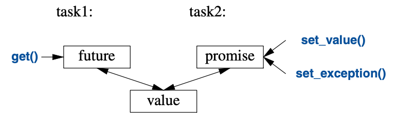

<a class="en-page-number" id="195"></a>

<div class="chapter-number"><p class="chapter-number">{{ page.ch }}</p></div>

# 并发 {#concurrency}

> 让事物保持简单：
>
> 越简单越好，
>
> 但不要过头。
>
> – <span title="没有明确证据证明爱因斯坦说过这句话，但是也没有证据证明他没说过，有一个考据在这个页面： https://quoteinvestigator.com/2011/05/13/einstein-simple/ ，我参考了网络上的一些翻译，感觉这样译合理，但也没有足够论据。"> —— 阿尔伯特·爱因斯坦</span>[^1]

## 15.1 导言 {#15.1}

并发——同时执行多个任务——被大量用于提高吞吐量（为单个计算任务使用多处理器的方式）
或提升响应能力（方法是在程序的一部分处理业务的同时，另一部分提供响应）。
所有的现代编程语言都支持并发。
C++里有个久经20多年考验，获得现代硬件普遍支持的并发方式，
C++标准库提供的支持是上述方法的一个变种，具备可移植性且类型安全。
标准库对并发的支持着眼于系统层面的并发，而不是直接提供高级并发模型，
后者可以作为程序库的形式呈现，利用标准库提供的设施进行构建。

对于多线程在单地址空间上的并发执行，标准库提供了直接的支持。
为此，C++提供一个相应的内存模型以及一组原子操作。
原子操作支援无锁编程[Dechev,2010]。

<a class="en-page-number" id="196"></a>

关于这个内存模型，只要程序员能避免数据竞争（对可变数据的失控并发访问），
它就确保一切能够无脑地执行得丝般顺滑。
但是，大多数用户所见的并发形式，表现为标准库以及构建于其上的程序库。
本章为标准库支持并发的构件提供简短示例：`thread`、`mutex`、
`lock()`操作、`packaged_task`、`future`。
这些特性直接建立在操作系统提供的功能之上，且不会造成性能损失。
当然，对操作系统的相关功能也没有显著的性能提升。

千万别以为并发是万全之策。
如果一个任务可以顺序搞定，那它通常是更简单、更快捷的方式。

作为显式应用并行特性的替代方案，
利用并行算法通常可以获取更好的性能（§12.9，§14.3.1）。

## 15.2 任务和`thread` {#15.2}

某个计算，如果有可能与其它计算并发执行，我们就称之为一个*任务（task）*。
*线程（thread）*是任务在程序里的系统级表示。
对于需要与其它任务并发执行的任务，可做为参数构造一个`std::thread`
（在`<thread>`里）来启动。任务是一个函数或者函数对象：

```cpp
void f();               // 函数

struct F {              // 函数对象
    void operator()();  // F的调用操作符（§6.3.2）
};

void user()
{
    thread t1 {f};      // f() 在单独的线程里和执行
    thread t2 {F()};    // F()() 在单独的线程里和执行

    t1.join();          // 等待t1
    t2.join();          // 等待t2
}
```

这两个`join()`确保我们在两个线程运行完之前不会退出`user()`。
“加入（join）”某个`thread`的意思是“等待这个线程终止”。

一个程序的线程之间共享同一个地址空间。
此处的线程有别于进程，进程间一般不会直接共享数据。
因为线程共享同一个地址空间，它们可以通过共享对象（§15.5）进行通信。
此类通信通常用锁或其它机制以避免数据竞争（对变量的失控并发访问）。
编程并发任务可能*特别*棘手。
琢磨以下任务`f`（函数）和`F`（函数对象）可能的实现：

```cpp
void f()
{
    cout << "Hello ";
}
```

<a class="en-page-number" id="197"></a>

```cpp
struct F {
    void operator()() { cout << "Parallel World!\n"; }
};
```

这展示了一个严重的错误：`f`和`F()`都用到了`cout`对象，但没通过任何形式进行同步。
输出的结果是无法预料的，而且该程序每次执行的结果都可能有差异，
原因在于，两个任务中各自操作的执行顺序是未定义的。
这个程序的输出可能会有点“莫名其妙”，比如这样的：

```cpp
PaHerallllel o World!
```

只有标准库里某个特定的保障才能力挽狂澜，
以避免`ostream`定义里的数据竞争导致可能的崩溃。

为并发程序定义任务的目标是，除简单明确的通信之外，保持任务相互间完全独立。
关于并发任务，最简单的思路是把它看做一个函数，仅仅是恰好与它的调用者同时运行。
为此，只需要传递参数，获取结果，并确保它们间不使用共享数据（没有数据竞争）。

## 15.3 参数传递 {#15.3}

一般来说，任务需要待加工的数据。
数据（或指向它的指针、引用）可以简单地作为参数传递。琢磨这个：

```cpp
void f(vector<double>& v);  // 函数：处理v

struct F {                  // 函数对象：处理v
    vector<double>& v;
    F(vector<double>& vv) :v{vv} { }
    void operator()();      // 调用操作符 §6.3.2
};

int main()
{
    vector<double> some_vec {1,2,3,4,5,6,7,8,9};
    vector<double> vec2 {10,11,12,13,14};

    thread t1 {f,ref(some_vec)};    // f(some_vec) 在单独的线程里运行
    thread t2 {F{vec2}};            // F(vec2)() 在单独的线程里运行

    t1.join();
    t2.join();
}
```

显然，`F{vec2}`在`F`中保存了参数vector的引用。
然后`F`就可以操作这个vector，但要祈祷在`F`运行时没有其它任务访问`vec2`。
为`vec2`传值可以消除这个风险。

`{f,ref(some_vec)}`这个初始化利用了`thread`的可变参数模板构造函数，
它接受任意的参数序列（§7.4）。

<a class="en-page-number" id="198"></a>

`ref()`是个来自`<functional>`的类型函数，很遗憾，
让可变参数模板把`some_vec`作为引用而非对象时少不了它。
如果缺少`ref()`，`some_vec`将以传值的方式传递。
编译器会检查能否用后续参数调用第一个参数，然后构造必要的函数对象传递给线程。
这样，`F::operator()()`和`f()`就执行同样的算法，两个任务的处理方式如出一辙：
两种情况下，都是构造一个函数对象给`thread`去执行。

## 15.4 结果返回 {#15.4}

在 §15.3 的例子中，参数按照非`const`引用的方式传递。
我仅在需要任务对引用的数据（§1.7）进行修改时才这么做。
这个返回结果的方式略有点旁门左道，但并不稀奇。
有个更通俗的方式是把输入数据以`const`引用方式传递，
再传递一个位置作为单独的参数，用于保存结果：

```cpp
void f(const vector<double>& v, double* res);   // 从v获取输入；结果放进 *res

class F {
public:
    F(const vector<double>& vv, double* p) :v{vv}, res{p} { }
    void operator()();              // 结果放进 *res
private:
    const vector<double>& v;        // 输入源
    double* res;                    // 输出目标
};
double g(const vector<double>&);    // 使用返回值

void user(vector<double>& vec1, vector<double> vec2, vector<double> vec3)
{
    double res1;
    double res2;
    double res3;

    thread t1 {f,cref(vec1),&res1};         // f(vec1,&res1) 在单独的线程里运行
    thread t2 {F{vec2,&res2}};              // F{vec2,&res2}() 在单独的线程里运行
    thread t3 { [&](){ res3 = g(vec3); } }; // 以引用的方式捕获局部变量

    t1.join();
    t2.join();
    t3.join();

    cout << res1 << ' ' << res2 << ' ' << res3 << '\n';
}
```

此代码运行良好，并且该技术也很常见，但我觉得通过引用传回结果不够优雅，
所以，§15.7.1会再聊到这个话题。

<a class="en-page-number" id="199"></a>

## 15.5 共享数据 {#15.5}

有时候任务之间不得不共享数据。
这种情况下，数据访问必须要同步，以便同一时刻最多只有一个任务访问数据。
资深程序员会觉得这有点以偏概全（比如，多个任务同时读取不可变的数据就没问题），
但请考虑这个问题：
对于一组给定的对象，在同一时刻，如何确保至多只有一个任务进行访问。

解决方案的基本要素是`mutex`（互斥量），
一个“互斥对象（mutual exclusion object）”。
`thread`执行`lock()`操作来获取`mutex`：

```cpp
mutex m;    // 参与控制的互斥量
int sh;     // 共享数据

void f()
{
    scoped_lock lck {m};    // 获取互斥量
    sh += 7;                // 操作共享数据
}   // 隐式释放互斥量
```

`lck`的类型被推导为`scoped_lock<mutex>`（§6.2.3）。
`scoped_lock`的构造函数负责获取互斥量（方法是调用`m.lock()`）。
如果另一个线程已经获取了这个互斥量，
当前线程就要等待（“阻塞”）到另一个线程访问结束。
待某个线程访问共享数据结束，
`scoped_lock`就会（调用`m.unlock()`）释放这个`mutex`。
当`mutex`被释放，等待它的`thread`就恢复执行（被唤醒）。
互斥量和锁构件的定义都在`<mutex>`里。

请留意RAII（§5.3）的运用。
使用`scoped_lock`、`unique_lock`之类的执柄，
比显式锁定和解锁`mutex`简单而且安全得多。

共享数据和`mutex`间的对应关系是约定俗成的：
程序员只需要知道哪个`mutex`对应哪个数据即可。
显而易见这容易出错，同样不言而喻的是，明确这种对应关系的方式也多种多样。
例如：

```cpp
class Record {
public:
    mutex rm;
    // ...
};
```

无需天赋异秉就能猜到，对于一个名为`rec`的`Record`，
在访问`rec`的其余内容之前，应该先获取`rec.rm`，
使用注释或更贴切的变量名，可以进一步提升可读性。

同时访问多个资源的操作并不罕见。这可能导致死锁。
例如，如果`thread1`获取了`mutex1`，然后试图再获取`mutex2`，
而此时`thread2`已经获取了`mutex2`并试图获取`mutex1`，
这样，二者就都无法继续执行了。
这是`scoped_lock`的用武之地，它同时获取多个锁来解决这个问题：

```cpp
void f()
{
    scoped_lock lck {mutex1,mutex2,mutex3}; // 三个锁全部获取
    // ... 处理共享数据 ...
} // 隐式释放所有的互斥量
```

<a class="en-page-number" id="200"></a>

只有在获取参数中的所有锁之后，这个`scoped_lock`才继续执行，
并且在持有`mutex`的情况下绝不会阻塞（“进入休眠”）。
当`thread`离开这个作用域时，`scoped_lock`的析构函数会确保释放这些`mutex`。

使用共享数据通信是个非常低级的方法。
尤其是，程序员还要搞清楚不同任务之间工作完成情况的各种组合。
在这方面，共享数据的使用相较于调用与返回的概念可就逊色太多了。
另一方面，有些人坚信数据共享比复制参数和返回的效率高。
如果涉及的数据量非常大，可能的确如此，但锁定和解锁操作的代价都相对高昂。
相反，现代的硬件都很擅长复制数据，尤其是紧凑的数据，比如`vector`那些元素。
因此，不要出于“效率”原因而不假思索也不进行测量就选择共享数据进行通信。

基础的`mutex`限定同一时刻仅有一个线程访问数据。
有一个最普遍的方式，是在众多读取者和单一的写入者之间进行共享。
`shared_mutex`支持这种“读写锁”。
一个读取者会申请“共享的”互斥量，以便其它读取者仍然能够访问，
而写入者则要求排他性的访问，比如：

```cpp
shared_mutex mx;    // 可共享的互斥量
void reader()
{
    shared_lock lck {mx};   // 乐于同其它读取者分享访问权限
    // ... 读取 ...
}
void writer()
{
    unique_lock lck {mx};   // 需要排他性（唯一的）访问
    // ... 写入 ...
}
```

## 15.6 等待事件 {#15.6}

有些情况下，`thread`需要等待外部事件，比如另一个`thread`完成了某个任务，
或者经过了特定长度的时间。最简单的“事件”是时间流逝。
利用`<chrono>`中的时间相关功能，可以这么写：

```cpp
using namespace std::chrono;    // 参见 §13.7

auto t0 = high_resolution_clock::now();
this_thread::sleep_for(milliseconds{20});
auto t1 = high_resolution_clock::now();

cout << duration_cast<nanoseconds>(t1-t0).count() << " nanoseconds passed\n";
```

请注意，我甚至不需要启动一个`thread`；
默认情况下，`this_thread`指向当前唯一的线程。

<a class="en-page-number" id="201"></a>

此处用了`duration_cast`将时间单位调整为我想要的纳秒。

对于利用外部事件进行通信的基本支持由`<condition_variable>`
中的`condition_variable`提供。
`condition_variable`是个允许一个`thread`等待其它线程的机制。
确切地说，它允许`thread`等待某种*条件（condition）*
（通常称为*事件（event）*）的发生，作为其它`thread`完成作业的结果。

使用`condition_variable`可以支持许多优雅且高效的共享方式，但可能要费些周折。
考虑经典的例子：两个`thread`借助一个`queue`传递消息进行通信。
为叙述简洁，我把`queue`和避免它发生数据竞争的机制定义在全局作用域
供生产者和消费者访问：

```cpp
class Message {     // 通信中使用的对象
    // ...
};

queue<Message> mqueue;      // 消息队列
condition_variable mcond;   // 变量通信事件
mutex mmutex;               // 用于同步对mcond的访问
```

`queue`、`condition_variable`、`mutex`这些类型都由标准库提供。

`consumer()`读取并处理`Message`：

```cpp
void consumer()
{
    while(true) {
        unique_lock lck {mmutex};       // 申请 mmutex 
        mcond.wait(lck,[] { return !mqueue.empty(); }); // 释放 lck 并进入等待
                                                        // 在被唤醒时重新申请 lck
                                                        // 只要mqueue是空的就不要唤醒
        auto m = mqueue.front();        // 取消息
        mqueue.pop();
        lck.unlock();                   // 释放 lck 
        // ... 处理 m ...
    }
}
```

此处，我把一个`unique_lock`用于`mutex`，
显式为`queue`和`condition_variable`上的操作提供保护。
`condition_variable`进入等待时释放它的锁参数，
等待结束（即队列非空）时重新获取它。
此处的`!mqueue.empty()`对条件进行显式查询，
以防唤醒后发现其它任务已经“领先一步”，以至于该条件不再成立。

此处选择`unique_lock`而非`scoped_lock`，出于两个原因：

- 需要将锁传给`condition_variable`的`wait()`。
    `scoped_lock`无法复制，而`unique_lock`可以。
- 在处理消息之前，需要给`mutex`加锁以保护条件变量。`unique_lock`提供了
    `lock()`、`unlock()`这些操作，用于低层次的同步控制。

另外，`unique_lock`只能处理单个的`mutex`。

<a class="en-page-number" id="202"></a>

配套的`producer`是这样的：

```cpp
void producer() {
    while(true) {
        Message m;
        // ... 填写信息 ...
        scoped_lock lck {mmutex};   // 保护下一条代码的操作
        mqueue.push(m);
        mcond.notify_one();         // 提示
    }                               // 释放锁（在作用域结束处）
}
```

## 15.7 通信任务 {#15.7}

标准库提供了几个构件，以便程序员能够在任务（可能需要并发的工作）的概念层级进行操作，
而不必直面线程和锁这么低的层级：

- `future`和`promise`从 在单独线程上生成的任务 里返回一个值
- `package_task`协助启动任务并连接返回结果的机制
- `async()`以酷似函数调用的方式启动一个任务

这些构件都在头文件`<future>`内。

### 15.7.1 `future`和`promise` {#15.7.1}

`future`和`promise`侧重点在于，两个任务之间传递值时，它们能避免锁的显式使用；
“系统”高效地实现这个传递。
基本思路很简单：一个任务需要给另一个任务传递值时，就把这个值放进`promise`。
“大变活值”之后，具体实现会把这个值弄进对应的`future`里，
（通常是该任务的启动者）就能从`future`里把值读出来了。
此过程图示如下：



如果有个名为`fx`的`future<X>`，就能从里面`get()`到一个`X`类型的值：

```cpp
X v = fx.get(); // 必要的话，等待这个值被计算出来
```

如果这个值尚未就绪，等待读取它的线程就会阻塞，直到它现身为止。
如果这个值算不出来，`get()`可能会抛出异常
（来自系统，或者从试图`get()`这个值的任务里传出来）。

<a class="en-page-number" id="203"></a>

`promise`的作用是提供一个简洁的“放置（put）”操作
（名称是`set_value()`和`set_exception()`），
匹配`future`的`get()`。
“future”和“promise”的命名是个历史遗留问题；
所以，别让我代人受过，也别让我掠人之美。
很多其它俏皮话儿也都是从它们这来的。

如果你的`promise`需要发送`X`类型的结果给`future`，
有两种选择：传一个值或者传一个异常。例如：

```cpp
void f(promise<X>& px)  // 一个任务：把结果放进px
{
    // ... 
    try {
        X res;
        // ... 给res计算值 ... 
        px.set_value(res);
    }
    catch (...) {       // 矮油：res难产了
        px.set_exception(current_exception());  // 把异常传给future所在的线程
    }
}
```

此处的`current_exception()`指向被捕获的异常。

要处理`future`发过来的异常，`get()`的调用者必须在某处做好准备捕捉它。例如：

```cpp
void g(future<X>& fx)   // 一个任务：从fx里提取结果
{
    // ...
    try {
        X v = fx.get(); // 必要的话，等待这个值被计算出来
        // ... 使用 v ...
    }
    catch (...) {       // 矮油：有银儿搞不定v了涅
        // ... 处理错误 ...
    }
}
```

如果`g()`无需自己处理错误，代码可以做到最精简：

```cpp
void g(future<X>& fx)   // 一个任务：从fx里提取结果
{
    // ...
    X v = fx.get();     // 必要的话，等待这个值被计算出来
    // ... 使用 v ...
}
```

### 15.7.2 `packaged_task` {#15.7.2}

怎么做才能把`future`放进等待结果的任务，
并且把对应的`promise`放进那个产生结果的线程呢？
想要把任务跟`future`对接，把`promise`跑在`thread`上，
使用`packaged_task`类型可以简化设置操作。
`packaged_task`封装了代码，能够把任务的返回值或异常放进`promise`
（如§15.7.1中代码所示）。

<a class="en-page-number" id="204"></a>

如果调用`get_future()`对`packaged_task`进行查询，
它会给你对应其`promise`的`future`。
例如，可以设置两个任务，分别用`accumulate()`（§14.3）
累加某个`vector<double>`一半的元素：

```cpp
double accum(double* beg, double* end, double init)
    // 计算[beg:end)的和，初始值为init
{
    return accumulate(beg,end,init);
}

double comp2(vector<double>& v)
{
    using Task_type = double(double*,double*,double);           // 任务的类型

    packaged_task<Task_type> pt0 {accum};                       // 把任务（即accum）打包
    packaged_task<Task_type> pt1 {accum};

    future<double> f0 {pt0.get_future()};                       // 获取pt0的future
    future<double> f1 {pt1.get_future()};                       // 获取pt1的future

    double* first = &v[0];
    thread t1 {move(pt0),first,first+v.size()/2,0};             // 为pt0启动一个线程
    thread t2 {move(pt1),first+v.size()/2,first+v.size(),0};    // 为pt1启动一个线程

    // ...

    return f0.get()+f1.get();                                   // 取结果
}
```

`packaged_task`模板接收任务的类型作为其模板参数
（此处是`Task_type`，为`double(double*,double*,double)`取的别名）
并以任务作为构造函数的参数（此处是`accum`）。
`move()`操作是必须的，因为`packaged_task`无法被复制。
`packaged_task`无法复制的原因在于，它是个资源执柄：
它拥有其`promise`并且（间接地）要对该任务占有的资源负责。

请留意，这份代码中并未显式用到锁：
现在可以把精力集中在业务上，而不必费神去管理通信机制。
这两个任务将运行在两个独立的线程上，因此可能会并行。

### 15.7.3 `async()` {#15.7.3}

本章追寻的思考轨迹，导向这个我认为是最简单但且可跻身于最强大技术之列的良策：
把任务当作可能凑巧跟其它任务同时运行的函数。
它绝非C++标准库支持的唯一模型，但它面对诸多需求都能游刃有余。
必要的时候，还有更微妙更诡秘的模型（比方依赖共享内存的编程样式）可用。

想发起一个可能异步执行的任务，可以用`async()`：

<a class="en-page-number" id="205"></a>

```cpp
double comp4(vector<double>& v)
    // 如果v足够大，就触发多个任务
{
    if (v.size()<10000)     // 值得采用并发吗？
        return accum(v.begin(),v.end(),0.0);

    auto v0 = &v[0];
    auto sz = v.size();

    auto f0 = async(accum,v0,v0+sz/4,0.0);          // 第一份
    auto f1 = async(accum,v0+sz/4,v0+sz/2,0.0);     // 第二份
    auto f2 = async(accum,v0+sz/2,v0+sz*3/4,0.0);   // 第三份
    auto f3 = async(accum,v0+sz*3/4,v0+sz,0.0);     // 最后一份

    return f0.get()+f1.get()+f2.get()+f3.get();     // 收集并求和结果
}
```

基本上，`async()`把函数调用的“调用部分”和“获取结果部分”拆开，
并把它们都与实际执行的任务分离开。
使用`async()`，就不用再去操心线程和锁，
相反，你需要考虑的就只是那个有可能异步执行的任务。
这有个明显的限制：想把用于需要对共享资源加锁的任务，门儿都没有。
采用`async()`，你甚至不知道有多少个`thread`，
因为这取决于`async()`，而它依据调用时刻的系统资源状况决定。
比方说，在决定用多少个`thread`之前，
`async()`可能会查询是否有空闲的核（处理器）可用。

用运行成本与启动`thread`成本间的关系，
比如`v.size()<10000`，进行揣摩，
相当粗略，而且关于性能优劣的结论往往错得离谱。
只是，此处的着眼点不在于`thread`管理方面的技术。
这是个简略且大概率有失偏颇的臆测，因此你就姑妄听之，别拿它太当真。

需要对标准库算法，比方说`accumulate()`，手动并行处理的情况凤毛麟角，
因为并行算法，比如`reduce(par_unseq,/*...*/)`通常都是出类拔萃的（§14.3.1）。
但是，这此处的技术是通用的。

请注意，`async()`不仅是专门用来提升性能的并行计算机制。
比如，还可以用它生成一个任务，用于获取来自用户的信息，
以便“主程序”保持活动状态去处理其它事物（§15.7.3）。

## 15.8 忠告 {#15.8}

- [1] 用并发提升响应能力或者提升吞吐量；§15.1。
- [2] 在可承受范围内的最高抽象级别作业；§15.1。
- [3] 把进程视作线程的替代方案；§15.1。
- [4] 标准库的并发构件是类型安全的；§15.1。
- [5] 内存模型存在的意义，是让大多数程序员不必在计算机硬件架构层级兜圈子；§15.1。

<a class="en-page-number" id="206"></a>

- [6] 内存模型让内存表现得大致符合稚朴的预期；§15.1。
- [7] 原子操作成全了无锁编程；§15.1。
- [8] 让专家们去跟无锁编程斗智斗勇吧；§15.1。
- [9] 有时候，顺序执行的方案比并发方案更简单、更快速；§15.1。
- [10] 避免数据竞争；§15.1，§15.2。
- [11] 与并发相比，优先考虑并行算法；§15.1，§15.7.3。
- [12] `thread`是系统线程的类型安全接口；§15.2。
- [13] 用`join()`等待`thread`完成；§15.2。
- [14] 请竭力避免显式使用共享数据；§15.2。
- [15] 优先采用RAII，而非显式的加锁/解锁；§15.5；[CG: CP.20]。
- [16] 使用`scoped_lock`管理`mutex`；§15.5。
- [17] 使用`scoped_lock`申请多个锁；§15.5； [CG: CP.21]。
- [18] 使用`scoped_lock`实现读写锁；§15.5。
- [19] 把`mutex`跟它保护的数据定义在一起；§15.5；[CG: CP.50]。
- [20] 使用`condition_variable`管理`thread`间的通信；§15.6。
- [21] 在需要复制一个锁或者在较低层次进行同步操作的时候，
    采用`unique_lock`（而非`scoped_lock`）；§15.6。
- [22] 针对`condition_variable`采用
    `unique_lock`（而非`scoped_lock`）；§15.6。
- [23] 不要无条件的等待（wait）；§15.6；[CG: CP.42]。
- [24] 最小化加锁代码（critical section）的运行时间；§15.6；[CG: CP.43]。
- [25] 把任务看作是可并发执行的，而不要直接以`thread`方式看待它；§15.7。
- [26] 别忽视了简单性的价值；§15.7。
- [27] 优先采用`packaged_task`和`promise`，
    而非直接死磕`thread`和`mutex`；§15.7。
- [28] 用`promise`返回结果，并用`future`去提取它；§15.7.1；[CG: CP.60]。
- [29] 用`packaged_task`处理任务抛出的异常和值返回；§15.7.2。
- [30] 用`packaged_task`和`future`表示针对外部服务的请求并等待它的响应；
    §15.7.2。
- [31] 用`async()`去启动简单的任务；§15.7.3；[CG: CP.61]。

[^1]: 没有明确证据证明爱因斯坦说过这句话，但是也没有证据证明他没说过，有一个考据在这个页面： https://quoteinvestigator.com/2011/05/13/einstein-simple/ ，我参考了网络上的一些翻译，感觉这样译合理，但也没有足够论据。 —— 译者注
