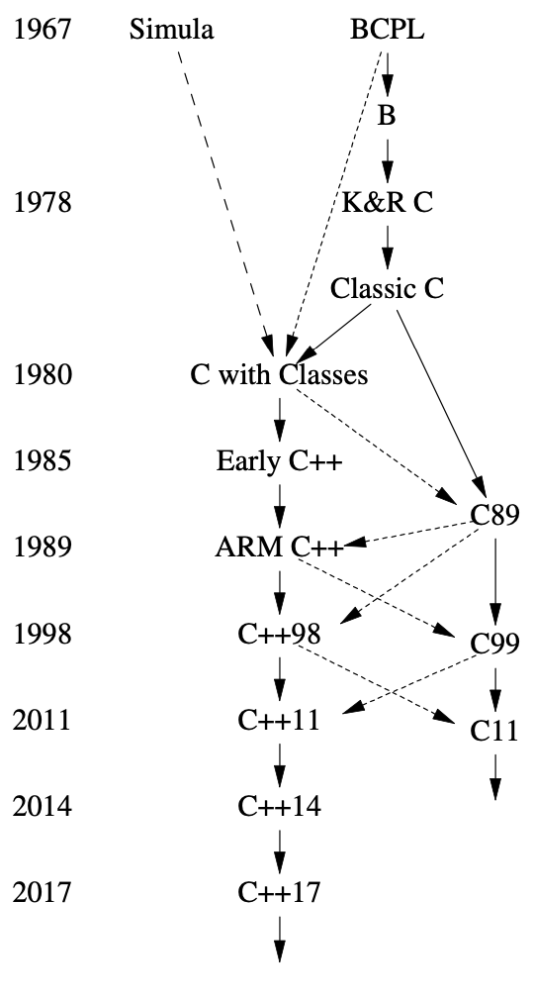

<a class="en-page-number" id="207"></a>

<div class="chapter-number"><p class="chapter-number">{{ page.ch }}</p></div>

# 历史及兼容性 {#concurrency}

> 搞快点儿，莫急。
>
> *（festina lente）。*
>
> <span title="这是一句古希腊格言，所以屋大维这个罗马皇帝仅仅是引用过，而不是原创这句话的人。因为一句话里同时用到了“快”和“慢”两个意思，所以这种修辞被称为“矛盾修饰法”，维基百科页面说它前一半是“第二人称单数现在主动祈使句”，后一半是“副词”。它被广泛认可的的英译是“make haste slowly”或“more haste, less speed”（美式英语为“haste makes waste”），仍然是祈使句。英译的“more haste, less speed”在《朗文当代高级英语辞典》、《剑桥高阶英汉双解词典》、《牛津高阶英汉双解词典》的“haste”词条中都被译为“欲速则不达”，仍然是个谚语或者格言，我认为这个汉译仅仅强调了“要避免忙中出错”的意思，丢失了祈使句的形式，也没表达出“要求加速”的意思。网络上有一些符合“即要提速，又要避免忙中出错”意思的理解，但我没发现仍保留祈使句形式的译法，因此私自主张这样译。"> —— 屋大维，凯撒·奥古斯都</span>[^1]

## 16.1 历史 {#16.1}

我发明了C++，给它起草了定义，并出品了第一个实现（编译器）。
我筛选、制定了C++的设计标准，设计了它的主要语言特性，开发或参与了许多早期程序库，
并在长达25年的时间里负责处理扩展提案。

C++的设计意图是把Simula的程序组织方式[Dahl,1970]
与C在系统编程方面的效率和灵活性[Kernighan,1978]结合起来。
Simula是C++抽象机制的最初来源。
类的概念（利用派生类和虚函数）就是从它借鉴来的。
但是模板和异常加入C++，则启发自其它来源。

<a class="en-page-number" id="208"></a>

C++的演化始终跟它的使用密不可分。
我投入了大量时间倾听用户的呼声，征询资深程序员的见解。
特别是我AT&T贝尔实验室的同事们，对C++起初十年的成长功不可没。

本章做一简要的概述，不会事无巨细地讲到所有的语言特性和库组件。
另外，也不会深究细节。有关更多信息，尤其是诸多贡献者的名字，
请查阅我在ACM编程语言历史大会上的文章[Stroustrup,1993] [Stroustrup,2007]，
还有我的书《C++语言的设计与演化（The Design and Evolution of C++）》[Stroustrup,1994]。
它们详尽地描述了C++的设计与演化，并记述了来自其它语言的影响。

C++标准化工作中产生的文档，大多可以在线获得[WG21]。
在我的FAQ中，努力维系了标准构件与它的发起人、改进者间的关联[Stroustrup,2010]。
C++并非出自面目模糊的无名氏团体，也非某个冥冥中全能
“[终身独裁者（dictator for life）](https://zh.m.wikipedia.org/zh-hans/%E7%BB%88%E8%BA%AB%E4%BB%81%E6%85%88%E7%8B%AC%E8%A3%81%E8%80%85)”的手笔；
而是众多热忱敬业、经验丰富、勤奋努力者的劳动成果。

### 16.1.1 时间线 {#16.1.1}

演化出C++的项目名为“带类的C（C with Classes）”，始自1979年秋。
以下是简化的时间线：

- *1979* “带类的C”启动。最初的特性集包括类、派生类、
    public/private访问控制、构造函数、析构函数，带有参数检测的函数声明。
    第一个程序库支持非抢占式并发任务和随机数生成器。
- *1984* “带类的C”更名为C++。当时，C++已经有了虚函数、函数与运算符重载、
    引用、I/O流和复数库。
- *1985* C++首次商业发布（10月14号）。程序库包括I/O流、复数、
    多任务（非抢占式调度）。
- *1985* *《C++程序设计语言，（The C++ Programming Language）》*（“TC++PL”，10月14号）[Stroustrup,1986]
- *1989* 《带评注的C++参考手册（The Annotated C++ Reference Manual）》
    （“the ARM”）[Ellis,1989]发表。
- *1991* 《C++程序设计语言，第二版（The C++ Programming Language, Second Edition）》[Stroustrup,1991]
    以模板形式提供泛型编程，基于异常的错误处理，
    还包括“资源请求即初始化（ Resource Acquisition Is Initialization）”（RAII）
    通用资源管理准则。
- *1997* 《C++程序设计语言，第三版（The C++ Programming Language, Third Edition）》[Stroustrup,1997]引入了 ISO C++，
    包括命名空间、`dynamic_cast`、许多模板方面的改进。
    标准库添加了STL范型容器和算法的框架。
- *1998* ISO C++ 标准[C++,1998]。
- *2002* 标准修订工作，俗称C++0x，启动了。
- *2003* 发布了一个有关ISO C++标准的“bug修正”修订方案。
    C++技术报告引入了新的标准库组件，如正则表达式、无序容器（哈希表），
    以及后来进入了C++11的资源管理指针。
- *2006* 有关性能的ISO C++技术报告解决了有关开销、可预测性及技术方面的问题，
    大多与嵌入式系统编程有关[C++,2004]。

<a class="en-page-number" id="209"></a>

- *2011* ISO C++11标准[C++,2011]。提供了统一的初始化、转移操作语意，
    从初始化器推导类型（`auto`）、区间-`for`、可变参数模板、lambda表达式、
    类型别名、一个适用于并发的内存模型等等。
    标准库添加了几个组件，包括线程、锁和2003技术报告中的绝大多数组件。
- *2013* 首个C++11的完整实现问世。
- *2013* *《C++程序设计语言，第四版（The C++ Programming Language, Fourth Edition）》*引入了C++11。
- *2014* ISO C++14标准[C++,2014]使用变量模板、数字分隔符、范型lambda表达式，
    和若干标准库改进完善了C++11。首个C++14的实现完成。
- *2015* C++ 核心指南（The C++ Core Guidelines）项目启动[Stroustrup,2015]。
- *2015* 概束的TS获得批准。
- *2017* ISO C++17标准[C++,2017]提供了一组丰富多样的特性，包括求值顺序保障、
    结构化绑定、折叠表达式、一个文件系统库、并行算法、`variant`和`optional`类型。
    首个C++17的实现完成。
- *2017* 模块的TS、区间的TS获得批准。
- *2020* ISO C++20标准（[计划中](https://www.iso.org/standard/79358.html "已经在2020年十二月出版 —— 译者")）。

在开发过程中，C++11被广泛称为C++0x。
恰如大项目喜闻乐见的那样，我们对完成日期的估计过于乐观了。
快要截止的时候，我们戏称C++0x里的'x'是个十六进制数，于是C++0x就成了C++0B。
除此之外，委员会如期交付了C++14和C++17，主要的编译器厂商也跟上了。

### 16.1.2 早期 {#16.1.2}

我最初设计并实现这个语言的原因，是想把一个Unix内核服务做成跨多处理器和局域网的分布式
（现在广为人知的名称是多核和集群）。
为此，我需要精确指定系统的各组成部分以及它们相互通信的方式。
如果不在意性能方面的问题，Simula[Dahl,1970]本该是个理想的选择。
我还需要直接跟硬件打交道，提供高性能的并行编程机制，
C在这方面是理想的选择，但它的软肋在模块化支持和类型检测方面。
Simula风格的类和C的结晶，“带类的C”，在关键项目中得到了应用，
在这些项目中，它精打细算地利用时间和空间的编程能力经受住了严苛的考验。
它缺失了运算符重载、引用、虚函数、模板、异常和许多许多内容[Stroustrup,1982]。
C++在研究机构以外的应用始自1983年七月。

C++（发音是“see 普拉斯 普拉斯”）这个名称，是 Rick Mascitti 在1983年提出的，
我选它取代了“带类的C”。
此名称意指对C的改变具有演化的性质；“++”是C的自增运算符。
稍短的名称“C+”是个语法错误；有个不相干的语言用它命名了。
对C语言语意懂行的人觉得C++不如++C。
它没有取名为D，因为它是对C的扩展，也因为它无意以丢弃特性的方式来修缮问题，
还因为已经有好几个试图取代C的语言取了D这个名字。
关于C++这个名字的另一个解读，请参见[Orwell,1949]的附录。

<a class="en-page-number" id="210"></a>

C++设计之初主要是为了我和我的朋友们编程时能避开汇编、C和当时还挺流行的几种高级语言。
主要目标是让程序员更容易、愉悦地编写优秀的程序。
初期并没有C++设计文稿；语言设计、文档编写和编译器实现是同步推进的。
当时也没有“C++项目”或者什么“C++设计委员会”。
自始至终，C++的演化是为了应对用户面临的问题，也是我的朋友、同事和我讨论的结果。

C++起初的设计（当时还叫“带类的C”）包括带参数类型检查的函数声明和隐式转换、
用`public`/`private`区分接口与实现的的类、派生类、构造函数和析构函数。
我用了宏实现了最初的参数化[Stroustrup,1982]。
到八十年代中期，这已经不再是实验性应用。
那年下半年，我展示了一组语言特性，用于支持相辅相成的编程风格。
现在想来，我觉得最重要的是引入了构造函数和析构函数。
用[Stroustrup,1979]的术语来讲，就是：

*某个“new函数”为成员函数创建运行环境，“delete函数”则反其道而行之。*

没过多久，“new函数”和“delete函数”就改称为了“构造函数”和“析构函数”。
这就是C++资源管理策略（导致了异常机制的必要性）的根本，
也是许多技术能够使得用户代码简明的关键所在。
就算当时有其它语言支持多个构造函数用于执行通用代码，我也（到现在都）不知道。
析构函数是C++引入的新事物。

C++在1985年进行了商业发布。当时，我已经添加了内联函数（§1.3， §4.2.1）、
`const`（§1.6）、函数重载（§1.3）、引用（§1.7）、运算符重载（§4.2.1），
和虚函数（§4.4）。
这些特性里，以虚函数形式支持运行时多态是当时最具争议的。
我通过Simula知道它的价值，但发现要说服系统编程领域的人们简直难如登天。
系统程序员习惯性地觉得间接函数调用有蹊跷；至于通过其它语言接触过面向对象编程的人，
对于`virtual`函数的运行速度能快到在系统编程里有一席之地也感到难以置信。
相反，很多有面向对象背景的程序员都曾（还有些仍然）不能接受这个思想，
即，使用虚函数调用，仅仅是表达：某个选择必须在运行时做出。
对虚函数的反感，很可能是源于对另一个想法的抵制，即：
借助由编程语言支持的更常规的代码结构，能获得更好的系统。
许多C程序员深信，最重要的因素是绝对的灵活性以及对程序全方位无死角的精雕细琢。
我的观点当时（并且现在也）是，有必要尽可能利用语言和工具提供的帮助：
我们试图构建的这些系统，其内在复杂度总是让我们的表达能力捉襟见肘。

早期文档（即[Stroustrup,1985] 和 [Stroustrup,1994]）这样描述C++：

*C++是一种通用的编程语言，它：*

- *是更好的C*
- *支持数据抽象*
- *支持面向对象编程*

请注意，*并非*“C++是一种面向对象的编程语言”。
在这里，“支持数据抽象”指的是信息隐藏，类继承体系以外的类，以及泛型编程。

<a class="en-page-number" id="211"></a>

起初，泛型编程由宏提供勉强的支持[Stroustrup,1982]。
模板和概束都是很久之后的事了。

C++的许多设计工作都是在我同事们的黑板上搞定的。
早些年来自Stu Feldman、 Alexander Fraser、 Steve Johnson、
Brian Kernighan、 Doug McIlroy、 和Dennis Ritchie的反馈都是无可替代的。

在1980年代的后半段，我为响应用户的讨论而继续添加语言特性。
这当中最重要的两个是模板[Stroustrup,1988]和异常处理[Koenig,1990]，
后者在标准化工作开始的时候被当作实验性的特性。
在模板的设计中，我被迫在灵活性、效率和初期的类型检查间进行取舍。
当时没人知道怎么才能一举三得。
为了在严苛的系统应用领域跟C-风格代码较量，我选择了前两条。
回顾当时，我仍认为这个决定在当时是合理的，而且有关改进模板类型检查的研究也没松懈
[DosReis,2006] [Gregor,2006] [Sutton,2011] [Stroustrup,2012a]。
异常机制的设计着眼于异常在多层次结构上的传播，向异常处理器递交任意信息，
以及融合异常和资源管理，后者使用局部变量和析构函数分别表示和释放资源。
我蹩脚地给这个至关重要的技术命名为
*资源请求即初始化（ Resource Acquisition Is Initialization）*
很快就有人把它简化成了缩写*RAII*（§4.2.2）。

我泛化了C++的继承机制，以支持多基类[Stroustrup,1987]。
它被称为*多继承（multiple inheritance）*，被认为是艰深且有争议的。
我认为它的重要性远逊于模板和异常机制。
抽象类（也被称为*接口（interface）*）的多继承如今在
支持静态类型检查和面向对象编程的语言中普及了。

C++语言本身的演化和一些关键库的构建是相辅相成的。
比如，我设计运算符重载机制的同时设计了复数[Stroustrup,1984]、
矢量、栈和（I/O）流类[Stroustrup,1985]。
最初的字符串和列表两个类由Jonathan Shopiro我共同完成，工作量五五开。
Jonathan的字符串和列表类是程序库最先得到广泛采纳的部分。
标准库里的字符串类就极大地得益于这些早期的贡献。
[Stroustrup,1987b]中描述的task类来自“带类的C”最初在1980年的首个程序。
它提供了协程和调度器。我为了支持Simula风格的仿真而编写了它和相关的类。
很遗憾，我们不得不等（了30年！）到2011年才把并发标准化且提供普遍支持（第15章）。
协程可能会成为[C++20的一部分[CoroutinesTS]](https://en.cppreference.com/w/cpp/language/coroutines "已经是了——译注")。
模板机制的开发受到了`vector`、`map`、`list`、`sort`多样性的影响，
这些模板由Andrew Koenig、 Alex Stepanov、我和其他一些人设计开发。

1998年标准库最重要的创新是STL，一个算法和容器的框架（第11章，第12章）。
这是Alex Stepanov（与Dave Musser、Meng Lee和其他一些人）的杰作，
构筑在十余年的泛型编程成果之上。STL对于C++社群内外全都影响深远。

C++都成长环境中有着众多广为人知或者实验性的编程语言（如，Ada [Ichbiah,1979]、
Algol 68 [Woodward,1974]、和ML [Paulson,1996]）。
在当时，我对大概25种语言能够得心应手，
它们对C++的影响记述于[Stroustrup,1994]和[Stroustrup,2007]中。
不过，决定性的影响总是来自于那些不期而遇的应用程序。
把“问题驱动”作为C++开发的策略，而没有采用“拿来主义”，是个深思熟虑的结果。

<a class="en-page-number" id="212"></a>

### 16.1.3 ISO C++ 标准 {#16.1.3}

C++的爆发式成长引发了一些变革。
1987年的某个时候情形日益凸显，正式把C++标准化已经势在必行了，
我们需要开始为标准化工作进行铺垫了[Stroustrup,1994]。
于是就开始有意识地保持编译器开发者和其用户之间的接触。
这项工作采用了纸质和电子邮件，以及C++研讨会和其它地方的面对面会议。

AT&T贝尔实验室为C++及其社群做出了巨大的贡献，
他们允许我向编译器开发者和用户分享C++参考手册的草稿及修订版本。
因为这当中的很多人就职于跟AT&T有竞争关系的那些公司，
这份贡献意义深远，不应该被磨灭。
如果是个不通情理的公司，仅仅袖手旁观就足以引发语言碎片化的灾难。
标准化工作展开之初，就有来自数十个公司的上百人参与阅读并回应了文档，
它成为得到广泛接受的参考手册以及ANSI C++标准化工作的基础。
他们的名字都可见于《带评注的C++参考手册
（The Annotated C++ Reference Manual）》（“the ARM”）[Ellis,1989]。
ANSI的X3J16委员会在惠普的倡议下于1989年12月召开。
1991年六月，C++的ANSI（美国国家）标准化并入了C++的ISO（国际）标准化工作。
ISO C++委员会被称为WG21。
从1990年开始，这些联合委员会一直是C++演进和定义完善的主要论坛。
我自始至终都在这些委员会中任职。
特别是1990至2014年，作为扩展工作组（后更名为演进工作组）的主席，
我直接负责处理有关C++重大变更以及新特性添加的提案。
一份供公众审阅的初始标准草案在1995年四月形成。
第一个ISO C++标准(ISO/IEC 14882-1998) [C++,1998]
在1998年以 22-0 的全体投票获得批准。
该标准的“错误修复版本”于2003年发布，
因此你有时候会听人们提起C++03，但本质上它与C++98是同一个语言。

C++11，在很多年里都被称作C++0x，是WG21成员们的成果。
委员会在自发性日益繁重的流程和工序下工作。
这些流程或许能促成更好（也更严谨）的规范，但同时也限制了创新[Stroustrup,2007]。
一份供公众审阅的初始标准草案在2009年形成。
第二个ISO C++标准(ISO/IEC 14882-2011) [C++,2011]
在2011年八月以 21-0 的全体投票获得批准。

两版标准间漫长的时间跨度要部分归咎于一个误会，
委员会的大部分成员（包括我）都误以为ISO有规定，
在标准发布后需要有个“等待期（waiting period）”，而后才能开展新特性的工作。
因此有关语言新特性的正经事直到2002年才启动。
还有一部分原因是现代语言及其程序库容量的增加。
按标准文档的页码算，语言本身大概增加了30%，标准库增加了100%。
大部分内容的增加都是因为更详尽的语言规格，而非新功能。
此外，新C++标准的工作显然得谨慎行事，以免因为不兼容的修改遗祸旧有的代码。
满世界跑着数十亿行C++代码，委员会要确保别把它们弄残了。
几十年的稳定性是个基本的“特性”。

C++11对标准库进行了大规模的扩充，还推进完善了特性集支持一种编程风格，
这种编程风格是“范式”和惯例的结合，已经被C++98证明是成功的。

<a class="en-page-number" id="213"></a>

C++11当时的整体目标是：

- 把C++打造成在系统编程和程序库构建方面更好的语言。
- 让C++更易教、易学。

这个目标被记录在案并详细说明于[Stroustrup,2007]。

有个主要的工作内容旨在让并行系统编程类型安全且可移植。
这涉及一个内存模型（§15.1）以及对无锁编程的支持。
该工作内容由Hans Boehm、Brian McKnight以及并行编程工作组其他成员负责。
在这些内容的基础上，我们添加了`thread`库。

C++11之后，大家普遍认同两个标准间相隔13年过于漫长了。
Herb Sutter提议委员会采取一个定期准时发布的规则，即“火车模型（train model）”。
我强烈要求采取较短的时间周期，以最大程度避免发生类似推迟：
仅仅因为有人坚持要延时以便能囊括“最后一个重要特性”。
我们一致赞同了三年这个雄心勃勃的日程表，并且交替发布主要和次要版本。

C++14特意定了一个次要版本发布，目标是“完善C++11”。
这反映了定期发布的实际问题，有些特性明知是必要的，但没办法按期完成。
还有，一旦被广泛应用，特性集里那些瑕疵就势必能察觉。

委员会为加快进度、让互相独立的特性同步开发、更好地利用众多志愿者的热情和技能，
采用了开发和出版方面的ISO机制“技术明细（Technical Specification）”（TSs）。
这似乎对标准库组件运作良好，尽管会导致开发过程的阶段数增加，并因此延迟。
在语言特性方面，TS似乎就差点儿意思。
原因可能在于重要语言特性很少能真正独立于其它特性，
标准和TS之间在文字工作方面的差异也没多大，
还因为极少有人能在编译器实现上做试验。

C++17原本要成为一个主要版本。
说“主要”，意思是包含重大特性，能改变我们对软件设计和结构的思考方式。
按这个定义看，C++17顶多是个半成品。
它包括了大量的次要扩展，但那些原本能带来剧变的修改（如概束、模块和协程）
要么尚未完成，要么掉进漫长争论的坑里，没了设计方向。
结果是C++17到处敲敲打打，但对于已经了解C++11和C++14的程序员却聊胜于无。
我希望C++20会是兑现承诺、被翘首以盼的主要修订版，
还希望主要的新特性在2020年之前就得到广泛支持。
危险在于“委员会设计”、特性臃肿、风格缺乏一致性以及目光短浅。
在一百多人的委员会里出席每个会议，参与更多的线上会议，
这样的不痛快的情形几乎无可避免。
想要把语言朝更加易用且更具一致性的方向推进，是很艰巨的。

### 16.1.4 标准和风格 {#16.1.4}

标准阐述了什么东西会生效，以及如何生效。
它没说明怎样才算优秀和高效的使用。
“理解编程语言特性的技术细节”，
跟“将此特性配合其它特性、库及工具高效地使用，从而打造更好的软件”之间有着天壤之别。
“更好”意指“更易于维护、更不易出错、运行速度更快”。

<a class="en-page-number" id="214"></a>

我们需要开发、普及、支持具有一致性的编程风格。
此外，还必须为陈旧代码向这种更现代、高效且具一致性风格的演化提供支持。

随着语言自身和标准库的壮大，普及高效编程风格的问题日益凸显。
让大批程序员摒弃尚有可取之处的东西极其困难。
仍有些人把C++视作C语言微不足道的装饰物，
仍有人把八十年代那种基于类继承体系的面向对象编程推崇备至。
许多人仍在充斥大量陈旧C++代码的环境里挣扎着应用C++11。
另一头，也有许多人狂热地滥用新特性。
比方说，有些码农确信只有大量使用模板元编程才是真正的C++。

什么是*现代C++（modern C++）*？
2015年，我为了回答这个问题而着手定制一套由明确基本原理支持的编码指南。
我很快意识到自己并非在单打独斗，并聚集了遍及全球——主要来自微软、
红帽子和脸书——的人们，开启了“C++ 核心指南”项目 [Stroustrup,2015]。
这是个雄心勃勃的项目，致力于以彻底类型安全、彻底资源安全为基础，
打造更简单、更高效、更易于维护的代码[Stroustrup,2015b]。
除了解释详尽的具体编码规则，我们还用静态分析工具和小型支持库作为该指南的后援。
我将其视为必不可少的要素，用以策动大规模的C++社群前行，
从语言特性、库和工具的改良中受益。

### 16.1.5 C++应用 {#16.1.5}

如今的C++是一个应用广泛的编程语言。
其用户数量从1979年的一个迅速增长到1991年的40万，
就是说，在十余年的时间里用户数每7.5个月就翻一番。
当然，初期的井喷式增长率已然放缓，
但我最乐观的估计是2018年已经有450万C++程序员[Kazakova,2015]。
这种增长主要在2005年之后，处理器速度的指数级爆发停止了，
因此语言性能的重要性提高了。
这样的增长是在不借助正式的市场推广、有组织的用户社群的情况下达成的。

C++主要是一种工业语言，相比教育和编程语言研究，它在工业领域更广为人知。
它成长于贝尔实验室，从电信和系统编程（包括驱动程序、网络和嵌入式系统）
变化无常且异常严苛的需求中受到启发。
从那以后，C++的应用就扩展到了各行各业：微电子、Web应用程序和基础设施、
操作系统、金融、医疗、汽车、航空航天、高能物理、生物学、能源生产、机器学习、
视频游戏、图形学、动画、虚拟现实等等等等。
它主要应用的场景是C++高效利用硬件的能力与管理复杂度能力搭配使用的情形。
看起来，这个应用的集合在持续扩张[Stroustrup,1993] [Stroustrup,2014]。

## 16.2 C++特性演进 {#16.2}

此处列出在C++11、C++14、C++17标准中加入C++的语言特性和标准库组件。

<a class="en-page-number" id="215"></a>

### 16.2.1 C++语言特性 {#16.2.1}

看语言特性列表让人头大。
请记住，语言特性不该单打独斗。
尤其是，C++11里的大多数功能如果跟原有特性提供的框架割裂开就毫无用处了。

- [1] 使用`{}`-列表进行统一且通用的初始化（§1.4，§4.2.3）
- [2] 从初始化器进行类型推导：`auto`（§1.4）
- [3] 类型缩窄预防（§1.4）
- [4] 通用且有保障的常量表达式：`constexpr`（§1.6）
- [5] 区间-`for`语句（§1.7）
- [6] 空指针关键字：`nullptr`（§1.7）
- [7] 带作用域且强类型的`enum`：`enum class`（§2.5）
- [8] 编译期断言：`static_assert`（§3.5.5）
- [9] `{}`-列表到`std::initializer_list`的语言层级的映射（§4.2.3）
- [10] 右值引用，支持转移语意（§5.2.2）
- [11] 嵌套模板参数以`>>`结尾（在`>`之间不用加空格了）
- [12] lambda表达式（§6.3.2）
- [13] 可变参数模板（§7.4）
- [14] 类型和模板别名（§6.4.2）
- [15] Unicode字符
- [16] `long long`整数类型
- [17] 对齐控制：`alignas`和`alignof`
- [18] 把表达式类型用作声明类型的能力：`decltype`
- [19] 原始字符串文本（§9.4）
- [20] 通用的POD（“Plain Old Data”）
- [21] 通用的`union`
- [22] 局部类作为模板参数
- [23] 后缀返回类型语法
- [24] 属性的语法及两个标准属性：`[[carries_dependency]]`和`[[noreturn]]`
- [25] 异常扩散预防：`noexcept`说明符（§3.5.1）
- [26] 测试表达式中`throw`的可能性：`noexcept`操作符
- [27] C99特性：扩展的整数类型（即：有关可选的更长整数类型的规则）；
    窄/宽字符串连接；`__STDC_HOSTED__`；`_Progma(X)`；
    变参宏以及空的宏参数
- [28] `__func__`作为字符串的名称，持有当前函数的名称
- [29] `inline`命名空间
- [30] 委托构造函数
- [31] 类内成员初始化（§5.1.3）
- [32] 控制默认操作：`default`和`delete`（§5.1.1）
- [33] 显式转换操作符
- [34] 用户定义文本值（§5.4.4）
- [35] `template`实例化更显式的控制：`extern template`
- [36] 函数模板的默认模板参数

<a class="en-page-number" id="216"></a>

- [37] 继承构造函数
- [38] 重载控制：`override`和`final`（§4.5.1）
- [39] 更简单更通用的SFINAE（Substitution Failure Is Not An Error）规则
- [40] 内存模型（§15.1）
- [41] 线程局部存储：`thread_local`

有关C++98到C++11变化更完整的描述，请参见[Stroustrup,2013]

### 16.2.2 C++14语言特性 {#16.2.2}

- [1] 函数返回值推导；§3.6.2
- [2] 改进的`constexpr`函数，即：允许`for`循环了（§1.6）
- [3] 变量模板（§6.4.1）
- [4] 二进制字面量（§1.4）
- [5] 数字分隔符（§1.4）
- [6] 范型lambda表达式（§6.3.3）
- [7] 更通用的lambda表达式捕获
- [8] `[[deprecated]]`属性
- [9] 几个更次要的扩展

### 16.2.3 C++17语言特性 {#16.2.3}

- [1] 有保证地略过复制操作（§5.2.2）
- [2] 超出对齐容量类型的动态分配
- [3] 更严格的估值顺序（§1.4）
- [4] UTF-8字面量（`u8`）
- [5] 十六进制浮点数字面量
- [6] 折叠表达式（§7.4.1）
- [7] 范型值模板形参（`auto`模板参数）
- [8] 类模板参数类型推导（§6.2.3）
- [9] 编译期`if`（§6.4.3）
- [10] 带初始化部分的选择语句（`if`和`switch`——译注）（§1.8）
- [11] `constexpr`lambda表达式
- [12] `inline`变量
- [13] 结构化绑定（§3.6.3）
- [14] 新的标准属性：`[[fallthrough]]`、`[[nodiscard]]`、`[[maybe_unused]]`
- [15] `std::byte`类型
- [16] 使用底层类型的值初始化`enum`（§2.5）
- [17] 几个更次要的扩展

### 16.2.4 C++11标准库组件 {#16.2.4}

C++11对标准库的扩充有两种形式：新组件（比如正则表达式匹配库）
和针对C++98组件的改进（比如容器的转移构造函数）。

<a class="en-page-number" id="217"></a>

- [1] 容器的`initializer_list`构造函数（§4.2.3）
- [2] 容器的转移语意（§5.2.2，§11.2）
- [3] 单链表：`forward_list`（§11.6）
- [4] 哈希容器：`unordered_map`、`unordered_multimap`、
    `unordered_set`、`unordered_multiset`（§11.6，§11.5）
- [5] 资源管理指针：`unique_ptr`、`shared_ptr`、`weak_ptr`（§13.2.1）
- [6] 并发支持：`thread`（§15.2）、mutex（§15.5）、
    锁（§15.5）、`condition_variable`（§15.6）
- [7] 高层次并发支持：`packaged_thread`、`future`、`promise`、
    `async()`（§15.7）
- [8] `tuple`（§13.4.3）
- [9] 正则表达式：`regex`（§9.4）
- [10] 随机数：分布器和引擎（§14.5）
- [11] 整数类型名称，比如`int16_t`、`uint32_t`、`int_fast64_t`
- [12] 固定容量的连续序列容器：`array`（§13.4.1）
- [13] 异常的复制和重新抛出（§15.7.1）
- [14] 使用错误码的错误报告：`system_error`
- [15] 容器的`emplace()`操作（§11.6）
- [16] `constexpr`函数的广泛应用
- [17] `noexcept`函数的系统化使用
- [18] 改进的函数对象适配器：`function`和`bind()`（§13.8）
- [19] `string`到数值的转换
- [20] （针对嵌套容器——译注）嵌套的分配器
- [21] 类型trait，例如`is_integral`、`is_base_of`（§13.9.2）
- [22] 关于时间的实用功能：`duration`、`time_point`（§13.7）
- [23] 编译期的有理数算术：`ratio`
- [24] 放弃进程：`quick_exit`
- [25] 更多算法，例如：`move()`、`copy_if()`、`is_sorted()`（第12章）
- [26] 垃圾回收API（§5.3）
- [27] 低层级的并发支持：`atomic`

### 16.2.5 C++14标准库组件 {#16.2.5}

- [1] `shared_mutex`（§15.5）
- [2] 用户定义的文本值（§5.4.4）
- [3] 按类型指定`tuple`元素（§13.4.3）
- [4] 关联容器的异质查找
- [5] 几个更次要的扩展

### 16.2.6 C++17标准库组件 {#16.2.6}

- [1] 文件系统（§10.10）
- [2] 并行算法（§12.9、§14.3.1）
- [3] 特殊数学函数（§14.2）
- [4] `string_view`（§9.3）

<a class="en-page-number" id="218"></a>

- [5] `any`（§13.5.3）
- [6] `variant`（§13.5.1）
- [7] `optional`（§13.5.2）
- [8] `invoke()`
- [9] 基础字符串转换：`to_chars`和`from_chars`
- [10] 多态分配器（§13.6）
- [11] 几个更次要的扩展

### 16.2.7 移除和废弃的特性 {#16.2.7}

亿万行C++代码在“岁月静好”，没人知道具体哪些特性在负重前行。
因此，ISO委员会在移除旧特性的时候总是百般无奈，而且要经过多年的警告。
无论如何，那些添乱的特性还是移除了：

- C++17终于移除了异常说明：

    ```cpp
    void f() throw(X,Y); // C++98; 现在会报错
    ```

    为异常说明提供支持的构件，`unexcepted_handler`、`set_unexpected()`、
    `get_unexpected()`、`unexpected()`也一并移除了。
    请使用`noexcept`（§3.5.1）代替。
- 不再支持三字符组。
- `auto_ptr`废弃了。取而代之，请用`unique_ptr`（§13.2.1）。
- 存储指示符`register`被移除了。
- 在`bool`类型上使用`++`操作的支持被移除了。
- C++98的`export`特性被移除了，因为它太复杂，而且主要的编译器厂商都没有提供支持。
    而后，`export`用作了模块系统的关键字（§3.3）。
- 对于带有析构函数的类，拷贝构造函数的自动生成被废弃了（§5.1.1）。
- 字符串字面量向`char*`的赋值被移除了。请用`const char*`和`auto`代替。
- 部分C++标准库的函数对象和相关的函数被废弃了。
    主要是参数绑定相关的。请用lambda表达式和`function`代替（§13.8）。

通过对功能的废弃声明，标准化委员会表达了把对应特性干掉的期望。
不过，委员会并不会强制立刻删除某个重度使用的特性——
但如果它属于冗余或者危险范畴，就有可能。
这样，废弃就是对避免使用该功能一个强烈的暗示。它将来可能会被干掉。
如果使用已废弃的功能，编译器很可能给出警告。
不过，被废弃的功能是标准的一部分，
以往的经验显示它们可能会出于兼容性原因“永久地”被支持。

## 16.3 C/C++兼容性 {#16.3}

除了极少数例外，C++是C（意指C11；[C,2011]）的超集。
绝大多数差的原因是C++更强调类型检查。
精心编写的C程序往往也是C++程序。
编译器可以判断C和C++之间的所有差异。
C99/C++11不兼容的部分在标准的附录C中列出。

<a class="en-page-number" id="219"></a>

### 16.3.1 C和C++手足情深 {#16.3.1}

经典C有两个主要的后代：ISO C 和 ISO C++。
随着时间迁移，二者各走各的路，并分道扬镳了。
结果是二者对传统C-风格编程提供了略有差异的支持。
由此导致的不兼容，让某些人处境艰难：同时使用C和C++的用户们，
写一种语言但使用另一种语言程序库的人们、C和C++程序库和工具的程序员们。

为什么说C和C++是手足呢？请看这个简化的家族树：



实线意思是特性大规模继承，短划线的意思是借鉴了主要特性，
虚线的意思是借鉴了次要特性。
由图可见，ISO C和ISO C++是作为手足脱胎自K&R C[Kernighan,1978]的两个主要后代。
分别保留了经典C的关键性状，但都不能跟经典C做到100%兼容。
“经典C”这个说法是我从一个便签上摘取的，这个便签曾贴在Dennis Ritchie的终端上。
它相当于 K&R C 外加枚举和`struct`赋值。
BCPL由[Richards,1980]定义，C89由[C1990]。

<a class="en-page-number" id="220"></a>

请注意，C和C++的差异不尽然是C++里对C的修改。
某些情形下，不兼容性是由于C以不兼容方式引入了某个特性，而它们在C++中却由来已久了。
比如，把`T*`赋值给`void*`的功能，以及对全局`const`的链接[Stroustrup,2002]。
有时候，某个特性在以不兼容方式引入C的时候，它已经进入ISO C++标准了，
比如，有关`inline`意义的细节。

### 16.3.2 兼容性问题 {#16.3.2}

C和C++之间有许多细微的不兼容。
全都给程序员惹麻烦，但又全都可以在C++语境里克服。
不出意外的话，C的代码片段可以以C进行编译，并利用`extern "C"`机制进行链接。

从C程序转化到C++程序的主要问题可能是：

- 不佳的设计和编程风格
- `void*`隐式转换到`T*`（就是说，没cast的转换）
- C++关键字，比如：`class`、`private`，在C代码里作为标识符
- 作为C编译的代码片段和作为C++编译的代码片段链接时的不兼容

### 16.3.2.1 编程风格问题 {#16.3.2.1}

理所当然的，C程序会以C风格编写，比如K&R[Kernighan,1988]所用的风格。
这意味着指针和数组的普遍应用，可能还有很多的宏。
这些构件在大规模的程序里很难得到可靠的应用。
资源管理和错误处理通常是就地专门写一个，记入文档（而非由语言和工具提供支持），
文档通常也不完整，并且跟具体问题记在同一处。
把C程序逐行转化到C++，结果程序往往是进行更严谨的检查。
实际上，我把C程序转化成C++程序时，一定会发现bug。
但是，基本结构无需改变，基本的错误根源也还在那。
如果原本的C程序里存在不完善的错误处理、资源泄露或者缓冲溢出，
那么C++版本里也是一样。
想要从中获益，就必须修改代码的基础结构：

- [1] 别把C++当作添加了少许特性的C。C++可以那么用，但那种用法欠佳。
    想要切实利用C++相对C的大量优势，需要使用不同的设计和实现风格。
- [2] 把C++标准库作为新技术和编程风格的老师。注意跟C标准库的差异
    （即，用`=`，而非`strcpy()`去复制字符串，用`==`取代`strcmp()`进行比对）。
- [3] 在C++里，宏替换实属旁枝末节。使用`const`（§1.6）、
    `constexpt`（§1.6）、`enum`或`enum class`（§2.5）去定义常量，
    `inline`（§4.2.1）以避免函数调用的开销，
    `template`（第6章）定义函数和类型的族群，
    `namespace`（§3.4）避免命名冲突。
- [4] 在用到之前别定义变量，一旦定义就立刻初始化。
    声明可以出现在任何允许语句出现的地方（§1.8）、`for`-语句初始化部分（§1.7）、
    在条件中（§4.5.2）。
- [5] 不要使用`malloc()`。`new`操作符（§4.2.2）可谓青出于蓝而胜于蓝，
    尝试用`vector`（§4.2.3，§12.1）以避免`realloc()`。
    别仅仅用“裸”的`new`和`delete`（§4.2.2）替换`malloc()`和`free()`。

<a class="en-page-number" id="221"></a>

- [6] 避免使用`void*`、联合和类型转换，除非深藏在某些函数或类的具体实现里。
    使用它们会限制类型系统的支持，而且会伤及性能。
    在多数情况下，类型转换意味着设计错误。
- [7] 如果必须显式使用类型转换，使用命名良好的转换（即`static_cast`；§16.2.7），
    把意图表达得更明确。
- [8] 尽量少用C-风格的数组和字符串。使用C++标准库的`string`（§9.2）、
    `array`（§13.4.1）和`vector`（§11.2）写出的代码，
    通常比传统C风格的更简洁也更易于维护。一般来说，标准库提供的东西就别自己再搞了。
- [9] 避免指针算术，除非在特定的代码中（比如内存管理）及简化数组遍历（即`++p`）。
- [10] 别以为以劳心费力以C风格（绕开类、模板、异常这些C++特性）写的东西
    就会比简短（即：使用标准库构件）的更高效。
    实际情况通常（当然并非所有情况下都）是反的。

### 16.3.2.2 `void*` {#16.3.2.2}

在C里，`void*`可在赋值操作中作为右值操作数，
或者用在任何指针类型变量的初始化中；
这种做法在C++里行不通。例如：

```cpp
void f(int n)
{
    int* p = malloc(n*sizeof(int)); /* C++里不行；在C++里用“new”分配内存 */
    // ...
}
```

这种不兼容通常是最难处理的。
注意，`void*`隐式转换到不同的指针类型并*非*总是无害：

```cpp
char ch;
void* pv = &ch;
int* pi = pv;   // C++里不行
*pi = 666;      // 覆盖了ch和ch附近的其它字节
```

在两种语言里，都要把`malloc()`的结果转化到正确的类型。
如果你只用C++，避免使用`malloc()`。

### 16.3.2.3 链接 {#16.3.2.3}

C和C++可以（并经常都）使用不同链接惯例。此举最基本的原因是C++强调类型检查。
实践角度的原因是C++支持重载，因此全局作用域里可以有两个名为`open()`的函数。
这必须反映在链接器运作的方式上。

要给C++函数使用C链接（以便可以在C程序片段里面调用），
或者让C函数可以在C++程序片段里被调用，使用`extern "C"`声明它。例如：

```cpp
extern "C" double sqrt(double);
```

现在`sqrt(double)`就可以从C或者C++代码片段调用了。
`sqrt(double)`的定义也可以按C函数或者C++函数进行编译。

<a class="en-page-number" id="222"></a>

对于给定名称的函数，同一作用域内只能有一个具备C链接方式（因为C不允许函数重载）。
链接规范不影响类型检查，因此对于`extern "C"`声明的函数，
C++针对函数调用和参数类型的检查仍然有效。

## 16.4 参考书目 {#16.4}

- [Boost] The Boost Libraries: free peer-reviewed portable C++ source libraries. www.boost.org。
- [C,1990] X3 Secretariat: Standard – The C Language. X3J11/90-013. ISO Standard ISO/IEC 9899-1990. Computer and Business Equipment Manufacturers Association. Washington, DC。
- [C,1999] ISO/IEC 9899. Standard – The C Language. X3J11/90-013-1999.
- [C,2011] ISO/IEC 9899. Standard – The C Language. X3J11/90-013-2011.
- [C++,1998] ISO/IEC JTC1/SC22/WG21 (editor: Andrew Koenig): International Stan- dard – The C++ Language. ISO/IEC 14882:1998.
- [C++,2004] ISO/IEC JTC1/SC22/WG21 (editor: Lois Goldtwaite): Technical Report on C++ Performance. ISO/IEC TR 18015:2004(E)
- [C++Math,2010] International Standard – Extensions to the C++ Library to Support Mathe- matical Special Functions. ISO/IEC 29124:2010.
- [C++,2011] ISO/IEC JTC1/SC22/WG21 (editor: Pete Becker): International Standard – The C++ Language. ISO/IEC 14882:2011.
- [C++,2014] ISO/IEC JTC1/SC22/WG21 (editor: Stefanus du Toit): International Stan- dard – The C++ Language. ISO/IEC 14882:2014.
- [C++,2017] ISO/IEC JTC1/SC22/WG21 (editor: Richard Smith): International Standard – The C++ Language. ISO/IEC 14882:2017.
- [ConceptsTS] ISO/IEC JTC1/SC22/WG21 (editor: Gabriel Dos Reis): Technical Specifica- tion: C++ Extensions for Concepts. ISO/IEC TS 19217:2015.
- [CoroutinesTS] ISO/IEC JTC1/SC22/WG21 (editor: Gor Nishanov): Technical Specification: C++ Extensions for Coroutines. ISO/IEC TS 22277:2017.
- [Cppreference] Online source for C++ language and standard library facilities. www.cppreference.com.
- [Cox,2007] Russ Cox: Regular Expression Matching Can Be Simple And Fast. January 2007。[^2] https://swtch.com/~rsc/regexp/regexp1.html
- [Dahl,1970] O-J. Dahl, B. Myrhaug, and K. Nygaard: SIMULA Common Base Language. Norwegian Computing Center S-22. Oslo, Norway. 1970.
- [Dechev,2010] D. Dechev, P. Pirkelbauer, and B. Stroustrup: Understanding and Effectively Preventing the ABA Problem in Descriptor-based Lock-free Designs. 13th IEEE Computer Society ISORC 2010 Symposium. May 2010.
- [DosReis,2006] Gabriel Dos Reis and Bjarne Stroustrup: Specifying C++ Concepts. POPL06. January 2006.
- [Ellis,1989] Margaret A. Ellis and Bjarne Stroustrup: The Annotated C++ Reference Manual. Addison-Wesley. Reading, Massachusetts. 1990. ISBN 0-201-51459-1.

<a class="en-page-number" id="223"></a>

- [Garcia,2015] J. Daniel Garcia and B. Stroustrup: Improving performance and maintainability through refactoring in C++11. Isocpp.org. August 2015. http://www.stroustrup.com/improving_garcia_stroustrup_2015.pdf.
- [Garcia,2016] G. Dos Reis, J. D. Garcia, J. Lakos, A. Meredith, N. Myers, B. Stroustrup: A Contract Design. P0380R1. 2016-7-11.
- [Garcia,2018] G. Dos Reis, J. D. Garcia, J. Lakos, A. Meredith, N. Myers, B. Stroustrup: Support for contract based programming in C++. P0542R4. 2018-4-2.
- [Friedl,1997] Jeffrey E. F. Friedl: Mastering Regular Expressions. O’Reilly Media. Sebastopol, California. 1997. ISBN 978-1565922570.[^3]
- [GSL] N. MacIntosh (Editor): Guidelines Support Library. https://github.com/mi- crosoft/gsl.
- [Gregor,2006] Douglas Gregor et al.: Concepts: Linguistic Support for Generic Program- ming in C++. OOPSLA’06.
- [Hinnant,2018] Howard Hinnant: Date. https://howardhinnant.github.io/date/date.html. Github. 2018.
- [Hinnant,2018b] Howard Hinnant: Timezones. https://howardhinnant.github.io/date/tz.html. Github. 2018.
- [Ichbiah,1979] Jean D. Ichbiah et al.: Rationale for the Design of the ADA Programming Language. SIGPLAN Notices. Vol. 14, No. 6. June 1979.
- [Kazakova,2015] Anastasia Kazakova: Infographic: C/C++ facts. https://blog.jetbrains.com/clion/2015/07/infographics-cpp-facts-before-clion/ July 2015.
- [Kernighan,1978] Brian W. Kernighan and Dennis M. Ritchie: The C Programming Language. Prentice Hall. Englewood Cliffs, New Jersey. 1978.
- [Kernighan,1988] Brian W. Kernighan and Dennis M. Ritchie: The C Programming Language, Second Edition. Prentice-Hall. Englewood Cliffs, New Jersey. 1988. ISBN 0-13-110362-8.[^4]
- [Knuth,1968] Donald E. Knuth: The Art of Computer Programming. Addison-Wesley. Reading, Massachusetts. 1968.[^5]
- [Koenig,1990] A. R. Koenig and B. Stroustrup: Exception Handling for C++ (revised). Proc USENIX C++ Conference. April 1990.
- [Maddock,2009] John Maddock: Boost.Regex. www.boost.org. 2009. 2017.
- [ModulesTS] ISO/IEC JTC1/SC22/WG21 (editor: Gabriel Dos Reis): Technical Specifica- tion: C++ Extensions for Modules. ISO/IEC TS 21544:2018.
- [Orwell,1949] George Orwell: 1984. Secker and Warburg. London. 1949.[^6]
- [Paulson,1996] Larry C. Paulson: ML for the Working Programmer. Cambridge University Press. Cambridge. 1996.[^7]
- [RangesTS] ISO/IEC JTC1/SC22/WG21 (editor: Eric Niebler):
Technical Specification: C++ Extensions for Ranges. ISO/IEC TS 21425:2017. ISBN 0-521-56543-X.
- [Richards,1980] Martin Richards and Colin Whitby-Strevens: BCPL – The Language and Its Compiler. Cambridge University Press. Cambridge. 1980. ISBN 0-521-21965-5.

<a class="en-page-number" id="224"></a>

- [Stepanov,1994] Alexander Stepanov and Meng Lee: The Standard Template Library. HP Labs Technical Report HPL-94-34 (R. 1). 1994.
- [Stepanov,2009] Alexander Stepanov and Paul McJones: Elements of Programming. Addi- son-Wesley. 2009. ISBN 978-0-321-63537-2.
- [Stroustrup,1979] Personal lab notes.
- [Stroustrup,1982] B. Stroustrup: Classes: An Abstract Data Type Facility for the C Language. Sigplan Notices. January 1982. The first public description of ‘‘C with Classes.’’
- [Stroustrup,1984] B. Stroustrup: Operator Overloading in C++. Proc. IFIP WG2.4 Confer- ence on System Implementation Languages: Experience & Assessment. September 1984.
- [Stroustrup,1985] B. Stroustrup: An Extensible I/O Facility for C++. Proc. Summer 1985 USENIX Conference.
- [Stroustrup,1986] B. Stroustrup: The C++ Programming Language. Addison-Wesley. Read- ing, Massachusetts. 1986. ISBN 0-201-12078-X.
- [Stroustrup,1987] B. Stroustrup: Multiple Inheritance for C++. Proc. EUUG Spring Confer- ence. May 1987.
- [Stroustrup,1987b] B. Stroustrup and J. Shopiro: A Set of C Classes for Co-Routine Style Pro- gramming. Proc. USENIX C++ Conference. Santa Fe, New Mexico. No- vember 1987.
- [Stroustrup,1988] B. Stroustrup: Parameterized Types for C++. Proc. USENIX C++ Confer- ence, Denver, Colorado. 1988.
- [Stroustrup,1991] B. Stroustrup: The C++ Programming Language (Second Edition). Addi- son-Wesley. Reading, Massachusetts. 1991. ISBN 0-201-53992-6.
- [Stroustrup,1993] B. Stroustrup: A History of C++: 1979–1991. Proc. ACM History of Pro- gramming Languages Conference (HOPL-2). ACM Sigplan Notices. Vol 28, No 3. 1993.
- [Stroustrup,1994] B. Stroustrup: The Design and Evolution of C++. Addison-Wesley. Read- ing, Massachusetts. 1994. ISBN 0-201-54330-3.[^8]
- [Stroustrup,1997] B. Stroustrup: The C++ Programming Language, Third Edition. Addison- Wesley. Reading, Massachusetts. 1997. ISBN 0-201-88954-4. Hardcover (‘‘Special’’) Edition. 2000. ISBN 0-201-70073-5.
- [Stroustrup,2002] B. Stroustrup: C and C++: Siblings, C and C++: A Case for Compatibility, and C and C++: Case Studies in Compatibility. The C/C++ Users Journal. July-September 2002. www.stroustrup.com/papers.html.
- [Stroustrup,2007] B. Stroustrup: Evolving a language in and for the real world: C++ 1991-2006. ACM HOPL-III. June 2007.
- [Stroustrup,2009] B. Stroustrup: Programming – Principles and Practice Using C++. Addi- son-Wesley. 2009. ISBN 0-321-54372-6.[^9]
- [Stroustrup,2010] B. Stroustrup: The C++11 FAQ. www.stroustrup.com/C++11FAQ.html.
- [Stroustrup,2012a] B. Stroustrup and A. Sutton: A Concept Design for the STL. WG21 Techni- cal Report N3351==12-0041. January 2012.
- [Stroustrup,2012b] B. Stroustrup: Software Development for Infrastructure. Computer. January 2012. doi:10.1109/MC.2011.353.

<a class="en-page-number" id="225"></a>

- [Stroustrup,2013] B. Stroustrup: The C++ Programming Language (Fourth Edition). Addison- Wesley. 2013. ISBN 0-321-56384-0.[^10]
- [Stroustrup,2014] B. Stroustrup: C++ Applications. http://www.stroustrup.com/applica- tions.html.
- [Stroustrup,2015] B. Stroustrup and H. Sutter: C++ Core Guidelines. https://github.com/isocpp/CppCoreGuidelines/blob/master/CppCoreGuide- lines.md.
- [Stroustrup,2015b] B. Stroustrup, H. Sutter, and G. Dos Reis: A brief introduction to C++’s model for type- and resource-safety. Isocpp.org. October 2015. Revised December 2015. http://www.stroustrup.com/resource-model.pdf.
- [Sutton,2011] A. Sutton and B. Stroustrup: Design of Concept Libraries for C++. Proc. SLE 2011 (International Conference on Software Language Engineering). July 2011.
- [WG21] ISO SC22/WG21 The C++ Programming Language Standards Committee: Document Archive. www.open-std.org/jtc1/sc22/wg21.
- [Williams,2012] Anthony Williams: C++ Concurrency in Action – Practical Multithreading. Manning Publications Co. ISBN 978-1933988771.[^11]
- [Woodward,1974] P. M. Woodward and S. G. Bond: Algol 68-R Users Guide. Her Majesty’s Stationery Office. London. 1974.

## 16.5 忠告 {#16.5}

- [1] ISO C++ 标准[C++,2017]定义了C++。
- [2] 在为新项目选择编程风格，或者翻新代码库时，请遵照C++核心指南；§16.1.4。
- [3] 学习C++时，别关注于孤立的语言特性；§16.2.1。
- [4] 别拘泥于陈旧了几十年的语言特性集和设计技术；§16.1.4。
- [5] 在把新特性应用于产品代码之前，写点小程序测试它与标准的一致性以及性能如何。
- [6] 学习C++时，请采用支持最新C++标准且支持最完善的编译器。
- [7] C和C++共有的功能子集并非学习C++的最佳起点；§16.3.2.1。
- [8] 相对于C-风格的类型转换，请采用命名良好的转换，如`static_cast`；§16.2.7。
- [9] 把C程序转化到C++时，首先请确认函数声明（原型）
    并使用一致的标准头文件；§16.3.2。
- [10] 把C程序转化到C++时，请把使用了C++关键字的变量重命名；§16.3.2。
- [11] 为可移植性和类型安全，如果不得不使用C，请采用C和C++的公共子集；§16.3.2.1。
- [12] 把C程序转化到C++时，请把`malloc()`的结果转换到适当的类型，
    或者用`new`替换所有的`malloc()`；§16.3.2.2。
- [13] 在从`malloc()`和`free()`转换成`new`和`delete`时，
    请考虑采用`vector`、`push_back()`和`reserve()`
    取代`realloc()`；§16.3.2.1。

<a class="en-page-number" id="226"></a>

- [14] 在C++中，不存在从`int`到枚举的隐式转换；
    必要的情况下，请使用显式的类型转换。
- [15] 对于每个向全局作用域添加名称的标准C头文件`<X.h>`，
    对应的`<cX>`头文件把这些名称至于命名空间`std`中。
- [16] 声明C函数的时候，请使用`extern "C"`；§16.3.2.3。
- [17] 请用`string`而非C-风格字符串（直接操作零结尾的`char`数组）。
- [18] 请用`iostream`而非`stdio`。
- [19] 请用容器（即`vector`）而非内建数组。

[^1]: 这是一句古希腊格言，所以屋大维这个罗马皇帝仅仅是引用过，而不是原创这句话的人。因为一句话里同时用到了“快”和“慢”两个意思，所以这种修辞被称为“矛盾修饰法”，[维基百科页面](https://en.wikipedia.org/wiki/Festina_lente "The words σπεῦδε and festina are second-person-singular present active imperatives, meaning "make haste", while βραδέως and lente are adverbs, meaning "slowly".")说它前一半是“第二人称单数现在主动祈使句”，后一半是“副词”。它被广泛认可的的英译是“make haste slowly”或“more haste, less speed”（美式英语为“haste makes waste”），仍然是祈使句。英译的“more haste, less speed”在《朗文当代高级英语辞典》、《剑桥高阶英汉双解词典》、《牛津高阶英汉双解词典》的“haste”词条中都被译为“欲速则不达”，仍然是个谚语或者格言，我认为这个汉译仅仅强调了“要避免忙中出错”的意思，丢失了祈使句的形式，也没表达出“要求加速”的意思。网络上有一些符合“即要提速，又要避免忙中出错”意思的理解，但我没发现仍保留祈使句形式的译法，因此私自主张这样译。—— 译者注

[^2]: 有中文版《正则文法匹配可以简单快捷》位于：http://ylonely.github.io/2016/07/22/regex-simpleandfast1/

[^3]: 此书第三版有中文版《精通正则表达式》，余晟 译，于2012-7由电子工业出版社出版，ISBN: 9787121175015

[^4]: 此书有中文版《C程序设计语言（第2版·新版）》，徐宝文、李志 译，于2004-1由机械工业出版社出版，ISBN: 9787111128069

[^5]: 此书有中文版《计算机程序设计艺术》多卷本，具体参考北京图灵文化发展有限公司页面： https://www.ituring.com.cn/search/result?q=%E8%AE%A1%E7%AE%97%E6%9C%BA%E7%A8%8B%E5%BA%8F%E8%AE%BE%E8%AE%A1%E8%89%BA%E6%9C%AF

[^6]: 此书中文版《一九八四》，董乐山 译，于2006-8由上海译文出版社出版，ISBN: 9787532739974

[^7]: 此书中文版《ML程序设计教程》，柯韦 译，于2005-5由机械工业出版社出版，ISBN: 9787111161219

[^8]: 此书中文版《C++语言的设计和演化》，裘宗燕 译，于2020-9-20由人民邮电出版社出版，ISBN: 9787115497116

[^9]: 此书中文版《C++程序设计原理与实践》，王刚 等 译，于2010.7由机械工业出版社出版，ISBN: 9787111303220

[^10]: 此书中文版分两本，分别是：《C++ 程序设计语言（第 1 - 3 部分）》，王刚 杨巨峰 译，于2016-7由机械工业出版社出版，ISBN: 9787111539414；《C++ 程序设计语言（第 4 部分：标准库）》，王刚 杨巨峰 译，于2016-9由机械工业出版社出版，ISBN: 9787111544395

[^11]: 此书中文版《C++并发编程实战》，周全 梁娟娟 宋真真 许敏 译，于2015-5由人民邮电出版社出版，ISBN: 9787115387325；另外，此书第二版中文版《C++并发编程实战（第2版）》，吴天明 译，于2021-11-1由人民邮电出版社出版，ISBN: 9787115573551
